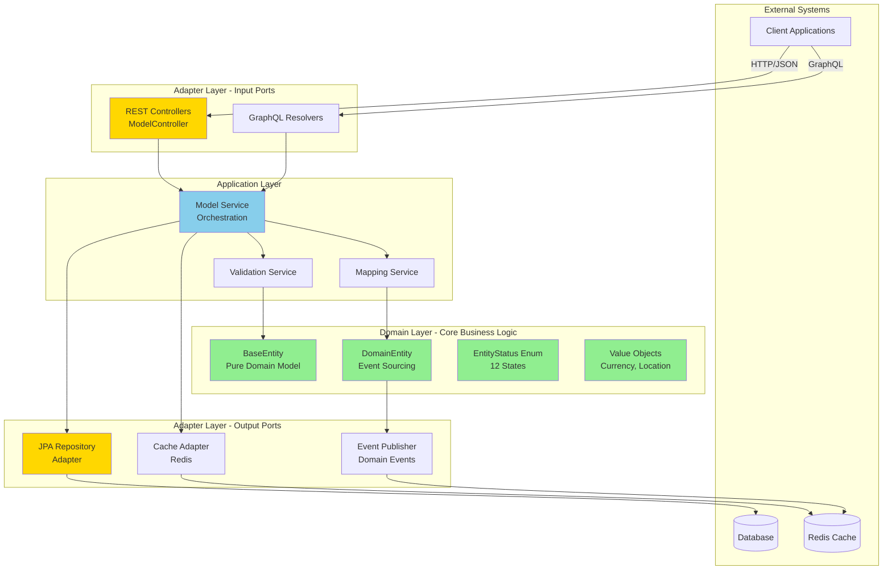

# Shared Model - Architecture Diagram

**Library:** shared-model-service  
**Version:** 1.0.0  
**Architecture:** Hexagonal (Ports & Adapters)

---

## System Architecture Overview



---

## Layer Responsibilities

### 1. Domain Layer (Pure Business Logic)
- **BaseEntity**: Abstract base for all entities
- **DomainEntity**: Entities with event sourcing support
- **EntityStatus**: 12-state lifecycle management
- **Value Objects**: Immutable domain concepts
- **No external dependencies** - Pure Java/business logic

### 2. Application Layer (Orchestration)
- **ModelService**: Coordinates domain operations
- **ValidationService**: Business rule validation
- **MappingService**: Entity transformations
- **Use Case Implementation**: Business workflows

### 3. Adapter Layer - Input (REST/GraphQL)
- **REST Controllers**: HTTP endpoints
- **GraphQL Resolvers**: Graph API
- **Request DTOs**: Data transfer objects
- **Response Mapping**: Output formatting

### 4. Adapter Layer - Output (Persistence/Integration)
- **JPA Repository Adapter**: Database operations
- **Cache Adapter**: Redis caching
- **Event Publisher**: Domain event publishing
- **External Service Clients**: Third-party integrations

---

## Key Components

### BaseEntity
```java
@MappedSuperclass
@Getter
public abstract class BaseEntity {
    private String id;
    private LocalDateTime createdAt;
    private LocalDateTime updatedAt;
    private String createdBy;
    private String updatedBy;
    private EntityStatus status;
}
```

### EntityStatus (12 States)
- DRAFT, PENDING_REVIEW, APPROVED, REJECTED
- ACTIVE, INACTIVE, SUSPENDED, DELETED
- ARCHIVED, EXPIRED, LOCKED, PENDING_DELETION

---

## Data Flow

1. **Request** → REST Controller receives HTTP request
2. **Validation** → ModelService validates input
3. **Domain Logic** → Domain entities execute business rules
4. **Persistence** → JPA Adapter saves to database
5. **Caching** → Cache Adapter updates Redis
6. **Events** → Event Publisher broadcasts domain events
7. **Response** → REST Controller returns HTTP response

---

## Dependencies

### Internal
- shared-validation (validation rules)
- shared-exceptions (error handling)
- shared-audit (change tracking)

### External
- Spring Boot 3.1.5
- Spring Data JPA
- Hibernate
- Redis
- Lombok

---

## Compliance

✅ **Hexagonal Architecture**: Full compliance  
✅ **Domain Purity**: Zero infrastructure leakage  
✅ **Testability**: All layers independently testable  
✅ **Dependency Inversion**: Interfaces for all adapters

---

**Status:** ✅ Production Ready  
**Last Updated:** 2025-10-26
