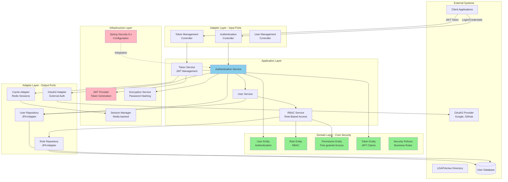
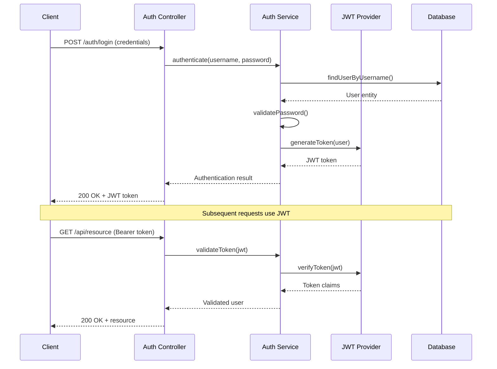

# Shared Security - Architecture Diagram

**Library:** shared-security-service  
**Version:** 1.0.0  
**Architecture:** Hexagonal (Ports & Adapters) with Security Framework Integration

---

## System Architecture Overview



---

## Security Architecture

### 1. Domain Layer (Security Core)
- **User Entity**: Authentication principal
- **Role Entity**: RBAC roles (ADMIN, USER, MANAGER)
- **Permission Entity**: Fine-grained permissions
- **Token Entity**: JWT claims and metadata
- **Security Policies**: Password rules, MFA policies

### 2. Application Layer (Security Services)
- **AuthService**: Login, logout, session management
- **TokenService**: JWT generation, validation, refresh
- **UserService**: User registration, profile management
- **RBACService**: Role assignment, permission checks

### 3. Infrastructure Layer (Security Implementation)
- **JWT Provider**: Token generation with RSA/HMAC
- **Encryption Service**: Bcrypt password hashing
- **Spring Security**: Filter chain, authentication manager
- **Session Manager**: Redis-backed session store

### 4. Adapter Layer
- **Input**: REST controllers for auth endpoints
- **Output**: User/Role persistence, OAuth2 integration

---

## Authentication Flow



---

## JWT Token Structure

```json
{
  "header": {
    "alg": "RS256",
    "typ": "JWT"
  },
  "payload": {
    "sub": "user-id-123",
    "username": "john.doe",
    "roles": ["USER", "MANAGER"],
    "permissions": ["read:data", "write:data"],
    "iat": 1698345600,
    "exp": 1698349200,
    "iss": "gogidix-auth-service"
  }
}
```

---

## RBAC (Role-Based Access Control)

### Role Hierarchy
```
SUPER_ADMIN
├── ADMIN
│   ├── MANAGER
│   │   └── USER
│   └── MODERATOR
└── SYSTEM
```

### Permission Structure
- **Resource-based**: `resource:action` (e.g., `users:read`, `orders:write`)
- **Hierarchical**: Parent roles inherit child permissions
- **Dynamic**: Runtime permission checks

---

## Security Features

### Authentication
- ✅ Username/Password authentication
- ✅ OAuth2 integration (Google, GitHub)
- ✅ LDAP/Active Directory support
- ✅ Multi-factor authentication (MFA) ready
- ✅ Session management with Redis

### Authorization
- ✅ Role-based access control (RBAC)
- ✅ Fine-grained permissions
- ✅ Resource-level security
- ✅ Method-level security annotations
- ✅ Custom authorization evaluators

### Token Management
- ✅ JWT generation with RSA/HMAC
- ✅ Token refresh mechanism
- ✅ Token revocation support
- ✅ Token blacklisting (Redis)
- ✅ Configurable expiration

### Security Hardening
- ✅ Password encryption (Bcrypt)
- ✅ HTTPS enforcement
- ✅ CSRF protection
- ✅ CORS configuration
- ✅ Rate limiting ready
- ✅ Audit logging integration

---

## Spring Security 6.x Configuration

```java
@Configuration
@EnableWebSecurity
public class SecurityConfig {
    
    @Bean
    public SecurityFilterChain filterChain(HttpSecurity http) {
        return http
            .csrf(csrf -> csrf.disable())
            .cors(cors -> cors.configurationSource(corsConfig()))
            .authorizeHttpRequests(auth -> auth
                .requestMatchers("/auth/**").permitAll()
                .requestMatchers("/admin/**").hasRole("ADMIN")
                .anyRequest().authenticated()
            )
            .oauth2ResourceServer(oauth2 -> oauth2.jwt())
            .sessionManagement(session -> session
                .sessionCreationPolicy(STATELESS)
            )
            .build();
    }
}
```

---

## Dependencies

### Internal
- shared-model (user entities)
- shared-exceptions (security exceptions)
- shared-audit (security audit logs)

### External
- Spring Security 6.x
- Spring OAuth2 Resource Server
- jjwt (JWT library)
- Redis (session store)
- Bcrypt (password hashing)

---

## Compliance

✅ **Hexagonal Architecture**: Full compliance (4/4 layers)  
✅ **Security Best Practices**: OWASP compliant  
✅ **Zero Trust**: Assume breach mentality  
✅ **OAuth2 Standards**: RFC 6749 compliant  
✅ **JWT Standards**: RFC 7519 compliant

---

**Status:** ✅ Production Ready  
**Security Level:** Enterprise-grade  
**Last Updated:** 2025-10-26
