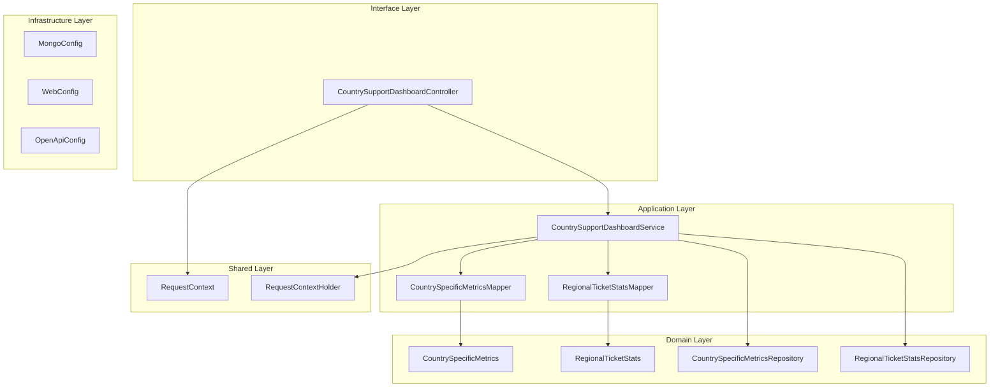
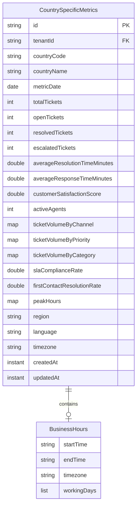
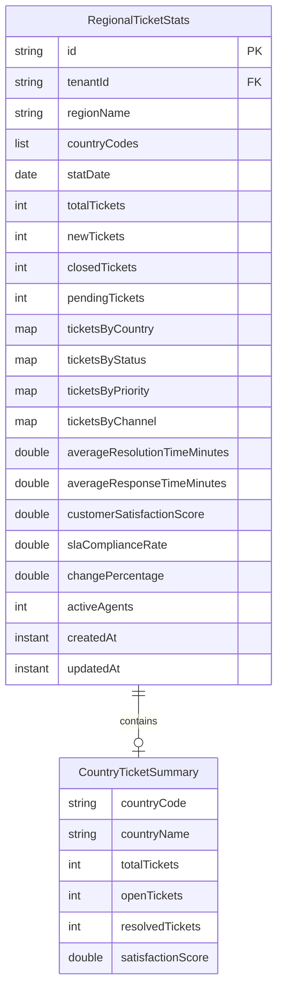
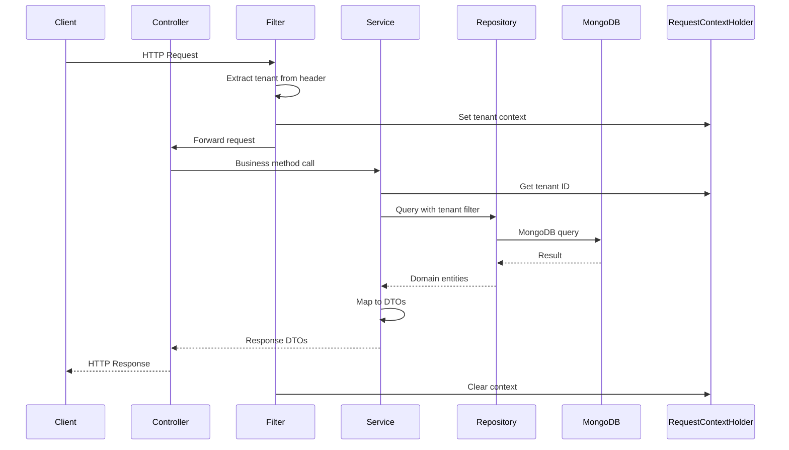
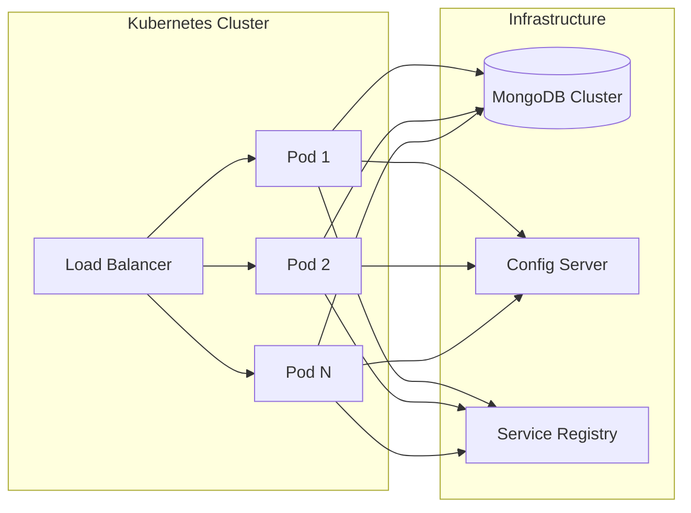
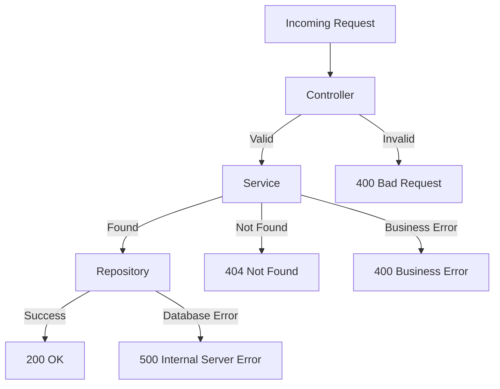

# Country Support Dashboard Service - Architecture Documentation

## Overview

The Country Support Dashboard Service is a Spring Boot microservice that provides country-specific support metrics and regional statistics for the Customer Support domain. It enables monitoring and analytics of support operations across different countries and regions.

## Technology Stack

- **Framework**: Spring Boot 3.2.0
- **Java Version**: 17
- **Database**: MongoDB
- **Build Tool**: Maven
- **API Documentation**: OpenAPI 3.0 (SpringDoc)
- **Testing**: JUnit 5, Mockito, Spring Boot Test

## Architecture Pattern

The service follows **Hexagonal Architecture** (Ports and Adapters) with clear separation of concerns:

## Layer Structure

### 1. Interface Layer (`interfaces.rest`)

**CountrySupportDashboardController**
- REST API endpoints for country-specific metrics and regional statistics
- Request validation using `@Valid`
- OpenAPI documentation annotations

### 2. Application Layer (`application`)

#### Service (`application.service`)
- **CountrySupportDashboardService**: Business logic for managing metrics and statistics

#### Mapper (`application.mapper`)
- **CountrySpecificMetricsMapper**: DTO to Entity mapping for country metrics
- **RegionalTicketStatsMapper**: DTO to Entity mapping for regional stats

#### DTO (`application.dto`)
- **Request DTOs**: Data transfer objects for incoming requests
- **Response DTOs**: Data transfer objects for API responses

### 3. Domain Layer (`domain`)

#### Models (`domain.model`)
- **CountrySpecificMetrics**: Entity representing country-level support metrics
- **RegionalTicketStats**: Entity representing regional ticket statistics
- **BaseEntity**: Abstract base entity with common fields

#### Repositories (`domain.repository`)
- **CountrySpecificMetricsRepository**: MongoDB repository for country metrics
- **RegionalTicketStatsRepository**: MongoDB repository for regional stats

### 4. Infrastructure Layer (`infrastructure`)

#### Configuration (`infrastructure.config`)
- **MongoConfig**: MongoDB configuration with auditing
- **WebConfig**: Web MVC configuration
- **OpenApiConfig**: OpenAPI/Swagger configuration

### 5. Shared Layer (`shared`)

- **RequestContext**: Tenant-scoped request context
- **RequestContextHolder**: Thread-local context holder

## Data Model

### CountrySpecificMetrics

### RegionalTicketStats

## Multi-Tenancy

The service supports multi-tenancy through tenant-scoped data isolation:

1. **Tenant Context**: `RequestContextHolder` maintains the current tenant ID in a ThreadLocal
2. **Data Isolation**: All database queries filter by tenant ID
3. **Security**: Cross-tenant data access is prevented at the repository level

## API Flow

## Caching Strategy

The service uses Spring Cache for optimizing frequently accessed data:

- Cache configuration is defined in `CacheConfig`
- Dashboard summaries are cached with TTL
- Cache is invalidated on data updates

## Monitoring & Observability

### Metrics
- **Micrometer** with Prometheus registry
- Exposes metrics at `/actuator/prometheus`
- Tracks request counts, response times, error rates

### Health Checks
- Spring Boot Actuator health endpoints
- MongoDB connection health verification

### Logging
- Structured logging with SLF4J
- Request correlation IDs for traceability

## Security Considerations

1. **Tenant Isolation**: All queries scoped to tenant ID
2. **Input Validation**: Bean validation on all request DTOs
3. **MongoDB Injection Prevention**: Using repository abstraction
4. **CORS**: Configured for allowed origins

## Deployment Architecture

## Scaling Strategy

### Horizontal Scaling
- Stateless service design enables horizontal scaling
- Multiple instances behind load balancer
- Sticky sessions not required

### Database Scaling
- MongoDB sharding for large datasets
- Read replicas for read-heavy workloads
- Index optimization for query performance

## Configuration Management

- **External Configuration**: Spring Cloud Config
- **Profile-based**: dev, test, staging, production profiles
- **Environment Variables**: Override sensitive values
- **Configuration Properties**: Type-safe configuration

## Error Handling

## Testing Strategy

### Unit Tests
- Service layer tests with mocked repositories
- Mapper tests for DTO conversions
- Domain model tests for business logic

### Integration Tests
- Repository tests with Testcontainers MongoDB
- Controller tests with MockMvc
- End-to-end API tests

### Test Coverage Goal
- Minimum 80% code coverage
- 100% coverage for critical business logic

## Future Enhancements

1. **Real-time Updates**: WebSocket support for live dashboard updates
2. **Advanced Analytics**: Integration with analytics engines
3. **Data Export**: CSV/PDF export capabilities
4. **Custom Dashboards**: User-configurable dashboard layouts
5. **Machine Learning**: Predictive analytics for ticket volumes
