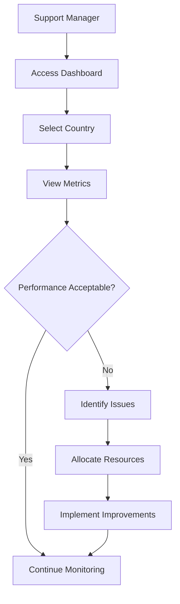
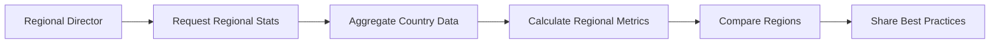
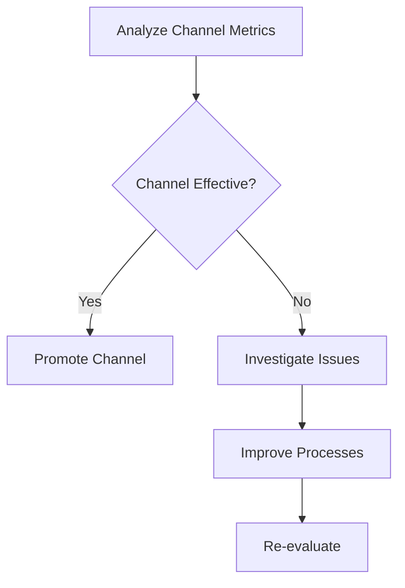
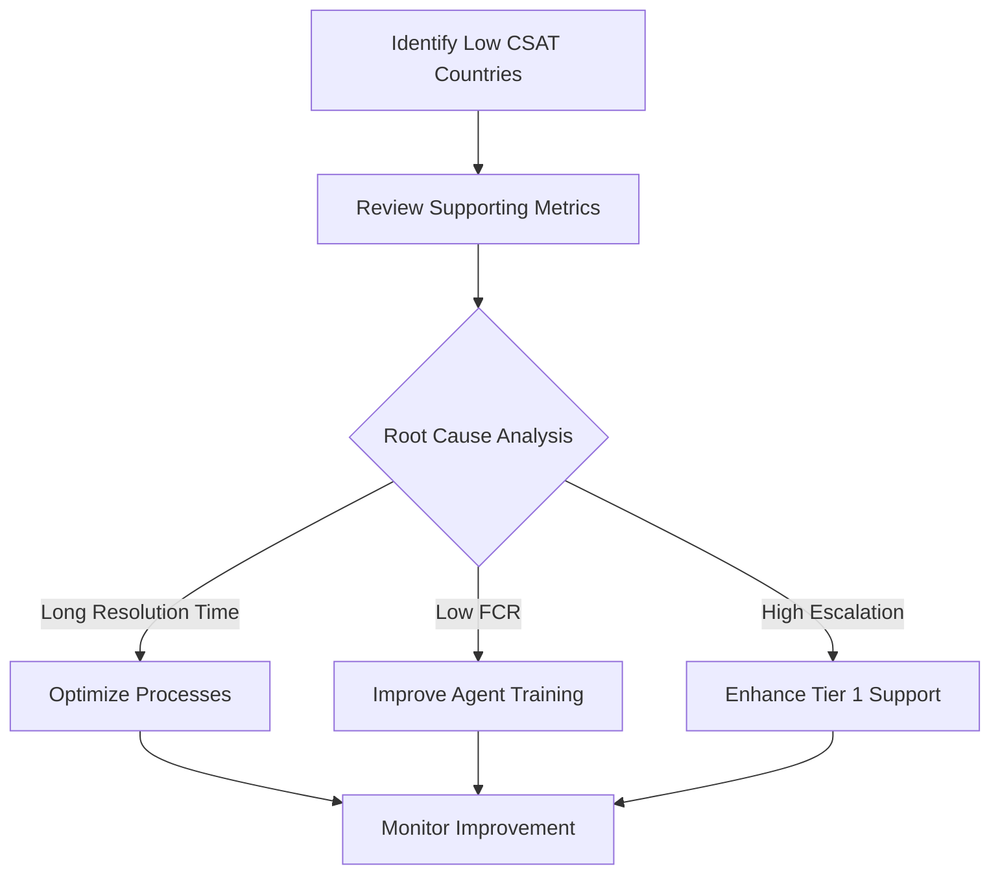

# Country Support Dashboard Service - Business Use Cases

## Overview

The Country Support Dashboard Service provides comprehensive analytics and monitoring capabilities for customer support operations across different countries and regions. This document outlines the key business use cases supported by the service.

---

## Use Case 1: Country-Level Performance Monitoring

### Business Need
Support managers need to monitor the performance of customer support operations in each country to identify areas for improvement and allocate resources effectively.

### User Story
> As a Support Manager, I want to view country-specific support metrics so that I can identify which countries need additional support resources or process improvements.

### Process Flow

### Key Metrics Provided
- Total tickets by country
- Open vs. resolved tickets
- Average resolution time
- Average response time
- Customer satisfaction score
- SLA compliance rate
- First contact resolution rate

### Business Value
- Data-driven resource allocation decisions
- Early identification of performance issues
- Benchmarking across countries

---

## Use Case 2: Regional Aggregated Analytics

### Business Need
Regional directors need a consolidated view of support performance across multiple countries in their region to make strategic decisions.

### User Story
> As a Regional Director, I want to view aggregated statistics for my region so that I can understand overall performance and plan region-wide initiatives.

### Process Flow

### Key Features
- Aggregated ticket volume across countries
- Regional performance trends
- Country-by-country comparison within region
- Change percentage tracking (period-over-period)

### Business Value
- Strategic regional planning
- Identification of best practices to share
- Unified regional performance view

---

## Use Case 3: Multi-Language Support Planning

### Business Need
Support operations teams need to understand language requirements and business hour coverage for each country to schedule multilingual agents appropriately.

### User Story
> As a Workforce Manager, I want to see language requirements and business hours for each country so that I can schedule agents with appropriate language skills during local business hours.

### Data Points Used
- Language preference by country
- Business hours configuration
- Timezone information
- Peak hours by ticket volume

### Business Value
- Optimal agent scheduling
- Improved customer experience with native language support
- Reduced wait times during peak hours

---

## Use Case 4: Channel Performance Analysis

### Business Need
Customer experience leaders need to analyze which support channels (email, phone, chat) perform best in each country to optimize channel mix and investment.

### User Story
> As a CX Leader, I want to compare support channel performance by country so that I can optimize our channel strategy and guide customers to the most effective channels.

### Process Flow

### Metrics Tracked
- Ticket volume by channel
- Resolution time by channel
- Customer satisfaction by channel
- First contact resolution by channel

### Business Value
- Optimized channel investment
- Improved customer satisfaction
- Reduced support costs through effective channel routing

---

## Use Case 5: SLA Compliance Monitoring

### Business Need
Compliance managers need to track SLA compliance across countries to ensure contractual obligations are met and identify regions at risk of SLA breaches.

### User Story
> As a Compliance Manager, I want to monitor SLA compliance rates by country so that I can proactively address regions at risk of breaching SLA commitments.

### Key Features
- SLA compliance rate by country
- Escalated tickets tracking
- Average resolution time vs. SLA target
- Regional SLA aggregation

### Business Value
- Proactive SLA breach prevention
- Data-backed contract negotiations
- Improved customer trust

---

## Use Case 6: Trend Analysis and Forecasting

### Business Need
Business analysts need to analyze trends over time to forecast future support volumes and plan resource capacity.

### User Story
> As a Business Analyst, I want to query historical metrics over date ranges so that I can identify trends and forecast future support volume.

### Features Used
- Date range queries
- Historical metric retrieval
- Period-over-period comparison
- Peak hours analysis

### Business Value
- Accurate capacity planning
- Budget forecasting
- Seasonal trend identification

---

## Use Case 7: Customer Satisfaction Improvement

### Business Need
Customer experience teams need to identify countries with low satisfaction scores and investigate root causes to implement improvement initiatives.

### User Story
> As a CX Manager, I want to identify countries with low CSAT scores and view their detailed metrics so that I can implement targeted improvement programs.

### Analysis Approach

### Related Metrics
- Customer satisfaction score
- Average resolution time
- First contact resolution rate
- Escalation rate

### Business Value
- Targeted improvement initiatives
- Measurable ROI on CX programs
- Improved customer retention

---

## Use Case 8: International Expansion Planning

### Business Need
Business development teams need to analyze support requirements in potential expansion markets to estimate support costs and resource needs.

### User Story
> As a Business Development Manager, I want to view support metrics for similar existing markets so that I can estimate support requirements for expansion into new countries.

### Data Used for Analysis
- Similar country metrics (language, region)
- Average ticket volumes
- Agent productivity metrics
- Business hour coverage patterns

### Business Value
- Accurate expansion cost estimates
- Data-driven go-to-market planning
- Risk assessment for new markets

---

## Use Case 9: Agent Performance Benchmarking

### Business Need
Team leaders need to compare agent performance across countries to identify top performers and share best practices.

### User Story
> As a Team Lead, I want to compare agent performance metrics across countries so that I can identify high-performing teams and replicate their practices.

### Metrics Compared
- Active agents by country
- Average tickets per agent
- Resolution time per agent
- Customer satisfaction by agent

### Business Value
- Performance standardization
- Knowledge sharing across teams
- Improved agent productivity

---

## Use Case 10: Incident Response Coordination

### Business Need
During service incidents or outages affecting specific countries, operations teams need quick access to current support metrics to coordinate response efforts.

### User Story
> As an Incident Manager, I want to quickly view current support metrics for affected countries so that I can assess impact and coordinate response efforts.

### Real-Time Metrics
- Current open tickets
- Active agents
- Average response time
- Customer satisfaction (recent)

### Business Value
- Faster incident response
- Better impact assessment
- Improved customer communication during incidents

---

## KPIs and Metrics Dictionary

### Ticket Metrics
| Metric | Description | Calculation |
|--------|-------------|-------------|
| Total Tickets | All tickets in period | Count of all tickets |
| Open Tickets | Currently unresolved | Count of tickets not closed |
| Resolved Tickets | Closed in period | Count of closed tickets |
| Escalated Tickets | Escalated to higher tier | Count of escalated tickets |
| New Tickets | Created in period | Count of new tickets |

### Time Metrics
| Metric | Description | Target |
|--------|-------------|--------|
| Average Response Time | Time to first response | < 15 minutes |
| Average Resolution Time | Time to close ticket | < 4 hours |
| First Contact Resolution % | Resolved on first contact | > 75% |

### Quality Metrics
| Metric | Description | Target |
|--------|-------------|--------|
| CSAT Score | Customer satisfaction (1-5) | > 4.0 |
| SLA Compliance % | Tickets meeting SLA | > 95% |

---

## Integration Points

### Upstream Services
- **Ticket Management Service**: Provides raw ticket data
- **Customer Portal Service**: Customer interaction data
- **Live Chat Service**: Chat channel metrics
- **Phone Support Service**: Voice channel metrics

### Downstream Consumers
- **Global Support Dashboard**: Regional aggregation
- **Support Analytics Service**: Advanced analytics
- **Quality Management Service**: Quality metrics correlation
- **SLA Management Service**: SLA compliance tracking

---

## Future Use Cases (Roadmap)

1. **Predictive Analytics**: ML-based ticket volume forecasting
2. **Sentiment Analysis Integration**: Correlate metrics with customer sentiment
3. **Automated Alerts**: Real-time alerts for metric threshold breaches
4. **Custom Dashboard Builder**: User-configurable dashboard layouts
5. **Comparative Benchmarking**: Industry benchmark comparisons
6. **Cost Analytics**: Cost-per-ticket by country and channel
7. **Agent Scheduling Optimization**: AI-based scheduling recommendations
8. **Voice of Customer Integration**: Link metrics to customer feedback
