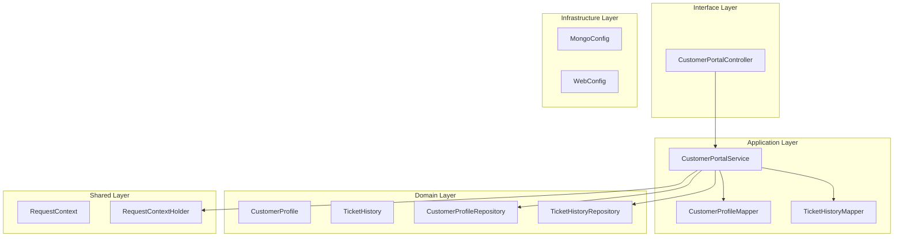
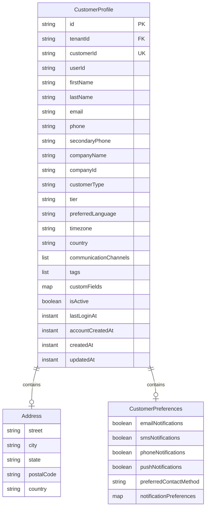
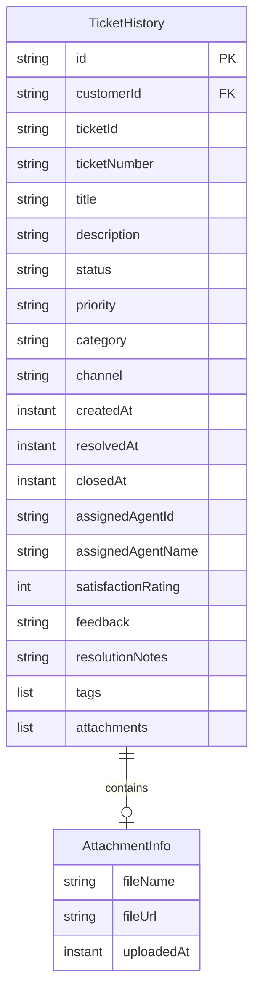
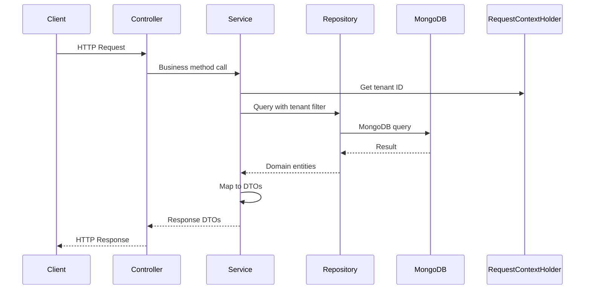

# Customer Portal Service - Architecture Documentation

## Overview

The Customer Portal Service is a Spring Boot microservice that provides self-service capabilities for customers to manage their profiles and view their ticket history within the Customer Support domain.

## Technology Stack

- **Framework**: Spring Boot 3.2.0
- **Java Version**: 17
- **Database**: MongoDB
- **Build Tool**: Maven
- **API Documentation**: OpenAPI 3.0 (SpringDoc)

## Architecture Pattern

The service follows **Hexagonal Architecture** (Ports and Adapters):

## Layer Structure

### 1. Interface Layer (`interfaces.rest`)

**CustomerPortalController**
- REST API endpoints for customer profile management
- Ticket history query endpoints
- Request validation

### 2. Application Layer (`application`)

#### Service (`application.service`)
- **CustomerPortalService**: Business logic for profiles and ticket history

#### Mapper (`application.mapper`)
- **CustomerProfileMapper**: Profile DTO to Entity mapping
- **TicketHistoryMapper**: Ticket history DTO to Entity mapping

### 3. Domain Layer (`domain`)

#### Models (`domain.model`)
- **CustomerProfile**: Customer profile entity with preferences
- **TicketHistory**: Historical ticket data
- **BaseEntity**: Common entity fields

#### Repositories (`domain.repository`)
- **CustomerProfileRepository**: Profile data access
- **TicketHistoryRepository**: Ticket history data access

## Data Model

### CustomerProfile

### TicketHistory

## Multi-Tenancy

The service supports multi-tenancy through tenant-scoped data isolation:

1. **Tenant Context**: `RequestContextHolder` maintains the current tenant ID
2. **Data Isolation**: All profile queries filter by tenant ID
3. **Security**: Cross-tenant data access is prevented

## API Flow

## Key Features

1. **Customer Profile Management**
   - Create, update, delete customer profiles
   - Profile lookup by customer ID or profile ID
   - Support for custom fields and tags

2. **Ticket History**
   - Complete ticket history for customers
   - Ticket count queries with status filtering
   - Chronological history ordering

3. **Customer Preferences**
   - Notification preferences
   - Communication channel preferences
   - Preferred contact method

## Security Considerations

1. **Tenant Isolation**: All queries scoped to tenant ID
2. **Input Validation**: Bean validation on all request DTOs
3. **Email Validation**: Email format validation
4. **Data Privacy**: Sensitive data handling compliance

## Testing Strategy

### Unit Tests
- Service layer tests with mocked repositories
- Mapper tests for DTO conversions
- Domain model tests

### Test Coverage Goal
- Minimum 80% code coverage
- 100% coverage for critical business logic
