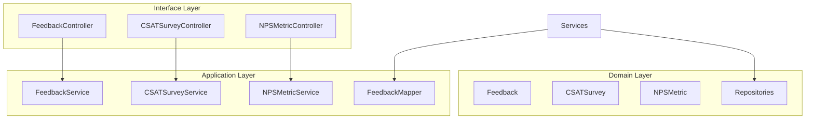

# Feedback Service - Architecture Documentation

## Overview

The Feedback Service is a Spring Boot microservice that manages customer feedback collection and analysis, including CSAT (Customer Satisfaction) surveys, NPS (Net Promoter Score) metrics, and feedback analytics.

## Technology Stack

- **Framework**: Spring Boot 3.2.0
- **Java Version**: 17
- **Database**: MongoDB
- **Build Tool**: Maven

## Architecture Pattern

## Data Models

### Feedback
- Customer feedback submissions
- Feedback categorization
- Sentiment analysis results

### CSAT Survey
- Customer satisfaction surveys
- Rating scores (1-5)
- Survey responses

### NPS Metric
- Net Promoter Score calculations
- Promoter/Passive/Detractor classification
- Score trends

## Key Features

1. **Feedback Collection**
   - Multi-channel feedback intake
   - Categorization and tagging
   - Sentiment analysis integration

2. **CSAT Surveys**
   - Automated survey distribution
   - Response collection
   - Analytics and reporting

3. **NPS Tracking**
   - Score calculation
   - Trend analysis
   - Segment-based reporting

## API Endpoints

### Feedback
- POST `/api/v1/feedback` - Submit feedback
- GET `/api/v1/feedback` - Get all feedback
- GET `/api/v1/feedback/{id}` - Get feedback by ID
- GET `/api/v1/feedback/analytics` - Get feedback analytics

### CSAT Surveys
- POST `/api/v1/csatsurveys` - Create survey
- GET `/api/v1/csatsurveys` - Get all surveys
- POST `/api/v1/csatsurveys/{id}/respond` - Submit response

### NPS Metrics
- POST `/api/v1/nps` - Record NPS score
- GET `/api/v1/nps/score` - Get current NPS
- GET `/api/v1/nps/trends` - Get NPS trends

## Multi-Tenancy

All data is scoped to tenant ID for multi-tenant isolation.

## Security

- Tenant-scoped queries
- Input validation
- Rate limiting on survey endpoints

## Testing

See test suite for comprehensive unit tests covering:
- Service layer business logic
- Controller endpoints
- Mapper functionality
- Domain model behavior
