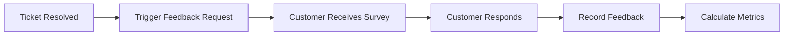
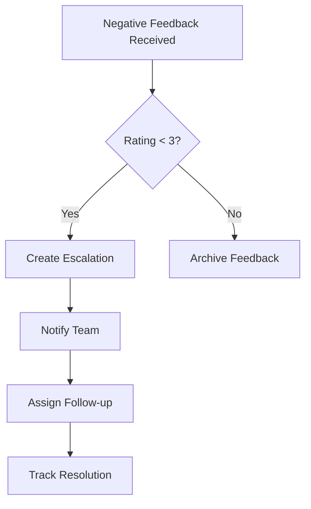

# Feedback Service - Business Use Cases

## Overview

The Feedback Service enables systematic collection, analysis, and reporting of customer feedback to measure and improve support quality.

---

## Use Case 1: Post-Interaction Feedback Collection

### Business Need
Collect immediate feedback after support interactions to gauge customer satisfaction.

### User Story
> As a Customer Experience Manager, I want to automatically send feedback requests after ticket resolution so that I can measure customer satisfaction in real-time.

### Process Flow



### Business Value
- Real-time satisfaction measurement
- Immediate issue identification
- Trend analysis capability

---

## Use Case 2: CSAT Survey Management

### Business Need
Manage comprehensive customer satisfaction surveys with multiple questions and response types.

### User Story
> As a Quality Manager, I want to create customizable CSAT surveys so that I can gather detailed feedback on specific support aspects.

### Features
- Custom survey questions
- Multiple response types (rating, text, multiple choice)
- Automated distribution
- Response aggregation

### Business Value
- Detailed feedback insights
- Flexible survey design
- Improved response rates

---

## Use Case 3: NPS Tracking and Analysis

### Business Need
Track Net Promoter Score to measure customer loyalty and predict business growth.

### User Story
> As a VP of Customer Success, I want to track NPS trends over time so that I can correlate customer sentiment with business outcomes.

### Calculation
```
NPS = % Promoters (9-10) - % Detractors (0-6)
```

### Business Value
- Industry-standard metric
- Predictive of customer behavior
- Benchmarking capability

---

## Use Case 4: Feedback Analytics and Reporting

### Business Need
Analyze feedback data to identify trends, issues, and improvement opportunities.

### User Story
> As a Support Director, I want to view feedback analytics by category, channel, and time period so that I can make data-driven improvements.

### Key Metrics
- Average rating
- Feedback volume by category
- Response rate
- Channel performance comparison

### Business Value
- Data-driven decision making
- Root cause identification
- Performance benchmarking

---

## Use Case 5: Negative Feedback Escalation

### Business Need
Automatically escalate negative feedback for follow-up and resolution.

### User Story
> As a Customer Retention Specialist, I want to be notified of negative feedback immediately so that I can intervene and prevent churn.

### Process



### Business Value
- Proactive issue resolution
- Reduced churn risk
- Customer retention improvement

---

## KPIs and Metrics

| Metric | Description | Target |
|--------|-------------|--------|
| CSAT Score | Customer Satisfaction (1-5) | > 4.0 |
| NPS Score | Net Promoter Score (-100 to 100) | > 40 |
| Response Rate | Survey completion rate | > 30% |
| Average Resolution Time | Time to resolve negative feedback | < 24 hours |
