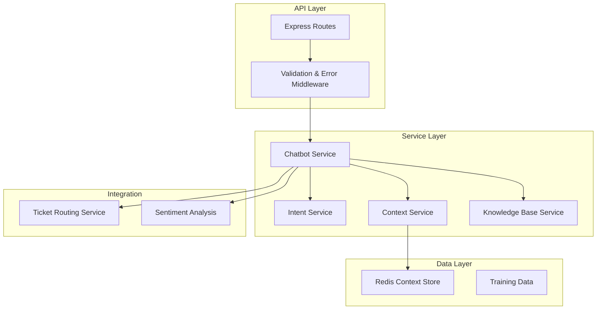
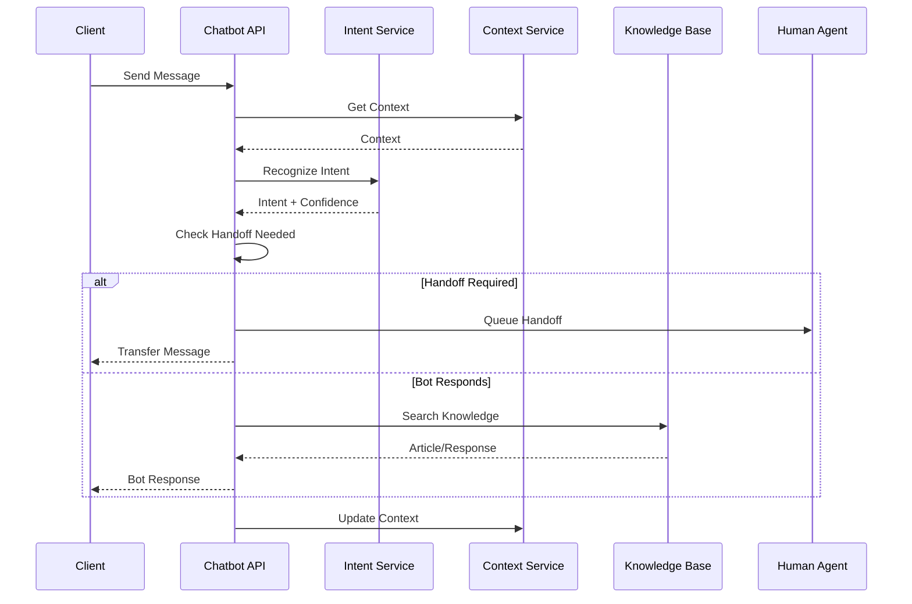

# Chatbot Service - Architecture Documentation

## Overview

The Chatbot Service is a Node.js/TypeScript microservice providing AI-powered conversational support for the Customer Support domain. It uses NLP for intent recognition and context management.

## Technology Stack

- **Runtime**: Node.js 18+
- **Language**: TypeScript 5.3
- **Framework**: Express.js
- **NLP**: natural, compromise, node-nlp
- **Cache**: Redis (ioredis)
- **Testing**: Jest, ts-jest

## Architecture Pattern



## Component Architecture

### Chatbot Routes
- `/api/chatbot/conversations` - Conversation management
- `/api/chatbot/conversations/:sessionId/message` - Message processing
- `/api/chatbot/conversations/:sessionId/history` - Conversation history
- `/api/chatbot/stats` - Service statistics
- `/api/chatbot/health` - Health check

### Chatbot Service
Core conversation processing:
- Message processing and intent recognition
- Response generation
- Handoff decision logic
- Context management

### Intent Service
- Intent recognition using NLP
- Entity extraction
- Confidence scoring
- Escalation keyword detection

### Context Service
- Session context storage
- Message history
- Entity tracking
- Context expiration

### Knowledge Base Service
- FAQ retrieval
- Article search
- Response personalization

## Data Models

### Message
```typescript
interface Message {
  sessionId: string;
  type: MessageType;
  content: string;
  intent?: Intent;
  confidence?: number;
  timestamp: Date;
}
```

### ConversationContext
```typescript
interface ConversationContext {
  sessionId: string;
  customerId?: string;
  language: string;
  messages: Message[];
  entities: Record<string, any>;
  createdAt: Date;
  updatedAt: Date;
}
```

### BotResponse
```typescript
interface BotResponse {
  message: string;
  intent: Intent;
  confidence: number;
  suggestedResponses?: string[];
  handoff?: {
    recommended: boolean;
    reason?: HandoffReason;
  };
}
```

## Intent Classification

### Supported Intents
- GREETING - Hello, hi, etc.
- FAQ - Frequently asked questions
- SUPPORT_REQUEST - Help requests
- BILLING_INQUIRY - Payment/billing questions
- TECHNICAL_ISSUE - Technical problems
- ORDER_STATUS - Order tracking
- REFUND_REQUEST - Refund requests
- FEEDBACK - Customer feedback
- COMPLAINT - Complaints
- ACCOUNT_ACCESS - Account access
- GOODBYE - Conversation ending
- UNKNOWN - Unrecognized intent

### Handoff Triggers
1. **Low Confidence** - Intent confidence < threshold (0.3)
2. **Escalation Keywords** - "speak to human", "agent"
3. **Complex Queries** - Complaints, refund requests
4. **Authentication Required** - Account access
5. **Negative Sentiment** - Detected via sentiment service

## Redis Data Structure

### Context Storage
```
Key: chatbot:context:{sessionId}
Value: JSON serialized ConversationContext
TTL: 3600 seconds (1 hour)
```

### Handoff Queue
```
Key: chatbot:handoff:{sessionId}
Value: JSON serialized HandoffRequest
TTL: 300 seconds (5 minutes)
```

## Multi-Language Support

The service supports multiple languages:
- English (en) - Default
- Spanish (es)
- French (fr)
- German (de)
- Additional languages configured via training data

## API Flow



## Configuration

### Environment Variables
```bash
PORT=3000
NODE_ENV=production
REDIS_HOST=localhost
REDIS_PORT=6379
HANDOFF_THRESHOLD=0.3
CONTEXT_TTL=3600
SUPPORTED_LANGUAGES=en,es,fr,de
```

## Monitoring

### Metrics Tracked
- Active conversations
- Pending handoffs
- Total messages processed
- Average messages per session
- Intent recognition accuracy
- Response time

### Health Check
```bash
GET /api/chatbot/health
```

Response:
```json
{
  "success": true,
  "service": "chatbot-service",
  "status": "healthy",
  "timestamp": "2024-01-15T10:00:00Z"
}
```

## Security Considerations

1. **Input Validation**: Joi schema validation on all inputs
2. **Rate Limiting**: Express rate-limit middleware
3. **CORS**: Configured for allowed origins
4. **Helmet**: Security headers
5. **Session Isolation**: Each session has unique ID with scoped context

## Testing

### Unit Tests
- Service layer tests with mocked dependencies
- Intent recognition tests
- Context management tests
- Handoff logic tests

### Test Coverage Goal: 80%+

## Deployment

### Docker Build
```bash
docker build -t chatbot-service:1.0.0 .
```

### Environment Configuration
Production configuration via environment variables or ConfigMap.

### Scaling Considerations
- Stateless API layer enables horizontal scaling
- Redis as shared context store
- Multiple instances with load balancer
