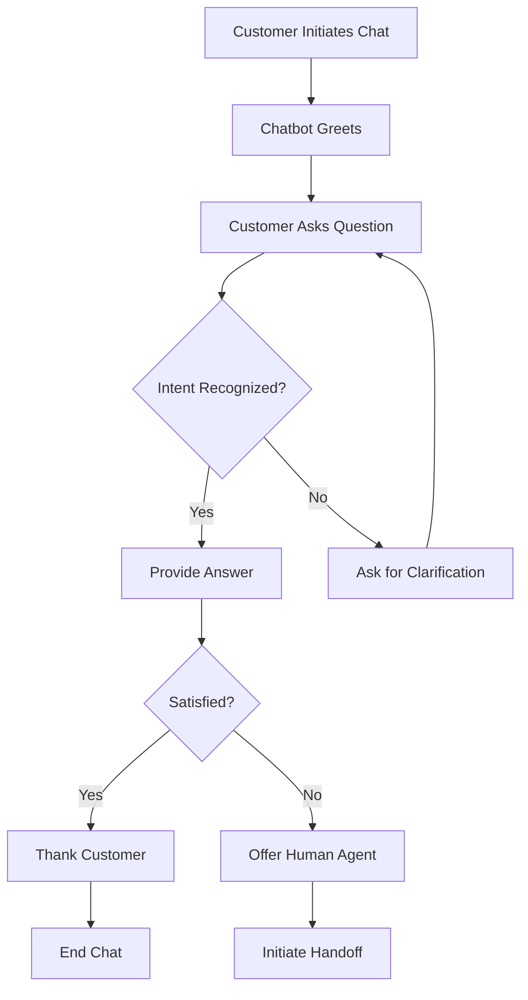
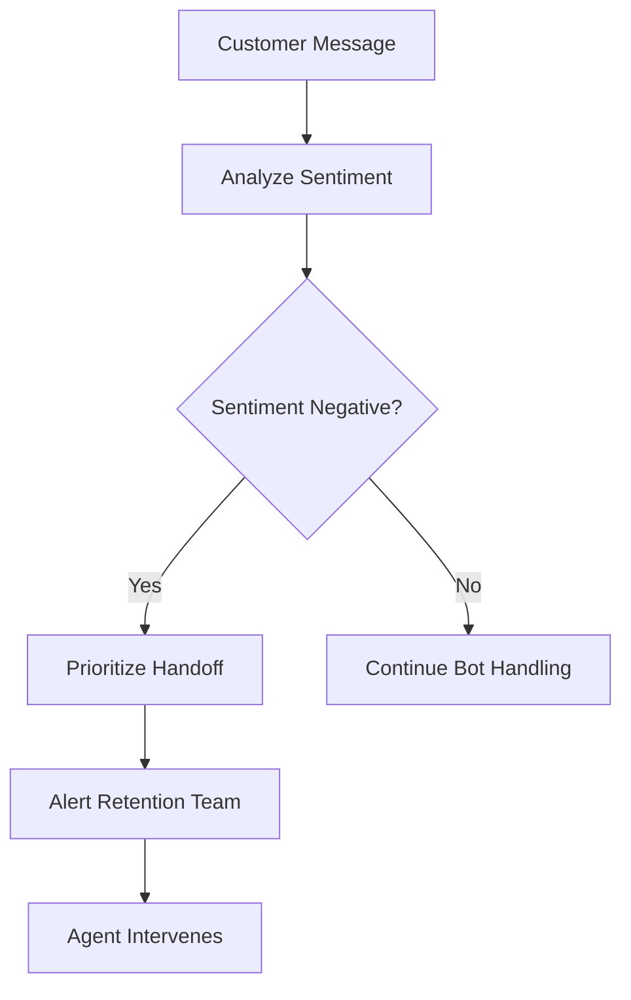

# Chatbot Service - Business Use Cases

## Overview

The Chatbot Service provides AI-powered conversational support to customers, handling common inquiries automatically and escalating complex issues to human agents.

---

## Use Case 1: 24/7 Basic Support Availability

### Business Need
Provide round-the-clock support for common customer inquiries without human agents.

### User Story
> As a Customer, I want to get help with basic questions at any time so that I don't have to wait for business hours.

### Process Flow



### Business Value
- Reduced support costs
- 24/7 availability
- Faster first response
- Reduced human agent workload

---

## Use Case 2: Order Status Inquiry

### Business Need
Automate order status inquiries, which constitute a large portion of support requests.

### User Story
> As a Customer, I want to quickly check my order status through chat so that I don't have to log into the website.

### Bot Flow
1. Customer asks: "Where is my order?"
2. Bot recognizes ORDER_STATUS intent
3. Bot requests order number if not provided
4. Bot retrieves order information from backend
5. Bot provides status with suggested follow-up actions

### Business Value
- 80% reduction in order status calls
- Improved customer experience
- Reduced agent handling time

---

## Use Case 3: FAQ and Knowledge Base Access

### Business Need
Provide instant answers to frequently asked questions.

### User Story
> As a Customer, I want to get answers to common questions instantly so that I don't have to search through documentation.

### Supported FAQ Categories
- Business hours
- Contact information
- Return policy
- Shipping information
- Payment methods
- Account management

### Business Value
- Reduced support ticket volume
- Instant information access
- Consistent answers

---

## Use Case 4: Intelligent Handoff to Human Agents

### Business Need
Seamlessly transfer complex or sensitive issues to human agents when the bot cannot help.

### User Story
> As a Customer, I want to be transferred to a human when the bot cannot help so that my issue gets resolved properly.

### Handoff Triggers
1. **Low Confidence** - Bot doesn't understand the request
2. **Escalation Request** - Customer asks for human
3. **Complex Query** - Complaints, account access
4. **Multiple Attempts** - Bot cannot resolve after 3 turns

### Handoff Process


### Business Value
- Improved customer satisfaction
- Reduced frustration
- Better context preservation

---

## Use Case 5: Multi-Language Support

### Business Need
Serve customers in their preferred language.

### User Story
> As a Non-English Speaker, I want to interact with the chatbot in my native language so that I can get support effectively.

### Supported Languages
- English (en)
- Spanish (es)
- French (fr)
- German (de)

### Business Value
- Global customer support
- Improved accessibility
- Market expansion support

---

## Use Case 6: Sentiment-Based Escalation

### Business Need
Identify unhappy customers and prioritize them for human intervention.

### User Story
> As a Customer Retention Manager, I want to be notified when a customer expresses frustration so that I can intervene and prevent churn.

### Process



### Business Value
- Proactive churn prevention
- Improved customer retention
- Early issue detection

---

## Use Case 7: Context-Aware Conversations

### Business Need
Maintain conversation context to provide personalized, relevant responses.

### User Story
> As a Customer, I want the bot to remember what I said earlier so that I don't have to repeat information.

### Context Tracking
- Session ID for conversation tracking
- Entity extraction (order numbers, emails)
- Conversation history
- Language preference

### Business Value
- More natural conversations
- Reduced customer effort
- Better resolution rates

---

## Use Case 8: Suggested Responses

### Business Need
Guide customers toward common actions to improve efficiency.

### User Story
> As a Customer, I want quick action options so that I can get what I need without typing.

### Example Suggestions
```
For "Order Status" intent:
- Track my order
- Cancel my order
- Change delivery address

For "Billing" intent:
- View my invoice
- Update payment method
- Request refund
```

### Business Value
- Reduced typing effort
- Faster resolution
- Guided user experience

---

## KPIs and Metrics

| Metric | Description | Target |
|--------|-------------|--------|
| Containment Rate | Issues resolved by bot alone | > 60% |
| First Response Time | Time to initial bot response | < 2 seconds |
| Handoff Rate | % of chats transferred to humans | < 40% |
| Customer Satisfaction | Post-chat CSAT | > 4.0 |
| Resolution Time | Average chat duration | < 5 minutes |
| Intent Recognition Accuracy | Correct intent classification | > 85% |

---

## Integration Points

### Upstream Services
- **Customer Portal**: Customer profile data
- **Order Service**: Order status information
- **Knowledge Base**: FAQ articles

### Downstream Services
- **Ticket Routing Service**: Handoff requests
- **Sentiment Analysis**: Message sentiment
- **Analytics Service**: Usage metrics

### Events Published
- `chat:conversation:started`
- `chat:conversation:ended`
- `chat:handoff:request`
- `chat:message:sent`

---

## Future Enhancements

1. **Voice Support**: Voice-based chatbot interactions
2. **Rich Media**: Images, cards, carousels in responses
3. **Machine Learning**: Continuous improvement from interactions
4. **Proactive Outreach**: Bot initiates conversations
5. **Multimodal**: Support for images and documents
6. **Integration Expansion**: More backend service integrations
