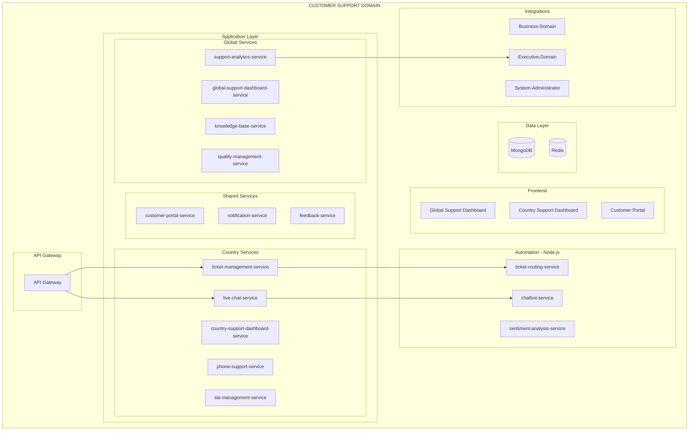

# PRD: Customer-Support Domain

**Version:** 1.0
**Date:** 2026-01-29
**Status:** Product Requirements Document
**Domain:** Management-Domain / Customer-Support

---

## Business Purpose

Provide excellent customer support globally with local language and cultural relevance.

## User Personas

1. **Global Support Director (HQ)** - Support strategy, quality standards
2. **Country Support Manager** - Local support operations
3. **Support Agent** - Ticket resolution
4. **Customer** - Support requests

## Domain Architecture



## Service Inventory

### Java Backend Services (12)

| Service | Priority |
|---------|----------|
| global-support-dashboard-service | P0 |
| support-analytics-service | P0 |
| knowledge-base-service | P1 |
| quality-management-service | P1 |
| country-support-dashboard-service | P0 |
| ticket-management-service | P0 |
| live-chat-service | P0 |
| phone-support-service | P1 |
| sla-management-service | P0 |
| customer-portal-service | P0 |
| notification-service | P1 |
| feedback-service | P1 |

### Node.js Services (3)

| Service | Priority |
|---------|----------|
| chatbot-service | P1 |
| ticket-routing-service | P0 |
| sentiment-analysis-service | P1 |

### Frontend (3)

| Application | Priority |
|-------------|----------|
| global-support-dashboard | P0 |
| country-support-dashboard | P0 |
| customer-portal | P0 |

## Integration Points

```
Customer-Support → Business-Domain
├── Customer orders
├── Shipping status
└── Account data

Customer-Support → shared-courier-core
├── Support item delivery
└── Equipment shipping

Customer-Support → shared-warehousing-core
├── Support equipment storage
```

---

**End of PRD: Customer-Support Domain**
