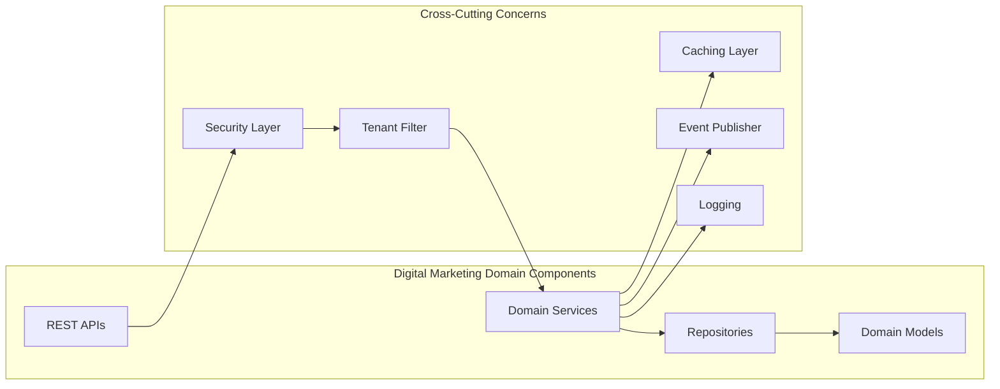
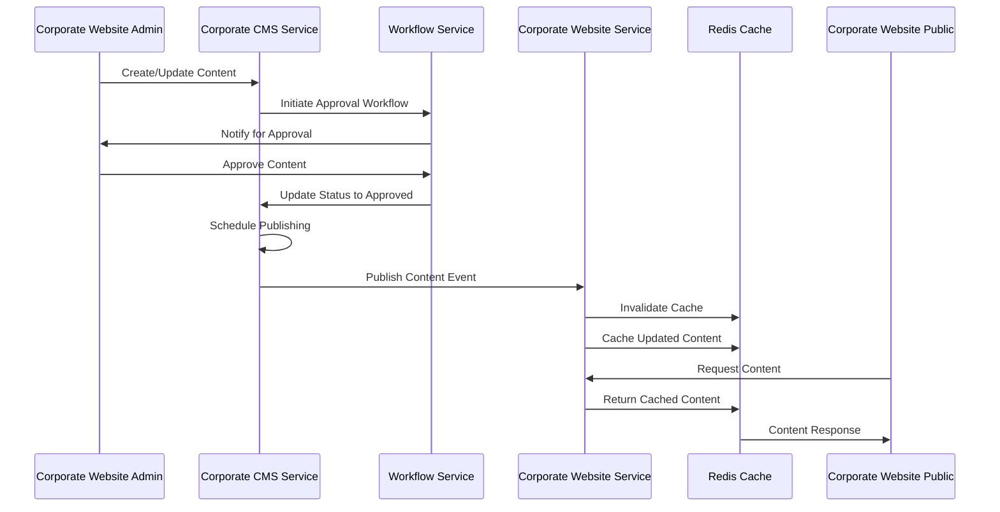
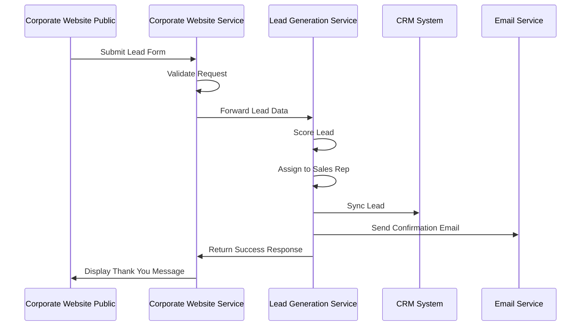

# Digital Marketing Domain - Architecture Documentation

## Overview

The Digital Marketing Domain is a core component of the Gogidix Ecosystem, providing comprehensive marketing automation, campaign management, content management, analytics, lead generation, and corporate website capabilities. This domain enables businesses to manage their entire digital marketing presence from a unified platform.

## Table of Contents

- [Domain Purpose](#domain-purpose)
- [Architecture Principles](#architecture-principles)
- [System Architecture](#system-architecture)
- [Backend Services](#backend-services)
- [Frontend Applications](#frontend-applications)
- [Technology Stack](#technology-stack)
- [Data Flow](#data-flow)
- [Integration Points](#integration-points)
- [Security](#security)
- [Scalability Considerations](#scalability-considerations)

---

## Domain Purpose

The Digital Marketing Domain is responsible for:

1. **Campaign Management**: Plan, execute, and monitor multi-channel marketing campaigns
2. **Email Marketing**: Design, send, and track email campaigns
3. **Social Media Management**: Manage social media presence and engagement
4. **SEO Optimization**: Track and improve search engine rankings
5. **Content Management**: Create, manage, and publish marketing content
6. **Analytics & Reporting**: Comprehensive marketing analytics and ROI tracking
7. **Lead Generation**: Capture, qualify, and nurture leads
8. **Marketing Automation**: Automated marketing workflows and triggers
9. **Segmentation**: Customer segmentation and targeting
10. **Personalization**: Personalized marketing experiences
11. **Attribution**: Multi-touch attribution analysis
12. **Social Listening**: Monitor social media conversations
13. **Influencer Management**: Manage influencer partnerships
14. **Marketing Integration**: Third-party marketing tool integrations
15. **Corporate Website**: Public-facing corporate website management
16. **Corporate CMS**: Headless CMS for corporate content

## Architecture Principles

The domain follows these architectural principles:

- **Domain-Driven Design (DDD)**: Clear domain boundaries and ubiquitous language
- **Microservices Architecture**: Loosely coupled, independently deployable services
- **API-First**: RESTful APIs with OpenAPI/Swagger documentation
- **Event-Driven**: Asynchronous communication via message brokers
- **Cloud-Native**: Designed for containerization and orchestration
- **Multi-Tenancy**: Support for multiple organizations/tenants
- **Security First**: Authentication, authorization, and data encryption

## System Architecture

### High-Level Architecture

```mermaid
graph TB
    subgraph "Frontend Layer"
        MWD[Marketing Web Dashboard]
        MWP[Marketing Web Portal]
        CWP[Corporate Website Public]
        CWA[Corporate Website Admin]
    end

    subgraph "API Gateway Layer"
        GW[API Gateway]
    end

    subgraph "Core Marketing Services"
        CMS[Campaign Management]
        EMS[Email Marketing]
        SMS[Social Media Service]
        SEO[SEO Service]
        CTS[Content Management]
        ANS[Analytics Service]
        LGS[Lead Generation]
        MAS[Marketing Automation]
        SGS[Segmentation]
        PES[Personalization]
        ATS[Attribution Service]
        SLS[Social Listening]
        INS[Influencer Service]
        MIS[Marketing Integration]
    end

    subgraph "Corporate Website Services"
        CWS[Corporate Website Service]
        CCMS[Corporate CMS Service]
    end

    subgraph "Data Layer"
        MG1[(MongoDB 1)]
        MG2[(MongoDB 2)]
        PG[(PostgreSQL)]
        RD[(Redis Cache)]
    end

    subgraph "Messaging Layer"
        KAFKA[Apache Kafka]
        RABBIT[RabbitMQ]
    end

    subgraph "External Services"
        GA[Google Analytics]
        FB[Facebook Ads]
        GOO[Google Ads]
        TW[Twitter API]
        LI[LinkedIn API]
        SEND[SendGrid]
        CRM[CRM Systems]
    end

    MWD --> GW
    MWP --> GW
    CWP --> GW
    CWA --> GW

    GW --> CMS
    GW --> EMS
    GW --> SMS
    GW --> SEO
    GW --> CTS
    GW --> ANS
    GW --> LGS
    GW --> MAS
    GW --> SGS
    GW --> PES
    GW --> ATS
    GW --> SLS
    GW --> INS
    GW --> MIS
    GW --> CWS
    GW --> CCMS

    CMS --> MG1
    EMS --> MG1
    SMS --> MG1
    SEO --> MG1
    CTS --> MG1
    LGS --> PG
    MAS --> MG2
    SGS --> MG2
    PES --> MG2
    ANS --> MG2
    ATS --> MG2
    SLS --> MG2
    INS --> MG2
    MIS --> MG2
    CWS --> MG1
    CCMS --> MG2

    CMS --> RD
    EMS --> RD
    ANS --> RD
    CWS --> RD

    CMS --> KAFKA
    EMS --> KAFKA
    ANS --> KAFKA
    LGS --> RABBIT

    KAFKA --> GA
    KAFKA --> FB
    KAFKA --> GOO
    RABBIT --> TW
    RABBIT --> LI
    RABBIT --> SEND
    KAFKA --> CRM
```

### Component Architecture

## Backend Services

### Core Marketing Services (14 Services)

#### 1. Campaign Management Service
- **Purpose**: Plan, execute, and monitor multi-channel marketing campaigns
- **Port**: 8081
- **Database**: MongoDB
- **Key Features**: Campaign creation, budget management, campaign templates, A/B testing

#### 2. Email Marketing Service
- **Purpose**: Design, send, and track email campaigns
- **Port**: 8082
- **Database**: MongoDB
- **Key Features**: Email templates, automation, list management, analytics

#### 3. Social Media Service
- **Purpose**: Manage social media presence and engagement
- **Port**: 8083
- **Database**: MongoDB
- **Key Features**: Post scheduling, engagement tracking, multi-platform support

#### 4. SEO Service
- **Purpose**: Track and improve search engine rankings
- **Port**: 8084
- **Database**: MongoDB
- **Key Features**: Keyword tracking, backlink monitoring, on-page SEO analysis

#### 5. Content Management Service
- **Purpose**: Create, manage, and publish marketing content
- **Port**: 8085
- **Database**: MongoDB
- **Key Features**: Content editor, approval workflows, publishing

#### 6. Analytics Service
- **Purpose**: Comprehensive marketing analytics and ROI tracking
- **Port**: 8086
- **Database**: MongoDB + Redis
- **Key Features**: Real-time metrics, custom reports, attribution analysis

#### 7. Lead Generation Service
- **Purpose**: Capture, qualify, and nurture leads
- **Port**: 8087
- **Database**: PostgreSQL
- **Key Features**: Lead scoring, qualification workflows, CRM integration

#### 8. Marketing Automation Service
- **Purpose**: Automated marketing workflows and triggers
- **Port**: 8088
- **Database**: MongoDB
- **Key Features**: Workflow designer, trigger rules, automation templates

#### 9. Segmentation Service
- **Purpose**: Customer segmentation and targeting
- **Port**: 8089
- **Database**: MongoDB
- **Key Features**: Dynamic segments, behavioral targeting, lookalike audiences

#### 10. Personalization Service
- **Purpose**: Personalized marketing experiences
- **Port**: 8090
- **Database**: MongoDB
- **Key Features**: Recommendation engine, dynamic content, personalization rules

#### 11. Attribution Service
- **Purpose**: Multi-touch attribution analysis
- **Port**: 8091
- **Database**: MongoDB
- **Key Features**: Attribution models, touchpoint tracking, ROI calculation

#### 12. Social Listening Service
- **Purpose**: Monitor social media conversations
- **Port**: 8092
- **Database**: MongoDB
- **Key Features**: Sentiment analysis, trend detection, brand monitoring

#### 13. Influencer Service
- **Purpose**: Manage influencer partnerships
- **Port**: 8093
- **Database**: MongoDB
- **Key Features**: Influencer discovery, campaign management, performance tracking

#### 14. Marketing Integration Service
- **Purpose**: Third-party marketing tool integrations
- **Port**: 8094
- **Database**: MongoDB
- **Key Features**: API connectors, data synchronization, webhook handling

### Corporate Website Services (2 Services)

#### 15. Corporate Website Service
- **Purpose**: Public-facing corporate website content delivery
- **Port**: 8095
- **Database**: MongoDB + Redis
- **Key Features**:
  - Multi-language content serving (EN, FR, ES, PT, AR)
  - Regional content filtering (NG, KE, GH, ZA, etc.)
  - Blog post delivery with SEO metadata
  - Case study showcasing
  - Press release distribution
  - Career opportunities listing
  - Product catalog display
  - Lead capture integration
  - Sitemap generation
  - Page view analytics integration

#### 16. Corporate CMS Service
- **Purpose**: Headless CMS for corporate content management
- **Port**: 8096
- **Database**: MongoDB
- **Key Features**:
  - Content management (pages, blog, press releases)
  - Media library management
  - Workflow and approval system
  - Product catalog management
  - Job/career posting management
  - Lead management
  - User management with RBAC
  - Analytics dashboard
  - Scheduled content publishing
  - Version history tracking

## Frontend Applications

### 1. Marketing Web Dashboard
- **Framework**: React 18 + TypeScript
- **Purpose**: Marketing team dashboard for analytics and campaign management
- **Features**:
  - Campaign overview and management
  - Real-time analytics dashboard
  - Multi-channel reporting
  - Lead pipeline visualization
  - Budget tracking
  - Team collaboration tools

### 2. Marketing Web Portal
- **Framework**: React 18 + TypeScript
- **Purpose**: Self-service portal for marketing operations
- **Features**:
  - Campaign creation wizards
  - Email template builder
  - Social media scheduler
  - Asset management
  - Approval workflows

### 3. Corporate Website Public
- **Framework**: Next.js 14 + TypeScript
- **Purpose**: Public-facing corporate website
- **Features**:
  - Multi-language support (EN, FR, ES, PT, AR)
  - Regional content adaptation
  - Product showcase pages
  - Developer portal with API docs
  - Partner program information
  - Enterprise solutions pages
  - Career opportunities
  - Blog and resources
  - Case studies
  - Contact forms and lead capture
  - SEO optimized
  - Responsive design

### 4. Corporate Website Admin
- **Framework**: React 18 + TypeScript + Material UI
- **Purpose**: Admin dashboard for managing corporate website content
- **Features**:
  - Content management (pages, blog, press releases)
  - Product catalog management
  - Career postings management
  - Media library
  - Analytics dashboard
  - SEO settings
  - User management
  - Workflow approvals
  - Lead management

## Technology Stack

### Backend Framework
- **Spring Boot 3.2**: Main application framework
- **Spring Data MongoDB**: Database access layer
- **Spring Data JPA**: PostgreSQL access
- **Spring Security**: Security framework
- **Spring Cloud**: Microservices infrastructure

### Frontend Framework
- **React 18**: UI library for dashboards
- **Next.js 14**: Framework for public website
- **TypeScript 5.3**: Type safety
- **Material UI 5**: Component library for admin
- **Tailwind CSS**: Styling for public site

### Database
- **MongoDB**: Primary data store for most services
- **PostgreSQL**: Relational data for leads and complex queries
- **Redis**: Caching and session management

### Messaging
- **Apache Kafka**: Event streaming and integration
- **RabbitMQ**: Message queuing for email and social

### API Documentation
- **SpringDoc OpenAPI 3**: API documentation
- **Swagger UI**: Interactive API console

### Build & Test
- **Maven**: Java build tool
- **npm/Node.js**: Frontend build
- **JUnit 5**: Java testing framework
- **Jest**: Frontend testing
- **Docker**: Containerization

## Data Flow

### Content Publishing Flow

### Lead Capture Flow

## Integration Points

### Corporate Website Service Integrations

1. **Corporate CMS Service**
   - Content synchronization
   - Media asset retrieval
   - Product catalog updates

2. **Lead Generation Service**
   - Lead form submissions
   - Demo requests
   - Contact inquiries

3. **Analytics Service**
   - Page view tracking
   - User behavior events
   - Conversion tracking

4. **SEO Service**
   - Sitemap generation
   - Metadata management
   - Structured data

### Corporate CMS Service Integrations

1. **Corporate Website Service**
   - Content publishing
   - Cache invalidation
   - Scheduled publishing

2. **Media Storage**
   - File upload/download
   - Image optimization
   - CDN synchronization

3. **Email Service**
   - Notifications
   - Workflow alerts

4. **Analytics Service**
   - Content metrics
   - User engagement data

## Security

### Authentication & Authorization
- **JWT Tokens**: Stateless authentication
- **OAuth 2.0**: Third-party integrations
- **Role-Based Access Control (RBAC)**: User roles and permissions
- **Multi-Factor Authentication**: Enhanced security

### API Security
- **HTTPS Only**: All endpoints require TLS
- **Rate Limiting**: Request throttling per tenant
- **Input Validation**: Request validation at API boundaries
- **CORS**: Cross-origin resource sharing policies

### Data Security
- **Encryption at Rest**: Database encryption
- **Encryption in Transit**: TLS for all communications
- **Audit Logging**: All mutations logged with user context
- **Data Masking**: Sensitive data protection

## Scalability Considerations

### Horizontal Scaling
- **Stateless Services**: All services are stateless
- **Connection Pooling**: Efficient database connection management
- **Load Balancing**: Multiple service instances behind load balancers

### Performance Optimization
- **Database Indexing**: Compound indexes for common queries
- **Caching Strategy**: Redis cache for frequently accessed data
- **CDN**: Static content delivery via CDN
- **Async Processing**: Event-driven architecture for heavy computations

### Deployment Architecture
- **Container Orchestration**: Kubernetes for service management
- **Service Mesh**: Istio for service-to-service communication
- **Auto-scaling**: Horizontal pod autoscaling based on load
- **Blue-Green Deployment**: Zero-downtime deployments

## Service Port Allocation

| Service | Port | Context Path |
|---------|------|--------------|
| Campaign Management | 8081 | /api/campaign/v1 |
| Email Marketing | 8082 | /api/email/v1 |
| Social Media | 8083 | /api/social/v1 |
| SEO | 8084 | /api/seo/v1 |
| Content Management | 8085 | /api/content/v1 |
| Analytics | 8086 | /api/analytics/v1 |
| Lead Generation | 8087 | /api/lead/v1 |
| Marketing Automation | 8088 | /api/automation/v1 |
| Segmentation | 8089 | /api/segmentation/v1 |
| Personalization | 8090 | /api/personalization/v1 |
| Attribution | 8091 | /api/attribution/v1 |
| Social Listening | 8092 | /api/listening/v1 |
| Influencer | 8093 | /api/influencer/v1 |
| Marketing Integration | 8094 | /api/integration/v1 |
| Corporate Website | 8095 | /api/v1 |
| Corporate CMS | 8096 | /api/cms/v1 |

## Monitoring & Observability

### Health Checks
- **Actuator Endpoints**: Spring Boot health checks
- **Liveness Probes**: Container health monitoring
- **Readiness Probes**: Service availability monitoring

### Logging
- **Structured Logging**: JSON-formatted logs
- **Centralized Logging**: ELK stack aggregation
- **Correlation IDs**: Request tracing across services

### Metrics
- **Prometheus**: Metrics collection
- **Grafana**: Metrics visualization
- **Custom Metrics**: Business-specific monitoring

---

## Version History

| Version | Date | Changes |
|---------|------|---------|
| 1.0.0 | 2024-01 | Initial release with 14 core marketing services |
| 2.0.0 | 2024-02 | Added corporate website services (Corporate Website Service, Corporate CMS Service) and frontend applications |
