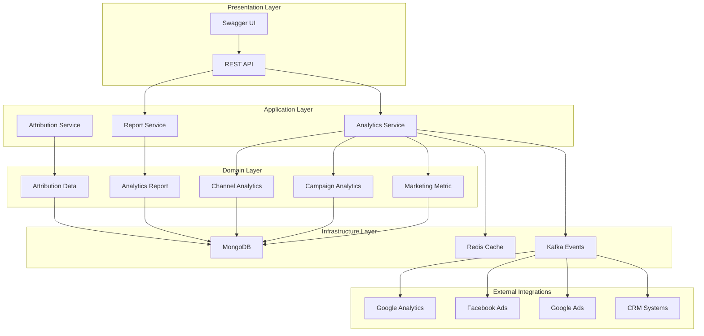
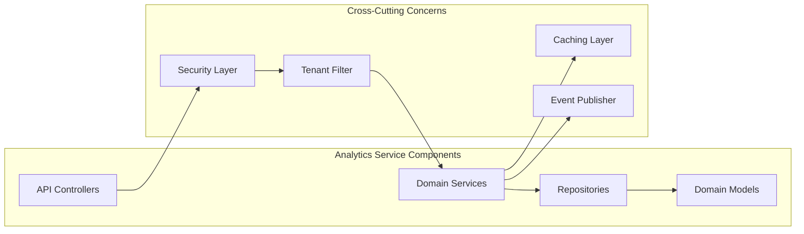
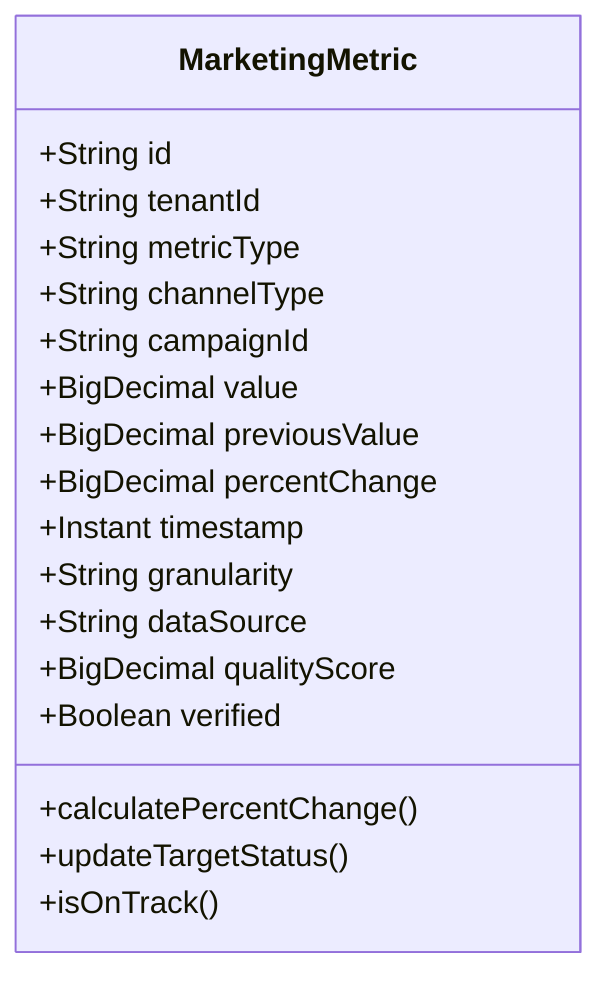
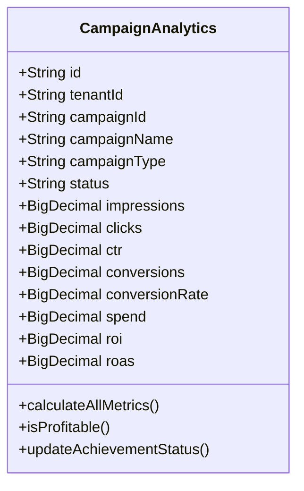
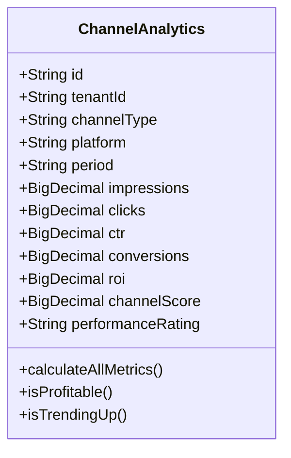
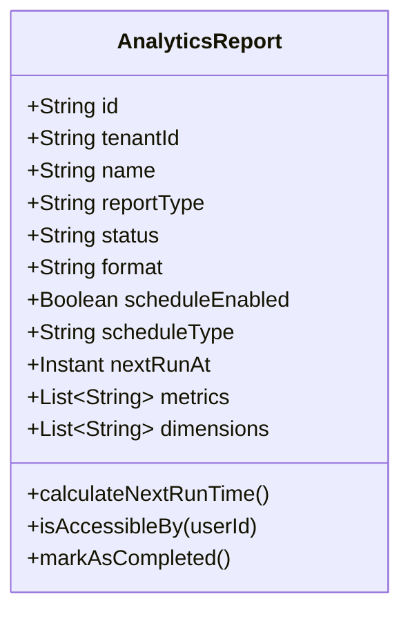
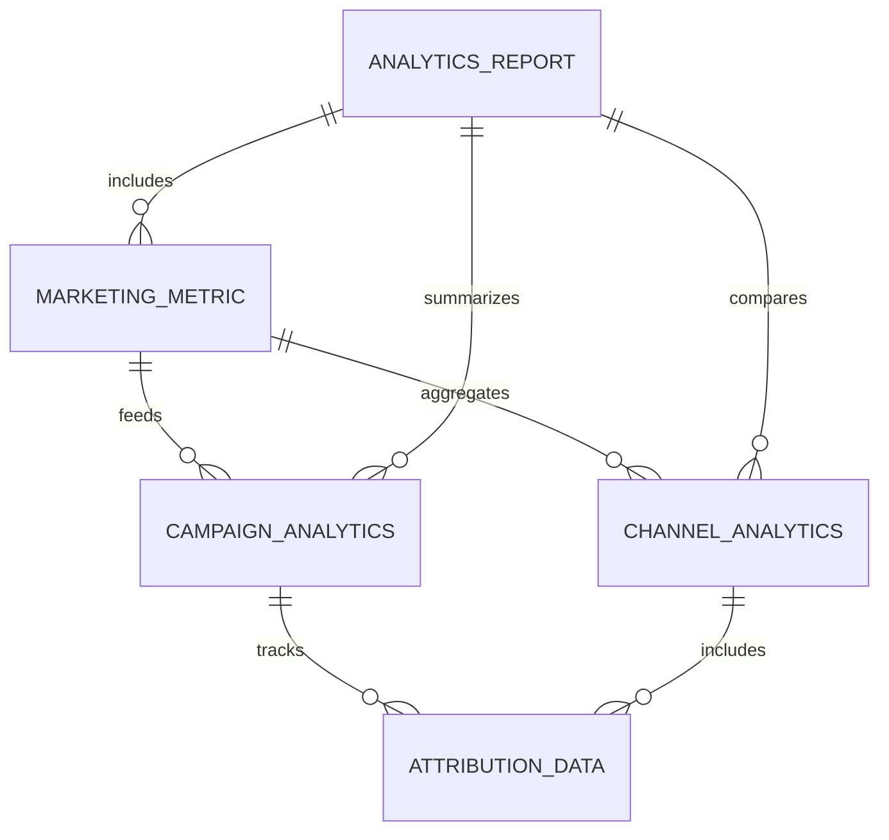
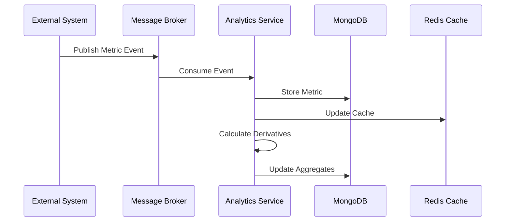
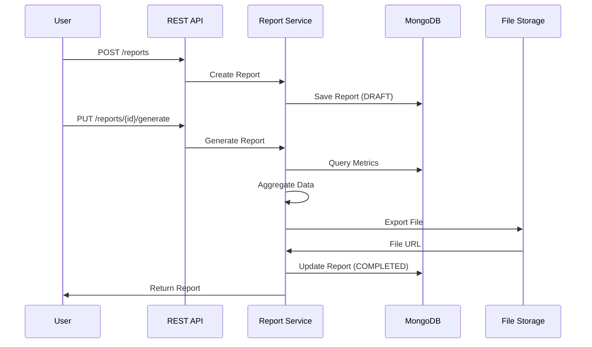

# Analytics Service - Architecture Documentation

## Overview

The Analytics Service is a core component of the Digital Marketing Domain within the Gogidix Ecosystem. It provides comprehensive tracking, analysis, and reporting capabilities for marketing metrics, campaign performance, channel attribution, and ROI calculations.

## Table of Contents

- [Service Purpose](#service-purpose)
- [Architecture Principles](#architecture-principles)
- [System Architecture](#system-architecture)
- [Domain Model](#domain-model)
- [Technology Stack](#technology-stack)
- [Multi-Tenancy](#multi-tenancy)
- [Data Flow](#data-flow)
- [Integration Points](#integration-points)
- [Security](#security)
- [Scalability Considerations](#scalability-considerations)

---

## Service Purpose

The Analytics Service is responsible for:

1. **Metric Collection**: Collecting and storing marketing metrics from various channels
2. **Campaign Analytics**: Tracking and analyzing campaign performance
3. **Channel Analytics**: Comparing performance across marketing channels
4. **Attribution Tracking**: Multi-touch attribution analysis
5. **ROI Calculation**: Return on investment and ROAS calculations
6. **Report Generation**: Creating scheduled and on-demand analytics reports

## Architecture Principles

The service follows these architectural principles:

- **Domain-Driven Design (DDD)**: Clear domain boundaries and ubiquitous language
- **Multi-Tenancy First**: All data isolated by tenant ID
- **Event-Driven**: Asynchronous processing for analytics calculations
- **API-First**: RESTful APIs with OpenAPI/Swagger documentation
- **Cloud-Native**: Designed for containerization and orchestration

## System Architecture

### High-Level Architecture



### Component Architecture



## Domain Model

### Core Entities

#### MarketingMetric
Represents individual marketing metric data points.



#### CampaignAnalytics
Aggregates campaign performance metrics.



#### ChannelAnalytics
Aggregates channel performance metrics.



#### AnalyticsReport
Represents generated analytics reports.



### Entity Relationships



## Technology Stack

### Backend Framework
- **Spring Boot 3.1.5**: Main application framework
- **Spring Data MongoDB**: Database access layer
- **Spring Data Redis**: Caching layer
- **Spring Security**: Security framework

### Database
- **MongoDB**: Primary data store
- **Redis**: Caching and session management
- **Embedded MongoDB**: Test database

### Messaging
- **Apache Kafka**: Event streaming and integration

### API Documentation
- **SpringDoc OpenAPI 2.3.0**: API documentation
- **Swagger UI**: Interactive API console

### Build & Test
- **Maven**: Build tool
- **JUnit 5**: Testing framework
- **Mockito**: Mocking framework
- **Embedded MongoDB**: Integration testing

### Additional Libraries
- **MapStruct 1.5.5**: DTO mapping
- **Lombok 1.18.30**: Code generation
- **Resilience4j 2.1.0**: Circuit breaker and retry
- **Mongock 5.4.0**: Database migrations

## Multi-Tenancy

The service implements tenant isolation at the database level:

### Tenant Isolation Strategy
- **Collection-Level Isolation**: Each document includes a `tenantId` field
- **Query Filtering**: All queries automatically filter by tenant ID
- **Index Strategy**: Compound indexes include tenant ID for query optimization

### Tenant Context
- **RequestContextFilter**: Extracts tenant ID from JWT tokens
- **RequestContextHolder**: Thread-local tenant context
- **BaseRepository**: Automatic tenant filtering in all queries

```java
@Query("{ 'tenantId': ?0 }")
List<T> findAllByTenantId(String tenantId);
```

## Data Flow

### Metric Ingestion Flow



### Report Generation Flow



## Integration Points

### External Service Integrations

1. **Google Analytics API**
   - Web traffic metrics
   - User behavior data
   - Conversion tracking

2. **Facebook Ads API**
   - Ad performance metrics
   - Audience insights
   - Campaign data

3. **Google Ads API**
   - Search campaign metrics
   - Keyword performance
   - Budget utilization

4. **CRM Systems**
   - Lead conversion data
   - Customer lifetime value
   - Revenue attribution

### Internal Service Integrations

1. **Campaign Management Service**
   - Campaign configuration data
   - Budget information
   - Target settings

2. **Budget Management Service**
   - Budget allocation data
   - Spend tracking
   - Forecasting data

3. **Lead Generation Service**
   - Lead quality metrics
   - Conversion funnel data
   - Source attribution

## Security

### Authentication & Authorization
- **JWT Tokens**: Stateless authentication
- **Role-Based Access Control (RBAC)**: User roles and permissions
- **Tenant Isolation**: Automatic tenant filtering

### API Security
- **HTTPS Only**: All endpoints require TLS
- **Rate Limiting**: Request throttling per tenant
- **Input Validation**: Request validation at API boundaries

### Data Security
- **Encryption at Rest**: MongoDB encryption
- **Encryption in Transit**: TLS for all communications
- **Audit Logging**: All mutations logged with user context

## Scalability Considerations

### Horizontal Scaling
- **Stateless Services**: All services are stateless
- **Connection Pooling**: Efficient database connection management
- **Caching Layer**: Redis cache reduces database load

### Performance Optimization
- **Database Indexing**: Compound indexes for common queries
- **Query Optimization**: Efficient MongoDB queries
- **Async Processing**: Event-driven architecture for heavy computations

### Caching Strategy
- **Metric Cache**: Frequently accessed metrics cached in Redis
- **Aggregation Cache**: Pre-computed aggregations cached
- **Cache Invalidation**: Time-based and event-based invalidation

### Batch Processing
- **Metric Batching**: Bulk metric ingestion
- **Scheduled Jobs**: Report generation and aggregation updates
- **Partitioning**: Data partitioned by tenant and date

## Deployment Architecture

### Container Configuration
- **Base Image**: OpenJDK 17-slim
- **Port**: 8086 (configurable)
- **Health Check**: Actuator health endpoint
- **Resource Limits**: CPU and memory constraints

### Environment Variables
```bash
SPRING_DATA_MONGODB_HOST=mongodb
SPRING_DATA_MONGODB_PORT=27017
SPRING_DATA_MONGODB_DATABASE=digital_marketing_analytics
SPRING_REDIS_HOST=redis
SPRING_REDIS_PORT=6379
SPRING_KAFKA_BOOTSTRAP_SERVERS=kafka:9092
```

### Kubernetes Considerations
- **Health Probes**: Liveness and readiness endpoints
- **Config Maps**: Externalized configuration
- **Secrets Management**: Sensitive data in Kubernetes secrets
- **Horizontal Pod Autoscaler**: Auto-scaling based on CPU/memory

---

## Version History

| Version | Date | Changes |
|---------|------|---------|
| 1.0.0 | 2024-01 | Initial release |
