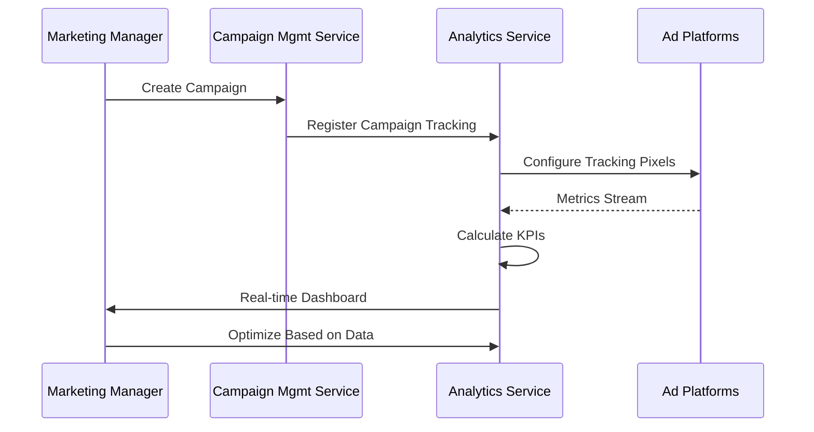
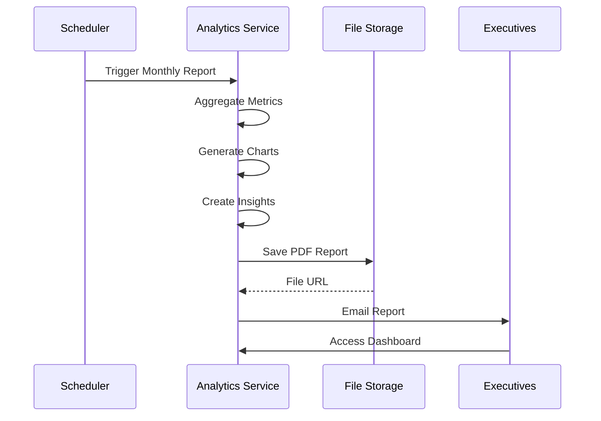

# Analytics Service - Business Use Cases

## Overview

The Analytics Service provides comprehensive analytics capabilities for digital marketing operations. This document outlines the key business use cases, user journeys, and workflows supported by the service.

---

## Table of Contents

1. [Performance Monitoring](#performance-monitoring)
2. [Campaign Optimization](#campaign-optimization)
3. [Channel Comparison](#channel-comparison)
4. [ROI Analysis](#roi-analysis)
5. [Reporting & Dashboards](#reporting--dashboards)
6. [Attribution Tracking](#attribution-tracking)
7. [Budget Allocation](#budget-allocation)
8. [Lead Quality Analysis](#lead-quality-analysis)

---

## Performance Monitoring

### Use Case: Real-Time Campaign Performance Tracking

**Business Goal:** Monitor marketing campaign performance in real-time to make data-driven decisions.

**Actors:**
- Marketing Manager
- Campaign Specialist
- Marketing Analyst

**Preconditions:**
- Campaigns are active
- Tracking pixels are installed
- Data connectors are configured

**Main Flow:**

1. **Access Dashboard**
   - User logs into the marketing dashboard
   - Selects the "Campaign Analytics" view
   - System retrieves real-time metrics

2. **View Key Metrics**
   - Impressions count and trend
   - Click-through rate (CTR)
   - Conversion rate
   - Cost per acquisition (CPA)
   - Return on ad spend (ROAS)

3. **Filter Data**
   - Filter by date range (Today, Yesterday, Last 7 Days, Custom)
   - Filter by campaign type
   - Filter by channel
   - Filter by geographic region

4. **Analyze Trends**
   - View time-series charts
   - Compare with previous period
   - Identify anomalies

5. **Take Action**
   - Pause underperforming ads
   - Increase budget for top performers
   - Adjust targeting parameters

**Postconditions:**
- Performance data is recorded
- Actions are logged
- Stakeholders are notified if thresholds are breached

---

## Campaign Optimization

### Use Case: Automated Campaign Optimization

**Business Goal:** Automatically optimize campaign settings based on performance data.

**Actors:**
- Marketing Automation System
- Campaign Manager

**Preconditions:**
- Campaigns have target KPIs defined
- Optimization rules are configured
- API access is enabled

**Main Flow:**

1. **Collect Performance Data**
   - Service aggregates campaign metrics
   - Calculates performance scores
   - Identifies underperforming elements

2. **Apply Optimization Rules**
   - If CPA > target: Reduce bids or pause ad groups
   - If ROAS < target: Reallocate budget
   - If CTR < target: Test new creatives

3. **Generate Recommendations**
   - System suggests bid adjustments
   - System recommends budget reallocation
   - System flags creative testing opportunities

4. **Execute Changes**
   - Apply automatic changes (if enabled)
   - Queue manual approval requests
   - Log all changes for audit

5. **Monitor Impact**
   - Track performance after changes
   - Measure improvement
   - Adjust rules as needed

**Business Value:**
- Reduced manual workload
- Faster optimization cycles
- Improved campaign performance
- Better ROI

---

## Channel Comparison

### Use Case: Multi-Channel Performance Analysis

**Business Goal:** Compare performance across marketing channels to optimize budget allocation.

**Actors:**
- Marketing Director
- Media Planner
- Marketing Analyst

**Preconditions:**
- Multiple channels are active
- Data is being collected from all channels
- Sufficient historical data exists

**Main Flow:**

1. **Select Comparison Parameters**
   - Choose date range
   - Select channels to compare (Email, Social, Search, Display)
   - Choose metrics to analyze

2. **Generate Comparison Report**
   - System aggregates data by channel
   - Calculates key performance indicators
   - Normalizes metrics for comparison

3. **View Channel Scores**
   - Overall performance score (0-100)
   - Performance rating (Excellent, Good, Average, Poor)
   - Trend direction (Up, Down, Stable)

4. **Analyze Cost Efficiency**
   - Cost per click (CPC) by channel
   - Cost per acquisition (CPA) by channel
   - Cost per thousand impressions (CPM)
   - Budget share vs. conversion share

5. **Review Recommendations**
   - Shift budget to high-performing channels
   - Optimize or pause underperforming channels
   - Test new channels based on opportunities

6. **Export Report**
   - Download as PDF or Excel
   - Schedule recurring reports
   - Share with stakeholders

**Key Metrics Compared:**
- Impressions and reach
- Engagement rate
- Conversion rate
- ROI and ROAS
- Customer acquisition cost
- Customer lifetime value
- Retention rate

---

## ROI Analysis

### Use Case: Marketing Return on Investment Analysis

**Business Goal:** Calculate and analyze marketing ROI to justify budget decisions.

**Actors:**
- CMO / Marketing VP
- Finance Manager
- Marketing Analyst

**Preconditions:**
- Revenue data is available
- Cost data is accurate
- Attribution model is defined

**Main Flow:**

1. **Define Analysis Scope**
   - Select time period
   - Choose campaigns or channels
   - Set baseline for comparison

2. **Calculate ROI Metrics**
   - Total revenue generated
   - Total marketing spend
   - Net profit (Revenue - Spend)
   - ROI % = (Net Profit / Spend) × 100
   - ROAS = Revenue / Spend

3. **Segment Analysis**
   - ROI by campaign
   - ROI by channel
   - ROI by segment/audience
   - ROI by product/service

4. **Compare vs. Targets**
   - Compare against target ROI
   - Compare against industry benchmarks
   - Compare against historical performance

5. **Identify Insights**
   - Most profitable campaigns/channels
   - Break-even points
   - Optimal spend levels
   - Diminishing returns threshold

6. **Make Budget Decisions**
   - Increase budget for high ROI areas
   - Decrease budget for low ROI areas
   - Set ROI targets for future campaigns

**ROI Calculation Methods:**

```
Basic ROI:
ROI = ((Revenue - Spend) / Spend) × 100

Return on Ad Spend (ROAS):
ROAS = Revenue / Spend

Customer Lifetime Value ROI:
ROI = (CLV - CAC) / CAC × 100

Where:
- CAC = Customer Acquisition Cost
- CLV = Customer Lifetime Value
```

---

## Reporting & Dashboards

### Use Case: Automated Marketing Performance Reports

**Business Goal:** Generate and distribute comprehensive marketing performance reports.

**Actors:**
- Marketing Manager
- Executive Team
- Clients (for agencies)

**Preconditions:**
- Report templates are configured
- Data sources are connected
- Delivery settings are configured

**Main Flow:**

1. **Configure Report**
   - Select report type (Campaign Performance, Channel Comparison, ROI Analysis)
   - Choose date range
   - Select campaigns/channels to include
   - Choose metrics to display
   - Set output format (PDF, Excel, PowerPoint)

2. **Customize Content**
   - Add executive summary
   - Include key insights
   - Add recommendations
   - Configure charts and visualizations
   - Add branding (logo, colors)

3. **Set Schedule**
   - Choose frequency (Daily, Weekly, Monthly, Quarterly)
   - Set delivery time
   - Add recipients
   - Configure delivery method (Email, S3, Webhook)

4. **Generate Report**
   - System collects required data
   - Calculates aggregations
   - Generates visualizations
   - Creates insights automatically
   - Compiles final report

5. **Deliver Report**
   - Send email with attachment
   - Upload to S3/shared drive
   - Post webhook notification
   - Update dashboard with latest data

6. **Access Reports**
   - View in application
   - Download from library
   - Share public link
   - Access via API

**Report Types:**

1. **Executive Summary**
   - High-level KPIs
   - Key achievements
   - Budget utilization
   - Top performing campaigns

2. **Campaign Performance**
   - Detailed campaign metrics
   - Trend analysis
   - Creative performance
   - Audience insights

3. **Channel Comparison**
   - Side-by-side comparison
   - Efficiency metrics
   - Budget allocation
   - Recommendations

4. **ROI Analysis**
   - Revenue attribution
   - Cost breakdown
   - Profitability analysis
   - Forecast vs. actual

5. **Custom Reports**
   - User-defined metrics
   - Custom dimensions
   - Branding options
   - Advanced filtering

---

## Attribution Tracking

### Use Case: Multi-Touch Attribution Analysis

**Business Goal:** Understand the customer journey and attribute conversions to appropriate touchpoints.

**Actors:**
- Marketing Analyst
- Attribution Specialist
- Data Scientist

**Preconditions:**
- Tracking is implemented across channels
- Customer journey data is available
- Attribution model is selected

**Main Flow:**

1. **Select Attribution Model**
   - First Touch (first interaction gets 100% credit)
   - Last Touch (last interaction gets 100% credit)
   - Linear (all touchpoints get equal credit)
   - Time Decay (recent touchpoints get more credit)
   - Position Based (first and last get more credit)
   - Custom (algorithmic)

2. **Define Conversion Goals**
   - Purchase
   - Lead submission
   - Sign-up
   - App install
   - Custom event

3. **Set Lookback Window**
   - 7 days
   - 14 days
   - 30 days (default)
   - 90 days
   - Custom

4. **Analyze Customer Journeys**
   - View typical paths
   - Identify common touchpoints
   - Analyze journey length
   - Measure time to convert

5. **Attribute Conversions**
   - Assign credit to each touchpoint
   - Calculate attributed value
   - Determine contribution percentage

6. **Generate Insights**
   - Most valuable channels
   - Optimal touchpoint combinations
   - Journey patterns that convert
   - Underperforming touchpoints

7. **Optimize Marketing Mix**
   - Increase investment in high-impact channels
   - Nurture leads through effective paths
   - Remove or improve low-impact touchpoints

**Attribution Models Explained:**

| Model | Description | Use Case |
|-------|-------------|----------|
| First Touch | First interaction gets 100% credit | Brand awareness campaigns |
| Last Touch | Last interaction gets 100% credit | Direct response campaigns |
| Linear | All touchpoints get equal credit | Consideration phase analysis |
| Time Decay | Recent touchpoints get more credit | Short sales cycles |
| Position Based | First and last get 40% each, middle 20% | Full-funnel attribution |
| Custom | Algorithmic / data-driven | Complex multi-touch scenarios |

---

## Budget Allocation

### Use Case: Data-Driven Budget Optimization

**Business Goal:** Allocate marketing budget across channels and campaigns for maximum ROI.

**Actors:**
- Marketing Director
- Media Buyer
- Finance Manager

**Preconditions:**
- Historical performance data exists
- Budget constraints are defined
- Optimization goals are set

**Main Flow:**

1. **Set Budget Parameters**
   - Total budget available
   - Minimum per-channel allocation
   - Maximum per-channel allocation
   - Time period

2. **Define Optimization Goals**
   - Maximize total conversions
   - Maximize revenue
   - Maximize ROI
   - Achieve target CPA

3. **Analyze Historical Performance**
   - Review past performance by channel
   - Calculate expected returns
   - Identify seasonal patterns
   - Consider market changes

4. **Run Optimization**
   - System simulates different allocations
   - Calculates expected outcomes
   - Recommends optimal distribution
   - Shows trade-offs

5. **Review Recommendations**
   - Compare scenarios
   - View risk assessment
   - Check constraints satisfaction
   - Validate assumptions

6. **Allocate Budget**
   - Set channel budgets
   - Configure campaign spend limits
   - Set pacing rules
   - Schedule automatic adjustments

7. **Monitor & Adjust**
   - Track actual vs. planned spend
   - Measure performance
   - Reallocate as needed
   - Report on results

**Budget Allocation Factors:**
- Historical ROI
- Seasonality
- Market conditions
- Competition
- Creative performance
- Audience saturation
- External events

---

## Lead Quality Analysis

### Use Case: Marketing Lead Quality Assessment

**Business Goal:** Evaluate and improve the quality of leads generated by marketing campaigns.

**Actors:**
- Marketing Manager
- Sales Manager
- Lead Generation Specialist

**Preconditions:**
- CRM integration is active
- Lead scoring is configured
- Sales feedback is available

**Main Flow:**

1. **Define Lead Quality Criteria**
   - Demographic fit
   - Firmographic fit (B2B)
   - Engagement score
   - Behavior indicators
   - Lead source

2. **Track Lead Metrics**
   - Lead volume by source
   - Lead acceptance rate
   - Contact rate
   - Qualification rate
   - Conversion to opportunity
   - Revenue per lead

3. **Analyze by Source**
   - Compare lead quality by channel
   - Compare lead quality by campaign
   - Compare lead quality by creative
   - Identify best sources

4. **Calculate Cost Metrics**
   - Cost per lead (CPL)
   - Cost per qualified lead (CPQL)
   - Cost per opportunity (CPO)
   - Cost per customer acquisition (CAC)

5. **Optimize Lead Generation**
   - Shift budget to high-quality sources
   - Improve targeting for low-quality sources
   - Adjust lead scoring models
   - Refine qualification criteria

6. **Align with Sales**
   - Share lead quality reports
   - Get sales feedback
   - Adjust handoff criteria
   - Close the loop on conversions

**Lead Quality Metrics:**

| Metric | Description | Target |
|--------|-------------|--------|
| Lead Acceptance Rate | % of leads accepted by sales | >80% |
| Contact Rate | % of leads successfully contacted | >60% |
| Qualification Rate | % of leads that become qualified | >40% |
| Conversion Rate | % of leads that become customers | >10% |
| Revenue Per Lead | Average revenue generated per lead | Increasing |

---

## Data Quality Management

### Use Case: Ensuring Analytics Data Accuracy

**Business Goal:** Maintain high data quality for reliable analytics and reporting.

**Actors:**
- Data Analyst
- Marketing Operations
- IT Support

**Preconditions:**
- Data sources are connected
- Validation rules are configured
- Monitoring is active

**Main Flow:**

1. **Monitor Data Quality**
   - Track data freshness scores
   - Check for missing values
   - Identify anomalies
   - Verify data consistency

2. **Validate Incoming Data**
   - Check data types and formats
   - Validate value ranges
   - Cross-reference with sources
   - Flag suspicious data

3. **Handle Issues**
   - Quarantine bad data
   - Notify data owners
   - Correct errors
   - Document issues

4. **Improve Quality**
   - Update validation rules
   - Improve source configurations
   - Add automated checks
   - Train data providers

5. **Report on Quality**
   - Generate quality dashboards
   - Track quality trends
   - Report improvement metrics
   - Identify recurring issues

---

## Integration Scenarios

### Campaign Launch Workflow



### Monthly Reporting Workflow



---

## Success Metrics

The Analytics Service contributes to the following business success metrics:

1. **Marketing Efficiency**
   - Reduced cost per acquisition (CPA)
   - Improved return on ad spend (ROAS)
   - Higher conversion rates

2. **Decision Quality**
   - Data-driven budget allocation
   - Faster optimization cycles
   - Reduced guesswork

3. **Operational Excellence**
   - Automated reporting
   - Reduced manual analysis time
   - Improved data accuracy

4. **Revenue Growth**
   - Better campaign performance
   - Optimized marketing mix
   - Improved lead quality

---

## Future Enhancements

Planned features for future releases:

1. **Predictive Analytics**
   - Forecast future performance
   - Predict churn risk
   - Recommend optimal actions

2. **Machine Learning**
   - Automated anomaly detection
   - Smart budget optimization
   - Personalized recommendations

3. **Advanced Attribution**
   - Algorithmic attribution models
   - Cross-device tracking
   - Unified customer view

4. **Real-Time Alerts**
   - Performance threshold alerts
   - Anomaly notifications
   - Opportunity alerts
