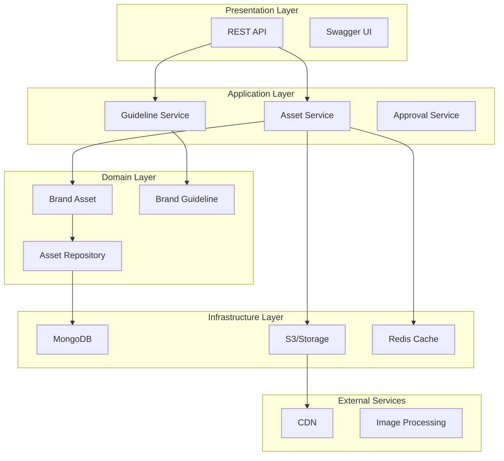
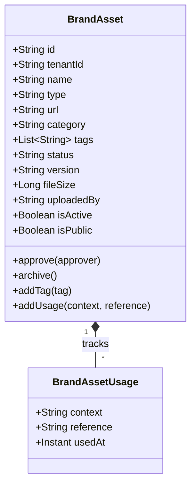
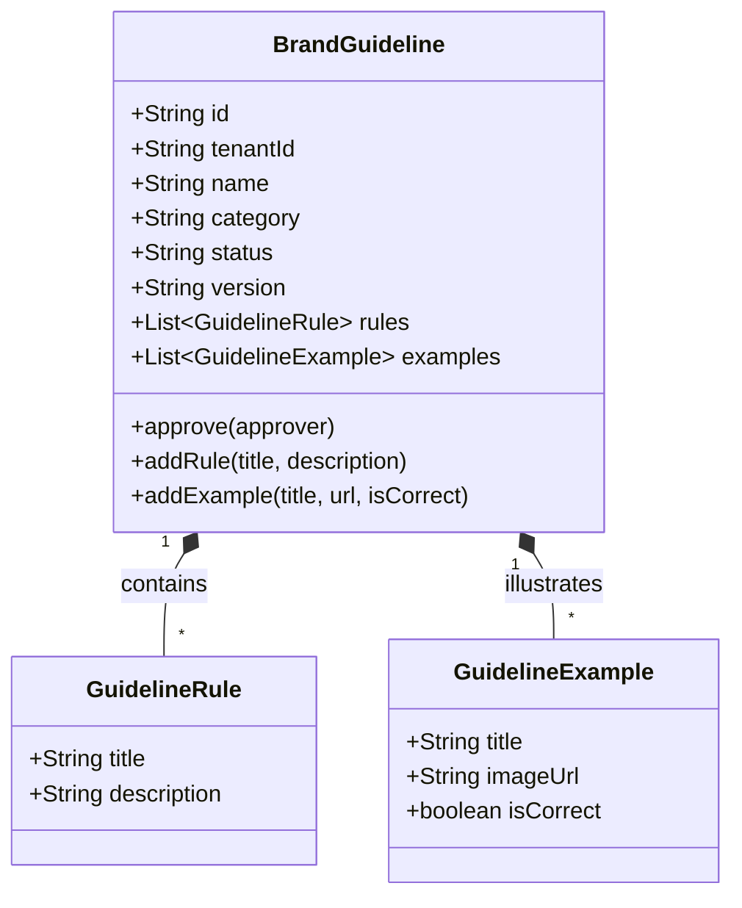
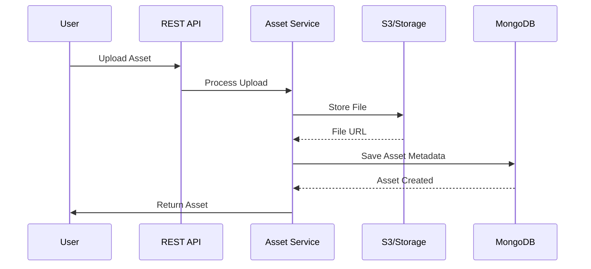

# Brand Management Service - Architecture Documentation

## Overview

The Brand Management Service is a core component of the Digital Marketing Domain within the Gogidix Ecosystem. It provides comprehensive brand asset management, brand guidelines enforcement, and brand consistency monitoring across all marketing channels.

## Table of Contents

- [Service Purpose](#service-purpose)
- [Architecture Principles](#architecture-principles)
- [System Architecture](#system-architecture)
- [Domain Model](#domain-model)
- [Technology Stack](#technology-stack)
- [Multi-Tenancy](#multi-tenancy)
- [Data Flow](#data-flow)
- [Integration Points](#integration-points)
- [Security](#security)

---

## Service Purpose

The Brand Management Service is responsible for:

1. **Brand Asset Management**: Centralized storage and management of brand assets (logos, images, videos, templates, etc.)
2. **Brand Guidelines**: Creation and distribution of brand usage guidelines
3. **Asset Approval Workflow**: Review and approval processes for brand assets
4. **Usage Tracking**: Monitoring where and how brand assets are used
5. **Brand Consistency**: Ensuring consistent brand representation across channels

## Architecture Principles

- **Domain-Driven Design**: Clear domain boundaries with ubiquitous language
- **Multi-Tenancy First**: Complete tenant isolation at all levels
- **Asset Storage Abstraction**: Support for multiple storage backends
- **Event-Driven**: Asynchronous processing for heavy operations
- **API-First**: RESTful APIs with comprehensive documentation

## System Architecture

### High-Level Architecture

## Domain Model

### BrandAsset

Core entity representing a brand asset.

### BrandGuideline

Entity representing brand usage guidelines.

## Technology Stack

- **Spring Boot 3.x**: Application framework
- **Spring Data MongoDB**: Data persistence
- **MongoDB**: Document database
- **Lombok**: Code generation
- **MapStruct**: DTO mapping

## Multi-Tenancy

All data is isolated by tenant ID through:
- Document-level `tenantId` field
- Compound indexes including tenant
- Repository-level filtering
- Request context-based tenant resolution

## Data Flow

### Asset Upload Flow

## Integration Points

- **Campaign Management Service**: Provides assets for campaigns
- **Content Management Service**: Enforces brand guidelines
- **Email Marketing Service**: Supplies email templates
- **Social Media Service**: Provides social media assets
- **Analytics Service**: Tracks asset usage metrics

## Security

- JWT-based authentication
- Role-based access control
- Tenant data isolation
- Asset access control (public/private)
- Audit logging for all mutations
