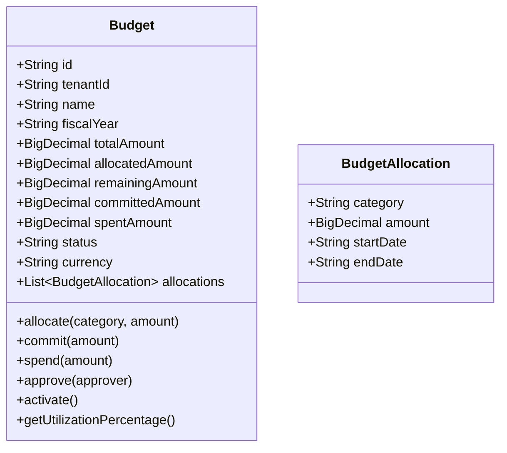
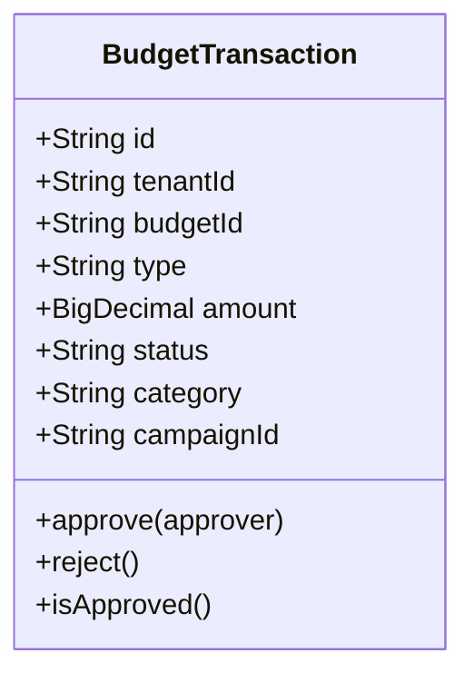

# Budget Management Service - Architecture Documentation

## Overview

The Budget Management Service handles marketing budget planning, allocation, tracking, and reporting. It ensures fiscal responsibility and provides real-time visibility into marketing spend.

## Service Purpose

1. **Budget Planning**: Create and manage marketing budgets by fiscal year, department, and campaign
2. **Fund Allocation**: Allocate funds to different marketing activities and channels
3. **Expense Tracking**: Track committed and actual spend against budgets
4. **Approval Workflow**: Budget approval and activation processes
5. **Forecasting**: Predict budget utilization and recommend adjustments

## Domain Model

### Budget

### BudgetTransaction

## Technology Stack

- **Spring Boot 3.x**: Application framework
- **Spring Data MongoDB**: Data persistence
- **MongoDB**: Document database
- **Lombok**: Code generation

## Key Features

- Multi-tenant budget isolation
- Hierarchical budget structure (parent/child budgets)
- Multi-currency support with exchange rate tracking
- Approval workflow integration
- Real-time budget availability checks
- Comprehensive audit trail

## Integration Points

- **Campaign Management**: Validates campaign budget availability
- **Analytics Service**: Provides budget vs. actual data
- **Procurement**: Processes vendor payments against budgets
- **Finance**: Synchronizes financial reporting
