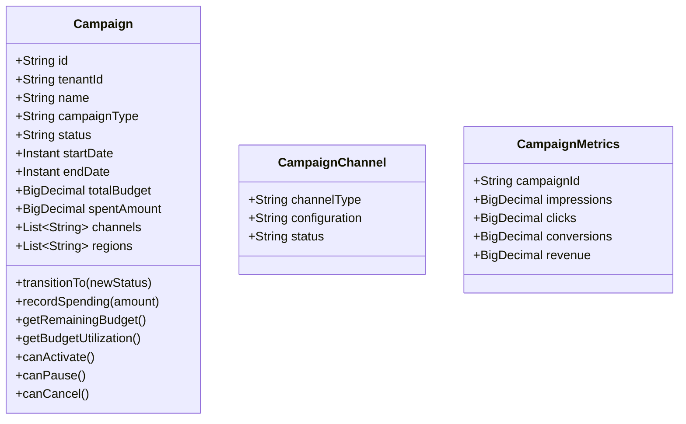
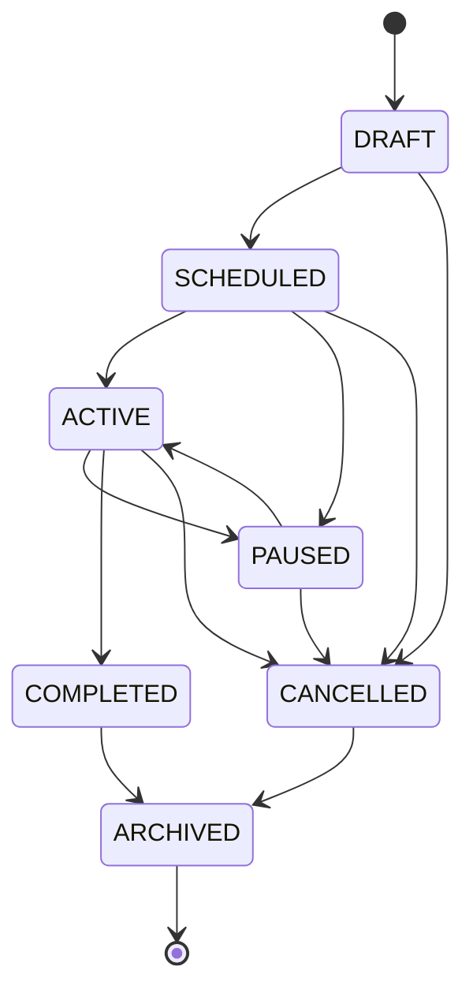

# Campaign Management Service - Architecture Documentation

## Overview

The Campaign Management Service is the central orchestrator for marketing campaigns within the Digital Marketing Domain. It handles campaign creation, execution, monitoring, and optimization across all marketing channels.

## Service Purpose

1. **Campaign Lifecycle Management**: Create, schedule, execute, pause, and complete campaigns
2. **Multi-Channel Orchestration**: Coordinate campaigns across email, social, search, display, and more
3. **Budget Tracking**: Monitor campaign spend against allocated budgets
4. **Target Audience Management**: Define and manage campaign target audiences
5. **Performance Monitoring**: Track KPIs and campaign metrics in real-time

## Domain Model

### Campaign

## Status Transitions

## Technology Stack

- **Spring Boot 3.x**: Application framework
- **Spring Data MongoDB**: Data persistence
- **MongoDB**: Document database
- **Lombok**: Code generation

## Key Features

- Multi-tenant campaign isolation
- Hierarchical campaign structure (parent/child campaigns)
- Campaign templates for quick setup
- Approval workflow integration
- Real-time budget tracking
- Multi-channel coordination
- Campaign cloning from templates

## Integration Points

- **Budget Management**: Validates and records campaign spend
- **Brand Management**: Enforces brand guidelines
- **Content Management**: Supplies campaign content
- **Email Marketing**: Executes email campaigns
- **Social Media**: Publishes social campaigns
- **Analytics Service**: Tracks campaign performance
- **Lead Generation**: Captures campaign leads
