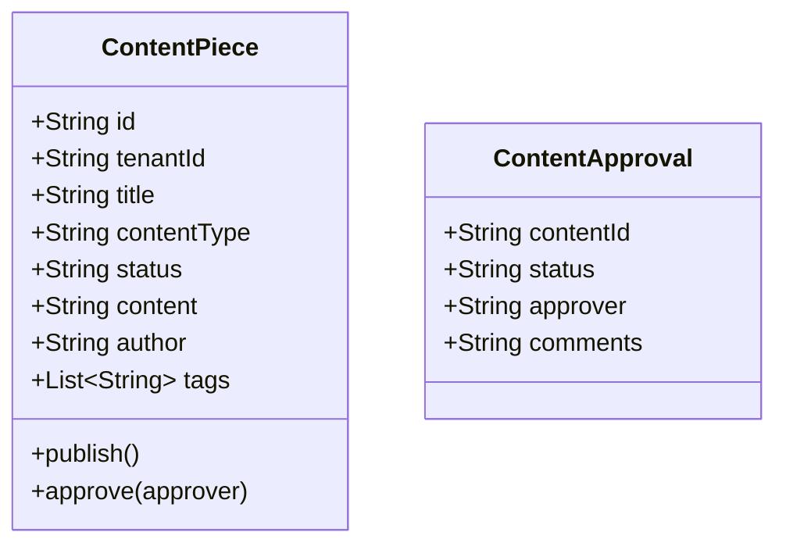

# Content Management Service - Architecture Documentation

## Overview

The Content Management Service handles the creation, approval, scheduling, and distribution of marketing content across all channels.

## Service Purpose

1. **Content Creation**: Create and manage marketing content pieces
2. **Content Approval**: Workflow for reviewing and approving content
3. **Content Scheduling**: Schedule content publication across channels
4. **Content Repository**: Centralized content storage and management
5. **SEO Optimization**: SEO metadata and optimization features

## Domain Model

### ContentPiece

## Technology Stack

- **Spring Boot 3.x**: Application framework
- **Spring Data MongoDB**: Data persistence
- **MongoDB**: Document database
- **Lombok**: Code generation

## Key Features

- Multi-tenant content isolation
- Content versioning
- Approval workflow
- Content scheduling
- SEO metadata management
- Multi-format content support
