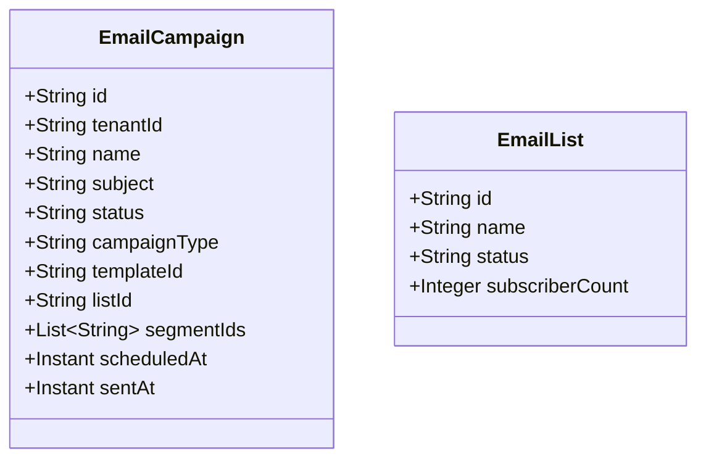

# Email Marketing Service - Architecture Documentation

## Overview

The Email Marketing Service manages email campaigns, lists, templates, and delivery tracking.

## Service Purpose

1. **Campaign Management**: Create and manage email campaigns
2. **List Management**: Manage email lists and segments
3. **Template Management**: Email template creation and management
4. **Delivery Tracking**: Track email sends, opens, clicks
5. **Automation**: Automated email sequences and triggers

## Domain Model

### EmailCampaign

## Technology Stack

- **Spring Boot 3.x**: Application framework
- **Spring Data MongoDB**: Data persistence
- **MongoDB**: Document database

## Key Features

- Multi-tenant email campaign isolation
- Email list segmentation
- Template management
- A/B testing support
- Delivery tracking
- Automated sequences
