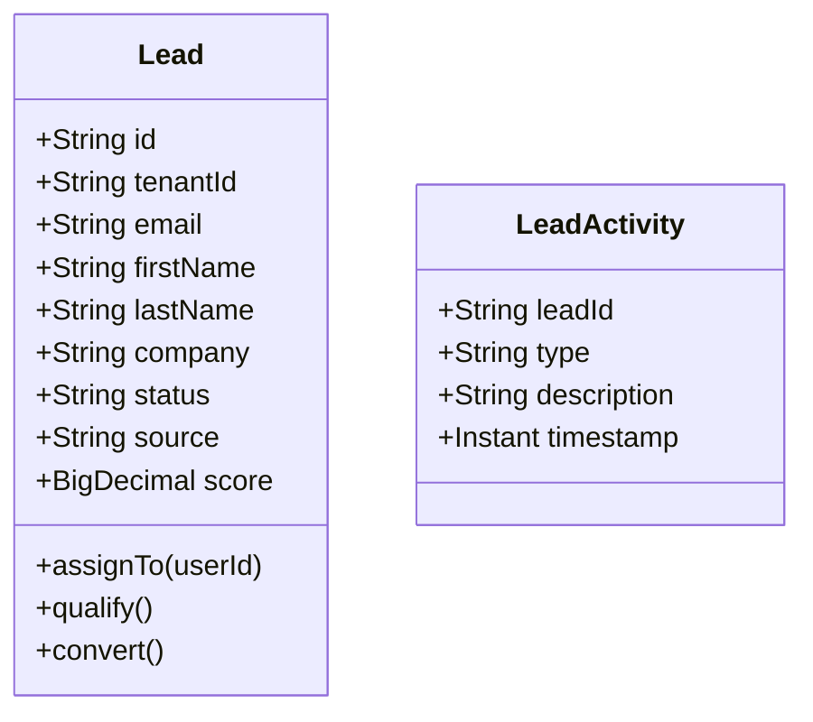

# Lead Generation Service - Architecture Documentation

## Overview

The Lead Generation Service captures, qualifies, and manages leads from all marketing channels.

## Service Purpose

1. **Lead Capture**: Capture leads from web forms, landing pages, events
2. **Lead Qualification**: Score and qualify leads based on criteria
3. **Lead Assignment**: Route leads to sales teams or nurturing
4. **Lead Nurturing**: Automated nurturing sequences
5. **Source Tracking**: Track lead sources and attribution

## Domain Model

### Lead

## Technology Stack

- **Spring Boot 3.x**: Application framework
- **Spring Data MongoDB**: Data persistence
- **MongoDB**: Document database

## Key Features

- Multi-tenant lead isolation
- Lead scoring
- Source attribution
- Lead routing
- Nurturing sequences
- Integration with CRM
