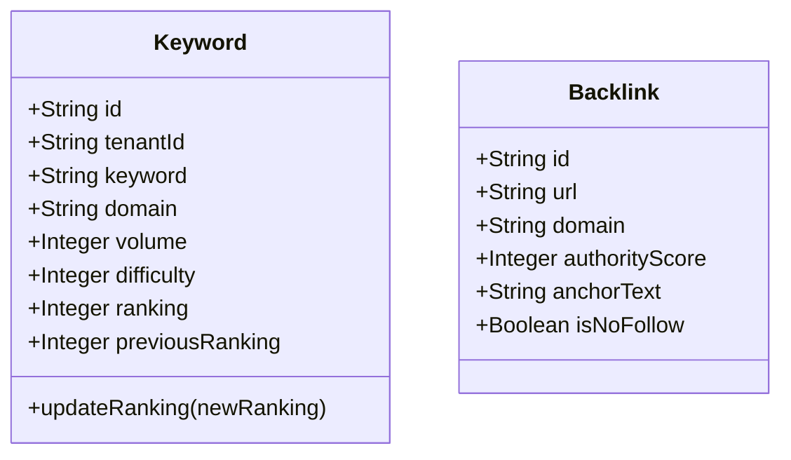

# SEO Service - Architecture Documentation

## Overview

The SEO Service manages search engine optimization activities including keyword tracking, backlink monitoring, and SEO performance reporting.

## Service Purpose

1. **Keyword Tracking**: Monitor keyword rankings and performance
2. **Backlink Monitoring**: Track backlinks and domain authority
3. **Technical SEO**: Site audits and technical issue tracking
4. **Content Optimization**: SEO recommendations for content
5. **Competitor Analysis**: Competitor keyword and backlink analysis

## Domain Model

### Keyword

## Technology Stack

- **Spring Boot 3.x**: Application framework
- **Spring Data MongoDB**: Data persistence
- **MongoDB**: Document database

## Key Features

- Multi-tenant keyword tracking
- Rank position monitoring
- Backlink analysis
- Competitor tracking
- SEO recommendations
- Automated site audits
