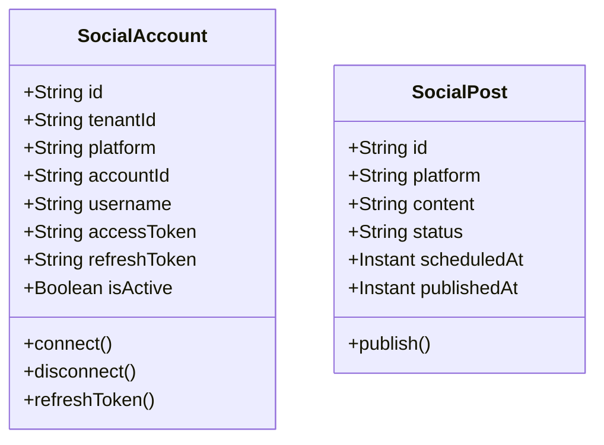

# Social Media Service - Architecture Documentation

## Overview

The Social Media Service manages social media accounts, content publishing, scheduling, and engagement tracking across all major social platforms.

## Service Purpose

1. **Account Management**: Connect and manage social media accounts
2. **Content Publishing**: Publish content to social platforms
3. **Scheduling**: Schedule posts for future publication
4. **Engagement Tracking**: Monitor likes, shares, comments, followers
5. **Social Listening**: Track brand mentions and sentiment

## Domain Model

### SocialAccount

## Technology Stack

- **Spring Boot 3.x**: Application framework
- **Spring Data MongoDB**: Data persistence
- **MongoDB**: Document database

## Key Features

- Multi-platform support (Facebook, Twitter, Instagram, LinkedIn, TikTok, YouTube, Pinterest)
- OAuth token management
- Post scheduling
- Engagement analytics
- Social listening
- Multi-tenant isolation
