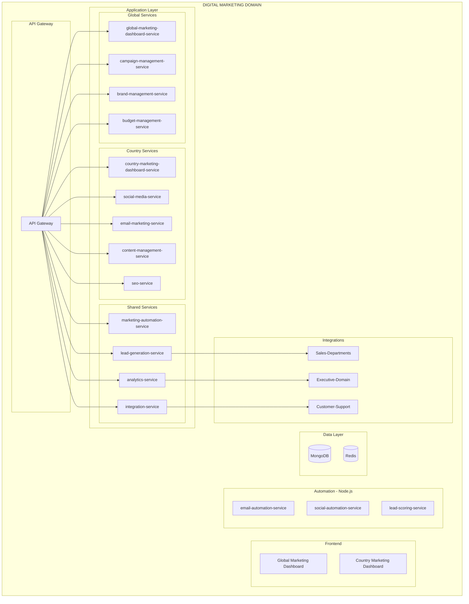

# PRD: Digital-Marketing Domain

**Version:** 1.0
**Date:** 2026-01-29
**Status:** Product Requirements Document
**Domain:** Management-Domain / Digital-Marketing

---

## Business Purpose

Execute global marketing campaigns with local relevance and generate qualified leads for sales teams.

## User Personas

1. **Global CMO (HQ)** - Marketing strategy, brand management
2. **Country Marketing Manager** - Local campaigns execution
3. **Campaign Manager** - Campaign operations
4. **Sales Team** - Lead recipients

## Domain Architecture



## Service Inventory

### Java Backend Services (12)

| Service | Priority |
|---------|----------|
| global-marketing-dashboard-service | P0 |
| campaign-management-service | P0 |
| brand-management-service | P1 |
| budget-management-service | P0 |
| country-marketing-dashboard-service | P0 |
| social-media-service | P0 |
| email-marketing-service | P0 |
| content-management-service | P1 |
| seo-service | P1 |
| marketing-automation-service | P0 |
| lead-generation-service | P0 |
| analytics-service | P0 |
| integration-service | P1 |

### Node.js Services (3)

| Service | Priority |
|---------|----------|
| email-automation-service | P0 |
| social-automation-service | P1 |
| lead-scoring-service | P1 |

### Frontend (2)

| Application | Priority |
|-------------|----------|
| global-marketing-dashboard | P0 |
| country-marketing-dashboard | P0 |

## Integration Points

```
Digital-Marketing → Sales-Departments
├── Lead handoff
├── Lead quality feedback
└── Campaign attribution

Digital-Marketing → Executive-Domain
├── Marketing performance
└── ROI analytics
```

---

## Implementation Roadmap

### Phase 1: Foundation (Weeks 1-2)
- [ ] Folder structure setup
- [ ] Multi-tenancy framework
- [ ] Base domain models

### Phase 2: Core Services (Weeks 3-6)
- [ ] campaign-management-service
- [ ] lead-generation-service
- [ ] analytics-service
- [ ] Dashboards

### Phase 3: Channels (Weeks 7-10)
- [ ] email-marketing-service
- [ ] social-media-service
- [ ] content-management-service
- [ ] seo-service

### Phase 4: Automation (Weeks 11-12)
- [ ] marketing-automation-service
- [ ] Node.js automation services
- [ ] Integration with Sales

### Phase 5: Advanced (Weeks 13-14)
- [ ] brand-management-service
- [ ] budget-management-service
- [ ] Advanced analytics

---

**End of PRD: Digital-Marketing Domain**
