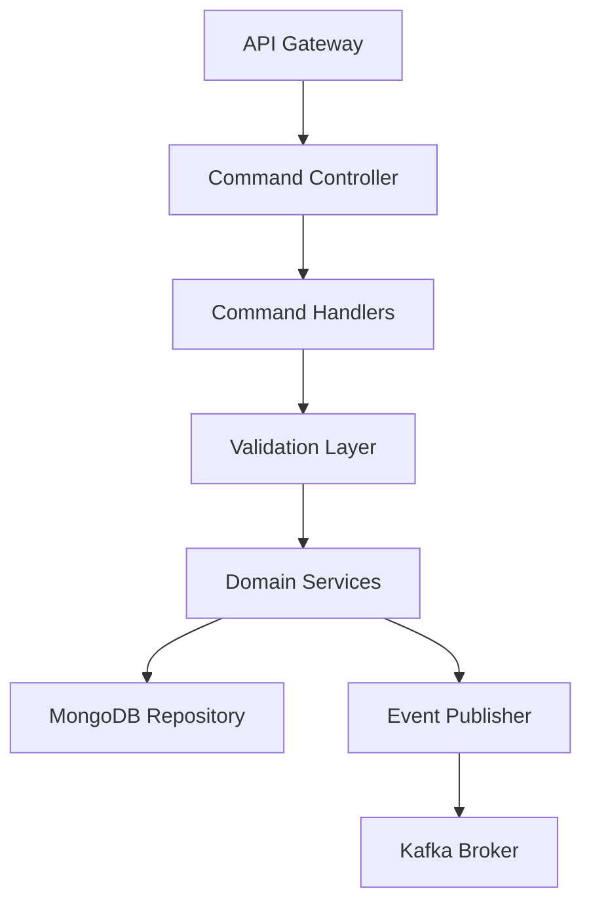

# Executive Command Service - Architecture Documentation

## Overview
The Executive Command Service handles all write operations for the Executive Domain using the CQRS (Command Query Responsibility Segregation) pattern. It processes commands that modify state and publishes events for the query side to consume.

## Technology Stack
- **Runtime**: Node.js 18+
- **Framework**: Express.js
- **Database**: MongoDB (primary write store)
- **Cache**: Redis (using ioredis)
- **Message Queue**: Kafka (event publishing)
- **Validation**: Joi + express-validator
- **Logging**: Winston
- **Testing**: Jest + Supertest

## Architecture



## Key Components

### API Layer
- REST endpoints for command operations
- Request validation middleware
- Authentication middleware
- Rate limiting

### Command Handlers
- CreateCommandHandler
- UpdateCommandHandler
- DeleteCommandHandler
- Domain-specific command handlers

### Domain Layer
- Business logic enforcement
- Validation rules
- State transitions

### Event Publishing
- Kafka event producer
- Event schema validation
- Retry logic

## CQRS Implementation

This service implements the Command side of CQRS:
- Handles all write operations
- Validates business rules
- Publishes domain events
- Does not expose read operations (handled by Query Service)

## API Endpoints

- POST /api/v1/commands/analytics - Create analytics
- PUT /api/v1/commands/analytics/:id - Update analytics
- DELETE /api/v1/commands/analytics/:id - Delete analytics
- POST /api/v1/commands/approvals - Create approval
- PUT /api/v1/commands/approvals/:id/submit - Submit approval
- POST /api/v1/commands/strategies - Create strategy

## Deployment

```yaml
# Environment variables
NODE_ENV: production
PORT: 3000
MONGODB_URI: mongodb://mongodb:27017/executive_command
REDIS_URI: redis://redis:6379
KAFKA_BROKERS: kafka:9092
```

## Monitoring

- Health check endpoint: /health
- Metrics endpoint: /metrics
- Logging: Winston with MongoDB transport
