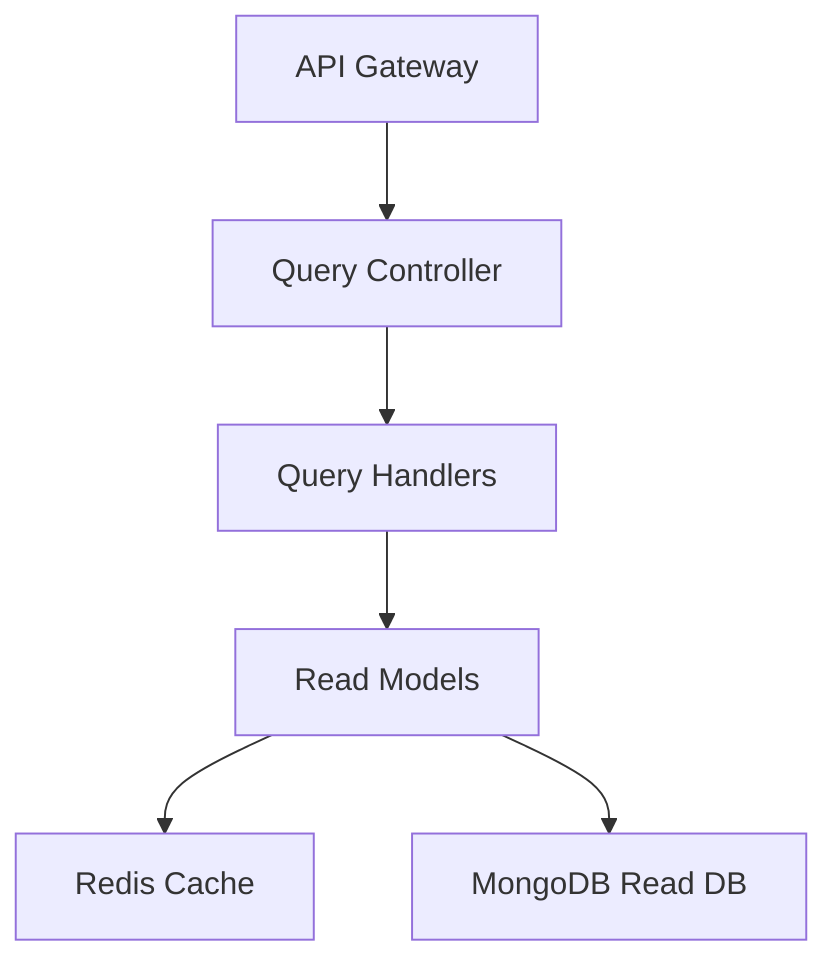

# Executive Query Service - Architecture Documentation

## Overview
The Executive Query Service handles all read operations for the Executive Domain using the CQRS pattern. It provides optimized read models and denormalized views for fast querying.

## Technology Stack
- **Runtime**: Node.js 18+
- **Framework**: Express.js
- **Database**: MongoDB (read-optimized)
- **Cache**: Redis (using ioredis)
- **Testing**: Jest + Supertest

## Architecture

## Key Components

### API Layer
- REST endpoints for query operations
- Response caching middleware
- Pagination support

### Query Handlers
- AnalyticsQueryHandler
- ApprovalQueryHandler
- StrategyQueryHandler
- DashboardQueryHandler

### Read Models
- Denormalized views
- Projection queries
- Aggregation pipelines

## CQRS Implementation

This service implements the Query side of CQRS:
- Handles all read operations
- Optimized for fast queries
- Separate read database
- Materialized views
- Cache-first strategy

## API Endpoints

- GET /api/v1/query/analytics - List analytics
- GET /api/v1/query/analytics/:id - Get analytics by ID
- GET /api/v1/query/approvals - List approvals
- GET /api/v1/query/approvals/pending - Get pending approvals
- GET /api/v1/query/dashboard - Get dashboard data
