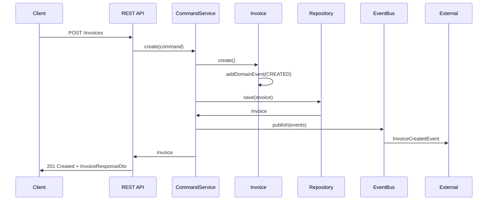
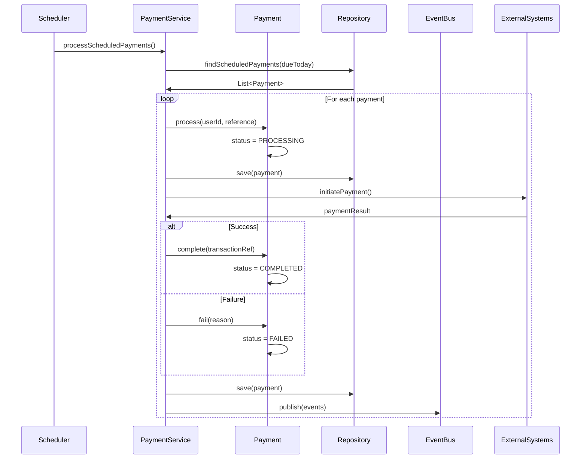
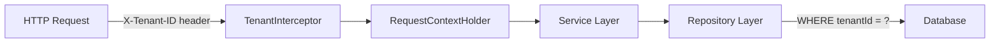
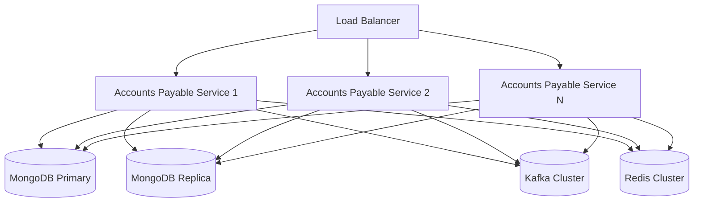

# Accounts Payable Service - Architecture Documentation

## Overview

The Accounts Payable Service is a Spring Boot-based microservice that manages vendor invoices, payments, and vendor relationships within the Gogidix Finance Ecosystem. It implements a Hexagonal (Ports and Adapters) architecture pattern, ensuring clean separation between the domain logic and external dependencies.

## Architecture Principles

### 1. Hexagonal Architecture
The service follows the Hexagonal Architecture pattern with clear separation of concerns:

```
┌─────────────────────────────────────────────────────────────┐
│                    Interfaces Layer                         │
│  ┌──────────────┐  ┌──────────────┐  ┌──────────────┐     │
│  │   REST API   │  │ Event        │  │   Message    │     │
│  │ Controllers  │  │ Publishers   │  │   Consumers  │     │
│  └──────────────┘  └──────────────┘  └──────────────┘     │
└─────────────────────────────────────────────────────────────┘
                            │
                            ▼
┌─────────────────────────────────────────────────────────────┐
│                   Application Layer                         │
│  ┌──────────────┐  ┌──────────────┐  ┌──────────────┐     │
│  │   Command    │  │    Query     │  │    DTOs      │     │
│  │  Services    │  │  Services    │  │              │     │
│  └──────────────┘  └──────────────┘  └──────────────┘     │
└─────────────────────────────────────────────────────────────┘
                            │
                            ▼
┌─────────────────────────────────────────────────────────────┐
│                      Domain Layer                           │
│  ┌──────────────┐  ┌──────────────┐  ┌──────────────┐     │
│  │   Domain     │  │   Domain     │  │   Domain     │     │
│  │   Models     │  │   Events     │  │   Ports      │     │
│  └──────────────┘  └──────────────┘  └──────────────┘     │
│                                                              │
│  Core Business Logic:                                       │
│  - Invoice entity with approval workflow                    │
│  - Vendor entity with lifecycle management                  │
│  - Payment entity with status transitions                   │
└─────────────────────────────────────────────────────────────┘
                            │
                            ▼
┌─────────────────────────────────────────────────────────────┐
│                  Infrastructure Layer                       │
│  ┌──────────────┐  ┌──────────────┐  ┌──────────────┐     │
│  │  MongoDB     │  │   Kafka      │  │    Redis     │     │
│  │ Repository   │  │ Adapter      │  │   Cache      │     │
│  └──────────────┘  └──────────────┘  └──────────────┘     │
└─────────────────────────────────────────────────────────────┘
```

### 2. Domain Model Design

#### Invoice Entity
- **Aggregate Root**: Yes
- **Lifecycle**: DRAFT → PENDING → APPROVED → PAID
- **Key Behaviors**:
  - Submit for approval
  - Approve at multiple levels (Manager, Finance, Executive)
  - Mark as paid/partially paid
  - Calculate tax and discounts
  - Track overdue status

#### Vendor Entity
- **Aggregate Root**: Yes
- **Lifecycle**: PENDING_APPROVAL → ACTIVE → INACTIVE/SUSPENDED/BLACKLISTED
- **Key Behaviors**:
  - Registration and approval
  - Payment terms management
  - Bank information management
  - Preferred vendor designation

#### Payment Entity
- **Aggregate Root**: Yes
- **Lifecycle**: PENDING → SCHEDULED → PROCESSING → COMPLETED
- **Key Behaviors**:
  - Schedule future payments
  - Process and complete payments
  - Handle payment failures
  - Support multi-invoice allocations

### 3. Technology Stack

| Component | Technology | Version |
|-----------|------------|---------|
| Framework | Spring Boot | 3.1.5 |
| Language | Java | 17 |
| Database | MongoDB | 6.x |
| Message Broker | Apache Kafka | 3.x |
| Cache | Redis | 7.x |
| Build Tool | Maven | 3.9+ |
| Testing | JUnit 5, Mockito | 5.10.1, 5.7.0 |

## Component Architecture

### Domain Layer

```
domain/
├── model/
│   ├── Invoice.java           # Invoice aggregate root
│   ├── Vendor.java            # Vendor aggregate root
│   ├── Payment.java           # Payment aggregate root
│   ├── PaymentSchedule.java   # Payment schedule value object
│   └── VendorTerm.java        # Vendor terms value object
├── event/
│   ├── InvoiceCreatedEvent.java
│   ├── InvoiceApprovedEvent.java
│   ├── PaymentProcessedEvent.java
│   └── VendorRegisteredEvent.java
├── port/
│   ├── in/                    # Input ports (use cases)
│   │   ├── InvoiceCommand.java
│   │   ├── InvoiceQuery.java
│   │   ├── VendorCommand.java
│   │   ├── VendorQuery.java
│   │   ├── PaymentCommand.java
│   │   └── PaymentQuery.java
│   └── out/                   # Output ports (infrastructure)
│       └── EventPublisher.java
└── repository/
    ├── InvoiceRepository.java
    ├── VendorRepository.java
    └── PaymentRepository.java
```

### Application Layer

```
application/
├── service/
│   ├── InvoiceCommandService.java    # Invoice write operations
│   ├── InvoiceQueryService.java      # Invoice read operations
│   ├── VendorCommandService.java     # Vendor write operations
│   ├── VendorQueryService.java       # Vendor read operations
│   ├── PaymentCommandService.java    # Payment write operations
│   ├── PaymentQueryService.java      # Payment read operations
│   └── AccountsPayableService.java   # Orchestration service
└── dto/
    └── response/
        ├── InvoiceResponseDto.java
        ├── VendorResponseDto.java
        ├── PaymentResponseDto.java
        └── APSummaryDto.java
```

### Infrastructure Layer

```
infrastructure/
├── persistence/
│   └── mongo/
│       ├── MongoInvoiceRepository.java
│       ├── MongoVendorRepository.java
│       └── MongoPaymentRepository.java
├── messaging/
│   └── kafka/
│       └── KafkaEventPublisher.java
├── config/
│   ├── MongoConfig.java
│   ├── KafkaConfig.java
│   ├── RedisConfig.java
│   └── WebConfig.java
└── security/
    └── TenantInterceptor.java
```

### Interfaces Layer

```
interfaces/
└── rest/
    ├── InvoiceController.java
    ├── VendorController.java
    ├── PaymentController.java
    ├── AccountsPayableController.java
    └── GlobalExceptionHandler.java
```

## Data Flow

### Invoice Processing Flow



### Payment Processing Flow



## Multi-Tenancy

The service implements multi-tenancy at the database level:

1. **Tenant Isolation**: All entities include a `tenantId` field
2. **Data Segregation**: All queries filter by `tenantId`
3. **Security**: `TenantInterceptor` validates tenant context on all requests

### Tenant Context Flow



## Event-Driven Architecture

### Published Events

| Event | Trigger | Consumers |
|-------|---------|-----------|
| InvoiceCreated | New invoice created | Budget Service, General Ledger |
| InvoiceSubmitted | Invoice submitted for approval | Notification Service |
| InvoiceApproved | Invoice approved | Payment Service, General Ledger |
| InvoicePaid | Invoice marked as paid | General Ledger, Cash Flow Service |
| VendorRegistered | New vendor registered | Compliance Service |
| VendorActivated | Vendor activated | All Finance Services |
| PaymentProcessed | Payment status changes | General Ledger, Cash Flow |

### Event Schema

```json
{
  "eventId": "string",
  "eventType": "string",
  "aggregateId": "string",
  "aggregateType": "string",
  "tenantId": "string",
  "payload": {},
  "timestamp": "2024-01-01T00:00:00Z",
  "correlationId": "string"
}
```

## Database Design

### Collections

#### invoices
```javascript
{
  _id: ObjectId,
  invoiceId: "string",
  tenantId: "string",
  vendorId: "string",
  invoiceNumber: "string",
  amount: Decimal128,
  currency: "string",
  status: "string",
  invoiceDate: Date,
  dueDate: Date,
  lineItems: [{...}],
  createdAt: ISODate,
  updatedAt: ISODate
}
```

#### vendors
```javascript
{
  _id: ObjectId,
  vendorId: "string",
  tenantId: "string",
  vendorCode: "string",
  vendorName: "string",
  status: "string",
  bankAccountNumber: "string",
  createdAt: ISODate,
  updatedAt: ISODate
}
```

#### payments
```javascript
{
  _id: ObjectId,
  paymentId: "string",
  tenantId: "string",
  vendorId: "string",
  amount: Decimal128,
  currency: "string",
  status: "string",
  paymentMethod: "string",
  scheduledDate: Date,
  createdAt: ISODate,
  updatedAt: ISODate
}
```

## Caching Strategy

### Redis Cache Usage

| Cache Key | TTL | Purpose |
|-----------|-----|---------|
| `invoice:{id}` | 1 hour | Invoice detail cache |
| `vendor:{id}` | 6 hours | Vendor profile cache |
| `payment:pending:{tenant}` | 5 minutes | Pending payments list |
| `summary:{tenant}:{date}` | 1 hour | Daily summary cache |

## Security

### Authentication & Authorization

1. **JWT Tokens**: Validated via Spring Security filters
2. **Role-Based Access**: User roles determine operation permissions
3. **Tenant Validation**: All operations validated for tenant access

### Audit Trail

All domain entities include:
- `createdBy`: User who created the record
- `createdAt`: Timestamp of creation
- `updatedBy`: User who last modified
- `updatedAt`: Timestamp of last update

## Scalability Considerations

### Horizontal Scaling
- Stateless service design enables horizontal scaling
- Session data stored in Redis, not in-memory
- Database sharding by `tenantId` for large deployments

### Performance Optimization
1. **Database Indexes**:
   - `tenantId + invoiceNumber` (unique)
   - `tenantId + status`
   - `tenantId + dueDate`

2. **Query Optimization**:
   - Projection for partial data retrieval
   - Pagination for large result sets
   - Aggregation pipeline for summary queries

3. **Async Processing**:
   - Event publishing is fire-and-forget
   - Background jobs for scheduled payments

## Deployment Architecture



## Monitoring & Observability

### Metrics Collected
- Request latency (p50, p95, p99)
- Invoice processing time by status
- Payment success/failure rates
- Database query performance
- Cache hit/miss ratios

### Health Checks
- Database connectivity
- Kafka connectivity
- Redis connectivity
- Disk space threshold

## Testing Strategy

### Unit Tests
- Domain model behavior tests
- Service layer tests with mocked repositories
- Controller layer tests with mocked services
- Target: 80%+ code coverage

### Integration Tests
- Repository layer with embedded MongoDB
- Event publishing with test Kafka
- End-to-end API tests

### Contract Tests
- API contract tests with external consumers
- Event schema validation tests

## Future Enhancements

1. **Advanced Payment Processing**
   - Support for international payments (SWIFT)
   - Multi-currency payment optimization
   - Payment batching and scheduling

2. **Intelligent Invoice Processing**
   - ML-based invoice classification
   - Automatic invoice reconciliation
   - Anomaly detection for invoice amounts

3. **Enhanced Vendor Management**
   - Vendor performance scoring
   - Risk assessment integration
   - Dynamic payment terms based on history
