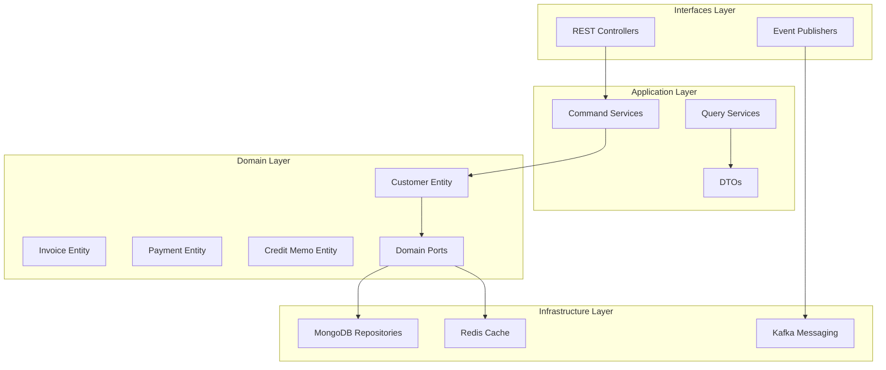

# Accounts Receivable Service - Architecture Documentation

## Overview

The Accounts Receivable Service manages customer invoices, payments, and customer credit management within the Gogidix Finance Ecosystem. It implements a Hexagonal (Ports and Adapters) architecture pattern with multi-tenant support.

## Architecture Diagram

## Domain Models

### Customer Entity
Manages customer information, credit limits, and payment terms.

**Key Behaviors:**
- Customer activation and suspension
- Credit limit management
- Outstanding balance tracking
- Collection stage management

### Invoice Entity
Manages customer invoices with line items and tax calculations.

**Key Behaviors:**
- Invoice generation and validation
- Payment application
- Credit memo application
- Overdue tracking

### Payment Entity
Manages customer payments and allocations.

**Key Behaviors:**
- Payment processing
- Multi-invoice allocation
- Refund handling

## Technology Stack

| Component | Technology |
|-----------|------------|
| Framework | Spring Boot 3.1.5 |
| Language | Java 17 |
| Database | MongoDB |
| Message Broker | Apache Kafka |
| Cache | Redis |

## API Endpoints

### Customer API
- `POST /customers` - Create customer
- `GET /customers/{id}` - Get customer
- `GET /customers` - List customers
- `PUT /customers/{id}` - Update customer
- `POST /customers/{id}/activate` - Activate customer
- `POST /customers/{id}/suspend` - Suspend customer
- `PUT /customers/{id}/credit` - Update credit limit

### Invoice API
- `POST /invoices` - Generate invoice
- `GET /invoices/{id}` - Get invoice
- `GET /invoices/customer/{customerId}` - Get customer invoices
- `POST /invoices/{id}/apply-payment` - Apply payment
- `POST /invoices/{id}/apply-credit-memo` - Apply credit memo

### Payment API
- `POST /payments` - Record payment
- `GET /payments/{id}` - Get payment
- `GET /payments/customer/{customerId}` - Get customer payments
- `POST /payments/{id}/allocate` - Allocate to invoices

## Event Publishing

| Event | Trigger |
|-------|---------|
| CustomerCreated | New customer registered |
| InvoiceGenerated | New invoice created |
| PaymentReceived | Payment recorded |
| CreditMemoIssued | Credit memo created |
