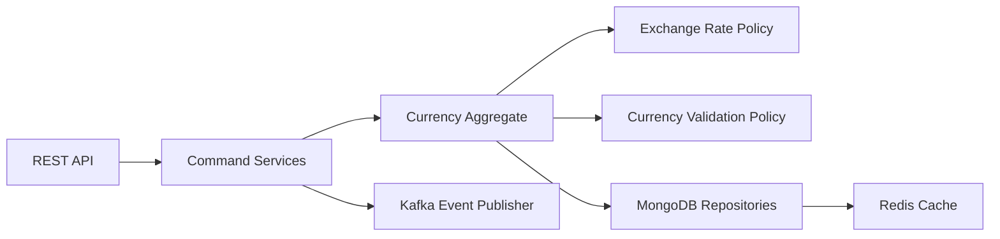

# Currency Service - Architecture Documentation

## Overview

The Currency Service manages currency definitions, exchange rates, and currency conversions for the Gogidix Finance Ecosystem. It provides multi-tenant support with real-time exchange rate updates.

## Domain Models

### Currency Entity
Manages currency definitions and their status.

**Key Behaviors:**
- Currency activation/deactivation
- Currency code validation (ISO 4217)
- Multi-country currency support

### ExchangeRate Entity
Manages exchange rates between currency pairs.

**Key Behaviors:**
- Rate updates
- Historical rate tracking
- Rate validation

### CurrencyConversion Entity
Tracks currency conversion operations.

**Key Behaviors:**
- Conversion execution
- Rate application
- Conversion history

## Technology Stack

| Component | Technology |
|-----------|------------|
| Framework | Spring Boot 3.1.5 |
| Language | Java 17 |
| Database | MongoDB |
| Message Broker | Apache Kafka |
| Cache | Redis |

## Architecture Diagram

## Event Publishing

| Event | Trigger |
|-------|---------|
| CurrencyCreated | New currency defined |
| CurrencyActivated | Currency activated |
| CurrencyDeactivated | Currency deactivated |
| ExchangeRateUpdated | Exchange rate changed |
| CurrencyConverted | Currency conversion executed |

## API Endpoints

### Currency API
- `POST /currencies` - Create currency
- `GET /currencies/{code}` - Get currency
- `GET /currencies` - List currencies
- `PUT /currencies/{code}` - Update currency
- `POST /currencies/{code}/activate` - Activate currency
- `POST /currencies/{code}/deactivate` - Deactivate currency

### Exchange Rate API
- `POST /exchange-rates` - Update exchange rate
- `GET /exchange-rates/{pair}` - Get exchange rate
- `GET /exchange-rates` - List all rates
- `GET /exchange-rates/{pair}/history` - Get rate history

### Currency Conversion API
- `POST /conversions` - Execute conversion
- `GET /conversions/{id}` - Get conversion
- `POST /conversions/calculate` - Calculate conversion
- `GET /conversions` - List conversions
