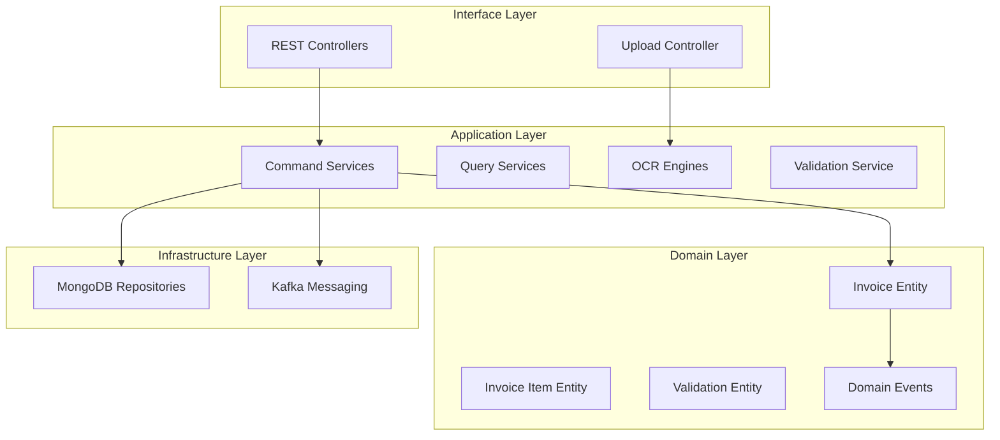

# Invoice Processing Service - Architecture Documentation

## Overview

The Invoice Processing Service is a NestJS-based microservice that handles automated invoice processing, OCR extraction, validation, and routing within the Gogidix Finance Ecosystem. It implements Hexagonal Architecture with TypeScript.

## Architecture Diagram

## Domain Models

### Invoice Entity
Manages invoice lifecycle from upload through processing.

**Key Behaviors:**
- Status transitions (DRAFT → RECEIVED → VALIDATING → VALIDATED → PROCESSING → PROCESSED)
- Line item management
- Payment tracking
- OCR processing integration

**Status States:**
- DRAFT - Initial state
- RECEIVED - Uploaded and queued
- VALIDATING - Under validation
- VALIDATED - Validation complete
- PROCESSING - Being processed
- PROCESSED - Successfully processed
- FAILED - Processing failed
- CANCELLED - Cancelled by user

### InvoiceItem Entity
Represents individual line items on an invoice.

**Properties:**
- Line number
- Description
- Quantity and unit price
- Tax rate
- Amount calculations

### InvoiceValidation Entity
Tracks validation results for invoices.

**Validation Rules:**
- Invoice number format
- Vendor validation
- PO matching
- Duplicate detection

## Technology Stack

| Component | Technology | Version |
|-----------|------------|---------|
| Framework | NestJS | 10.3.0 |
| Language | TypeScript | 5.3.3 |
| Database | MongoDB | 6.x |
| Message Broker | Kafka (kafkajs) | 2.2.4 |
| OCR | Tesseract.js, Google Vision API | 5.0.4, 4.2.0 |
| Build | Nest CLI | 10.3.0 |

## API Endpoints

### Invoice API
- `POST /invoices` - Create new invoice
- `POST /invoices/upload` - Upload invoice file
- `GET /invoices/:id` - Get invoice by ID
- `POST /invoices/:id/validate` - Validate invoice
- `POST /invoices/:id/approve` - Approve invoice
- `POST /invoices/:id/reject` - Reject invoice
- `POST /invoices/:id/process` - Process invoice
- `GET /invoices/search` - Search invoices

## Event Publishing

| Event | Trigger | Consumers |
|-------|---------|-----------|
| InvoiceReceived | Invoice uploaded | Validation Service |
| InvoiceValidated | Validation passed | Routing Service |
| InvoiceProcessed | Processing complete | GL Service, Cash Flow |
| InvoiceFailed | Processing failed | Notification Service |
