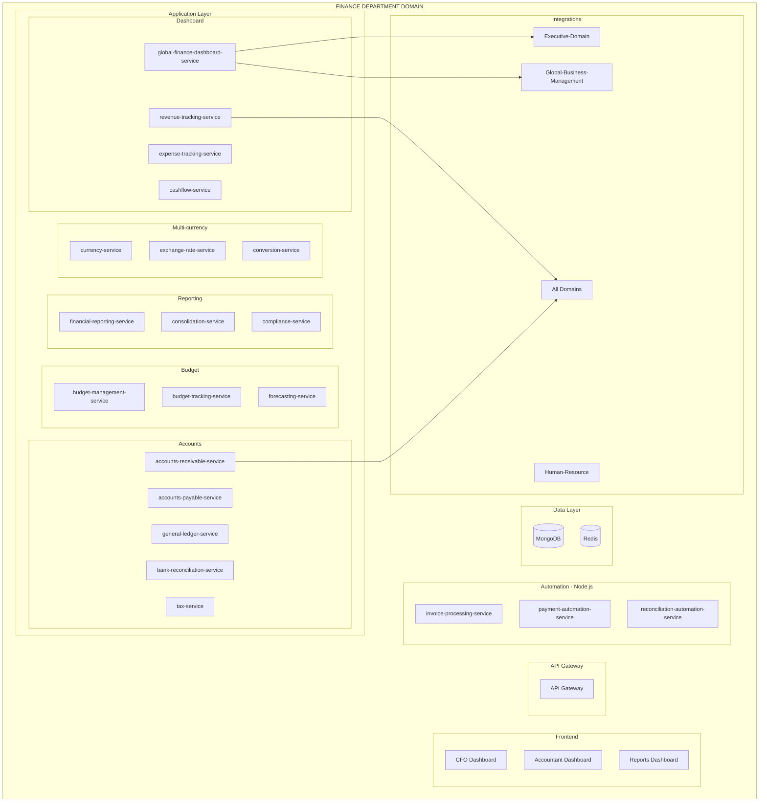

# PRD: Finance-Department Domain

**Version:** 1.0
**Date:** 2026-01-29
**Status:** Product Requirements Document
**Domain:** Management-Domain / Finance-Department

---

## Business Purpose

Provide accurate, timely, and compliant financial management across all global operations.

## User Personas

1. **Global CFO** - Financial strategy, oversight
2. **Regional Finance Manager** - Regional financials
3. **Accountant** - Financial transactions, reporting
4. **Executive Team** - Financial insights

## Domain Architecture



## Service Inventory

### Java Backend Services (18)

| Service | Priority |
|---------|----------|
| global-finance-dashboard-service | P0 |
| revenue-tracking-service | P0 |
| expense-tracking-service | P0 |
| cashflow-service | P0 |
| accounts-payable-service | P0 |
| accounts-receivable-service | P0 |
| general-ledger-service | P0 |
| bank-reconciliation-service | P0 |
| tax-service | P0 |
| budget-management-service | P0 |
| budget-tracking-service | P0 |
| forecasting-service | P0 |
| financial-reporting-service | P0 |
| consolidation-service | P0 |
| compliance-service | P0 |
| currency-service | P0 |
| exchange-rate-service | P0 |
| conversion-service | P0 |

### Node.js Services (3)

| Service | Priority |
|---------|----------|
| invoice-processing-service | P0 |
| payment-automation-service | P0 |
| reconciliation-automation-service | P0 |

### Frontend (3)

| Application | Priority |
|-------------|----------|
| cfo-dashboard | P0 |
| accountant-dashboard | P0 |
| reports-dashboard | P0 |

## Integration Points

```
Finance-Department → All Domains
├── Financial data ingestion
├── Budget allocation
├── Expense tracking
└── Revenue reporting

Finance-Department → shared-courier-core
├── Confidential document delivery
├── Financial document shipping
└── Courier cost tracking

Finance-Department → Global-Business-Management
├── Regional financials
├── Currency conversion
└── Consolidated reporting

Finance-Department → Human-Resource
├── Payroll data
├── Salary processing
└── Benefits costs
```

---

**End of PRD: Finance-Department Domain**
