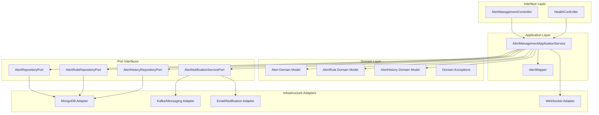
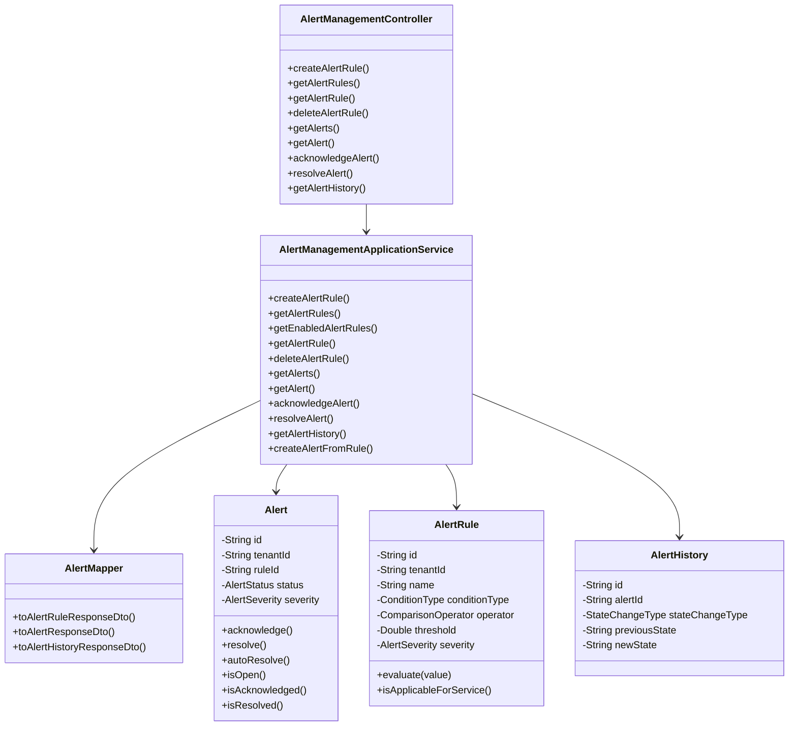
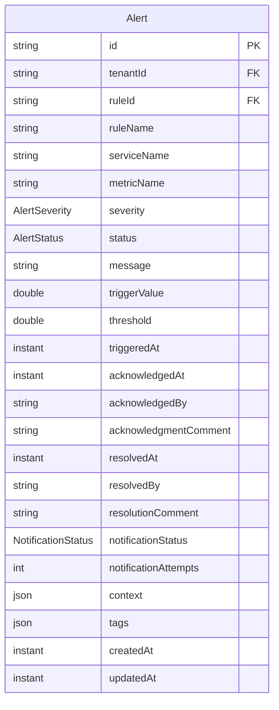
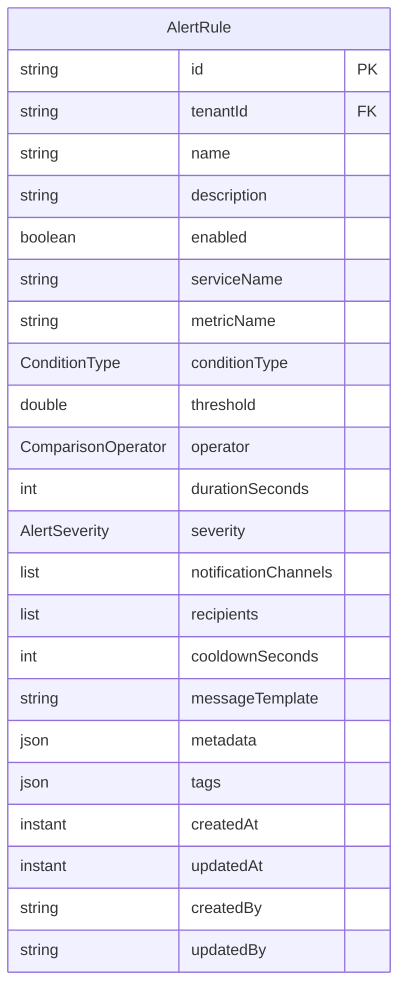
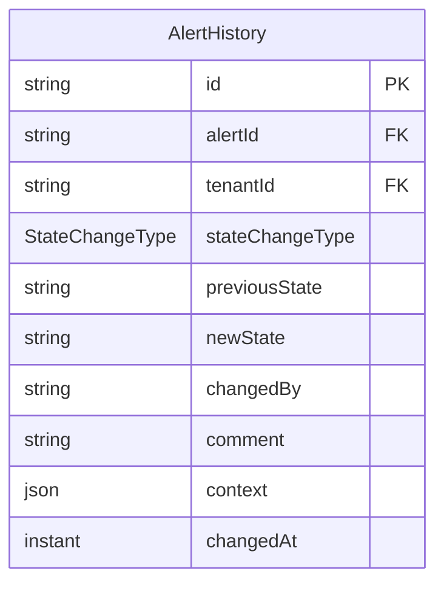
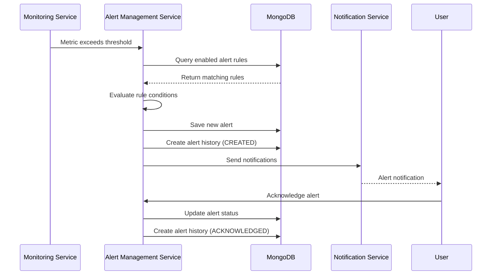
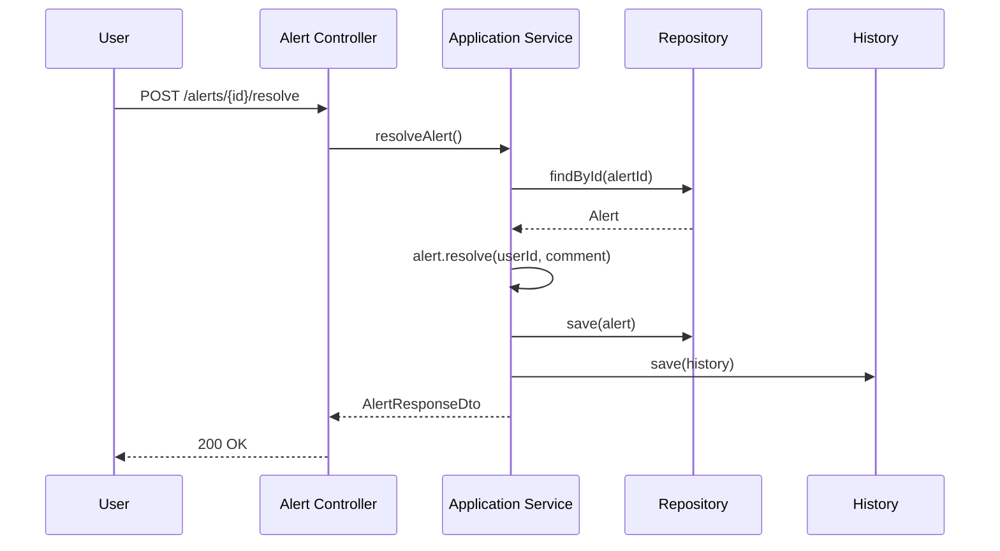
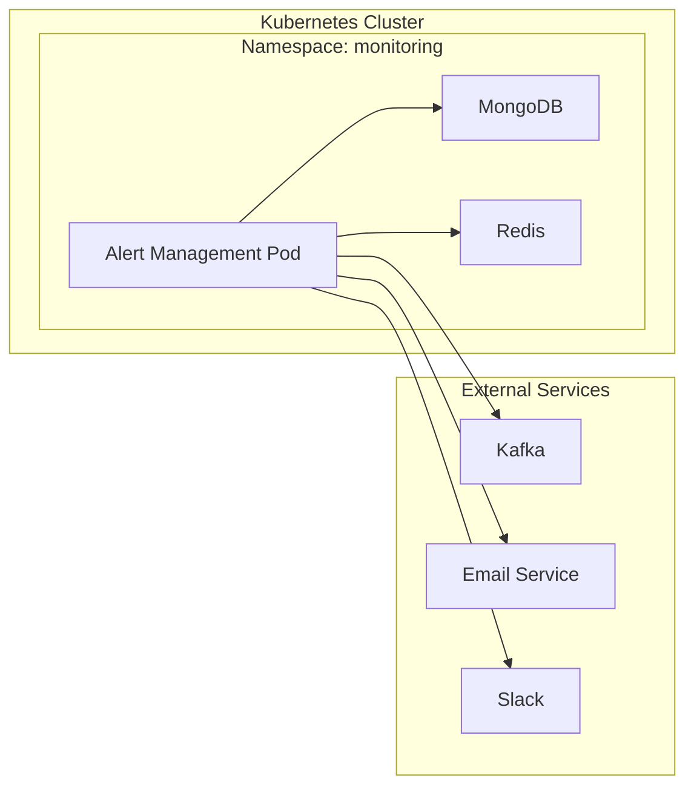

# Alert Management Service - Architecture Documentation

## Overview

The Alert Management Service is a core component of the Foundation-Services-Monitoring domain within the Gogidix Ecosystem. It provides comprehensive alert rule management, alert generation, and notification capabilities for monitoring system health and performance metrics.

## Table of Contents

1. [System Architecture](#system-architecture)
2. [Component Diagram](#component-diagram)
3. [Domain Model](#domain-model)
4. [Data Flow](#data-flow)
5. [Technology Stack](#technology-stack)
6. [Design Patterns](#design-patterns)
7. [Port and Adapter Architecture](#port-and-adapter-architecture)

## System Architecture

The Alert Management Service follows a hexagonal (ports and adapters) architecture pattern, separating domain logic from external concerns like databases, messaging systems, and web APIs.



## Component Diagram

### Core Components



## Domain Model

### Alert

The `Alert` entity represents a generated alert from a rule trigger.



### AlertRule

The `AlertRule` entity defines conditions under which alerts should be generated.



### AlertHistory

The `AlertHistory` entity records all state changes for an alert.



## Data Flow

### Alert Creation Flow



### Alert Resolution Flow



## Technology Stack

| Component | Technology | Version |
|-----------|-----------|---------|
| Language | Java | 17 |
| Framework | Spring Boot | 3.1.5 |
| Build Tool | Maven | - |
| Database | MongoDB | - |
| Cache | Redis | - |
| Messaging | Kafka | - |
| API Documentation | SpringDoc OpenAPI | 2.3.0 |
| Testing | JUnit 5, Mockito | - |
| Testcontainers | MongoDB Testcontainers | 1.19.3 |

## Design Patterns

### 1. Hexagonal Architecture (Ports and Adapters)

The service implements hexagonal architecture with:
- **Domain**: Core business logic without external dependencies
- **Ports**: Interfaces for interacting with external systems
- **Adapters**: Implementation of ports for specific technologies

### 2. Domain-Driven Design (DDD)

- Bounded context for alert management
- Domain entities with rich behavior
- Value objects for DTOs
- Repository pattern for data access

### 3. CQRS (Command Query Responsibility Segregation)

- Separate DTOs for requests and responses
- Optimized read models via mappers
- Separate operations for commands (create, update) and queries (get)

### 4. Builder Pattern

All domain entities use Lombok's `@Builder` for fluent object construction.

## Port and Adapter Architecture

### Output Ports (Domain Interface)

```java
// Alert Repository Port
public interface AlertRepositoryPort {
    Alert save(Alert alert);
    Optional<Alert> findById(String id);
    List<Alert> findByTenantId(String tenantId);
    List<Alert> findByTenantIdAndStatus(String tenantId, AlertStatus status);
    List<Alert> findByTenantIdAndSeverity(String tenantId, AlertSeverity severity);
    void deleteById(String id);
    long deleteOlderThan(Instant timestamp);
}

// Alert Rule Repository Port
public interface AlertRuleRepositoryPort {
    AlertRule save(AlertRule rule);
    Optional<AlertRule> findById(String id);
    List<AlertRule> findByTenantId(String tenantId);
    List<AlertRule> findEnabledByTenantId(String tenantId);
    void deleteById(String id);
}

// Alert History Repository Port
public interface AlertHistoryRepositoryPort {
    AlertHistory save(AlertHistory history);
    List<AlertHistory> findByAlertId(String alertId);
}

// Alert Notification Service Port
public interface AlertNotificationServicePort {
    void sendNotification(Alert alert, NotificationChannel channel, List<String> recipients);
}
```

### REST API Endpoints

| Method | Endpoint | Description |
|--------|----------|-------------|
| POST | `/alerts/rules` | Create alert rule |
| GET | `/alerts/rules` | Get all alert rules |
| GET | `/alerts/rules/{ruleId}` | Get specific alert rule |
| DELETE | `/alerts/rules/{ruleId}` | Delete alert rule |
| GET | `/alerts` | Get alerts with pagination |
| GET | `/alerts/{alertId}` | Get specific alert |
| POST | `/alerts/{alertId}/acknowledge` | Acknowledge alert |
| POST | `/alerts/{alertId}/resolve` | Resolve alert |
| GET | `/alerts/{alertId}/history` | Get alert history |

## Enumerations

### AlertStatus
- `OPEN`: Alert is active and unacknowledged
- `ACKNOWLEDGED`: Alert has been acknowledged by a user
- `RESOLVED`: Alert has been resolved
- `SUPPRESSED`: Alert is suppressed
- `CLOSED`: Alert is closed

### AlertSeverity
- `CRITICAL`: Critical severity requiring immediate action
- `HIGH`: High severity
- `MEDIUM`: Medium severity
- `LOW`: Low severity
- `INFO`: Informational

### NotificationStatus
- `PENDING`: Notification pending
- `SENT`: Notification sent successfully
- `FAILED`: Notification failed
- `RETRYING`: Notification being retried

### ConditionType
- `THRESHOLD`: Simple threshold-based condition
- `ANOMALY_DETECTION`: Anomaly-based detection
- `RATE_OF_CHANGE`: Rate of change condition
- `MISSING_DATA`: Missing data condition
- `PREDICTIVE`: Predictive condition

### ComparisonOperator
- `GREATER_THAN`: Value greater than threshold
- `LESS_THAN`: Value less than threshold
- `EQUAL_TO`: Value equal to threshold
- `NOT_EQUAL_TO`: Value not equal to threshold
- `GREATER_THAN_OR_EQUAL`: Value greater than or equal to threshold
- `LESS_THAN_OR_EQUAL`: Value less than or equal to threshold

### NotificationChannel
- `EMAIL`: Email notification
- `SMS`: SMS notification
- `WEBHOOK`: Webhook notification
- `SLACK`: Slack notification
- `PAGERDUTY`: PagerDuty notification
- `INCIDENT_MANAGEMENT`: Incident management system

## Deployment Architecture



## Security Considerations

1. **Multi-tenancy**: All operations are scoped to tenant ID
2. **Authentication**: JWT-based authentication via Spring Security
3. **Authorization**: Role-based access control
4. **Data Isolation**: Tenant data isolation at database level

## Monitoring and Observability

1. **Health Checks**: `/health`, `/health/liveness`, `/health/readiness`
2. **Metrics**: Prometheus metrics via Micrometer
3. **Logging**: Structured logging with correlation IDs
4. **Tracing**: Distributed tracing support
