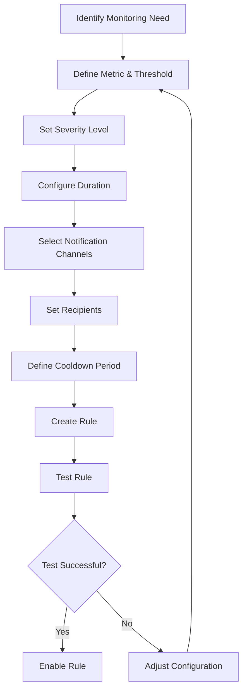
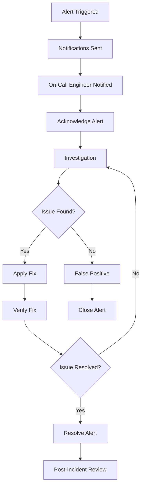
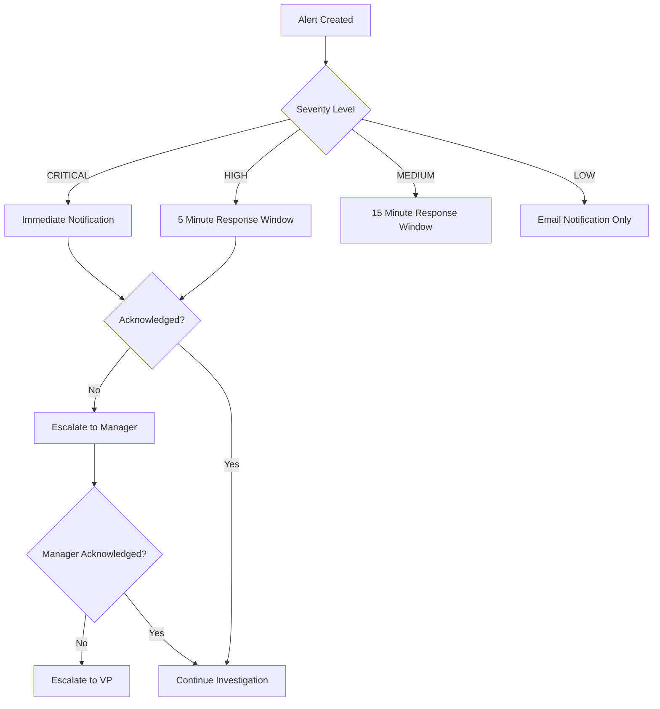
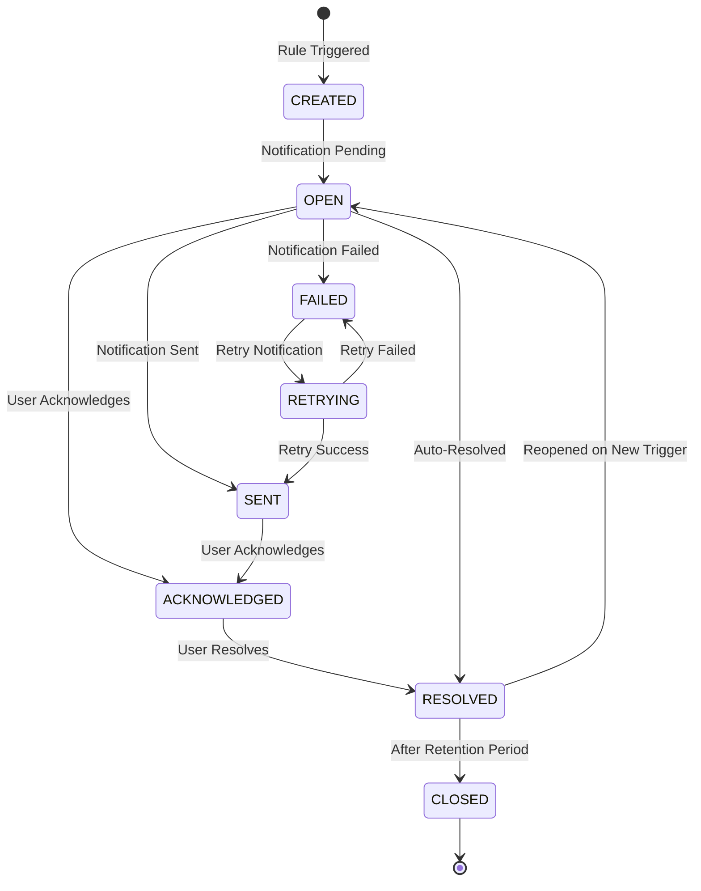

# Alert Management Service - Business Use Cases

## Overview

The Alert Management Service enables organizations to proactively monitor their systems and respond to issues before they impact users. This document outlines the key business use cases and workflows supported by the service.

## Table of Contents

1. [Core Business Capabilities](#core-business-capabilities)
2. [Use Cases](#use-cases)
3. [User Personas](#user-personas)
4. [Business Processes](#business-processes)
5. [Alert Lifecycle](#alert-lifecycle)
6. [Notification Workflows](#notification-workflows)

## Core Business Capabilities

### 1. Proactive Monitoring
- Define custom alert rules based on metrics thresholds
- Monitor multiple services and metrics simultaneously
- Set severity levels to prioritize response

### 2. Multi-Channel Notifications
- Configure multiple notification channels (Email, Slack, SMS, Webhook)
- Route alerts to appropriate teams based on service/metric
- Support for escalation policies

### 3. Alert Workflow Management
- Acknowledge alerts to indicate investigation in progress
- Resolve alerts with resolution comments
- Track complete audit history of all alert state changes

### 4. Multi-Tenancy Support
- Isolate alert configurations per tenant
- Custom notification recipients per tenant
- Tenant-specific alert rules and policies

## Use Cases

### UC-1: High CPU Usage Alert

**Actor:** DevOps Engineer

**Goal:** Monitor and respond to high CPU usage across production services

**Preconditions:**
- Services are instrumented with metrics collection
- Alert Management Service is configured

**Main Flow:**
1. DevOps Engineer creates an alert rule:
   - Metric: `cpu.usage`
   - Threshold: 80%
   - Operator: Greater than
   - Duration: 5 minutes
   - Severity: HIGH
   - Notification channels: Email, Slack
2. When CPU usage exceeds 80% for 5 minutes, an alert is generated
3. Notifications are sent to configured recipients
4. DevOps Engineer receives notification and acknowledges alert
5. Investigation and remediation occurs
6. DevOps Engineer resolves the alert with resolution notes

**Postconditions:**
- Alert is marked as resolved
- Complete history is recorded for audit purposes

**Business Value:**
- Early detection of performance issues
- Reduced mean time to resolution (MTTR)
- Audit trail for compliance and post-mortem analysis

---

### UC-2: Memory Leak Detection

**Actor:** Platform Engineer

**Goal:** Detect potential memory leaks in microservices

**Preconditions:**
- JVM metrics are being collected
- Alert Management Service is operational

**Main Flow:**
1. Platform Engineer creates alert rule:
   - Metric: `jvm.memory.used`
   - Threshold: 90% of heap
   - Operator: Greater than
   - Duration: 10 minutes
   - Severity: CRITICAL
   - Notification channels: PagerDuty, Slack
2. Memory usage crosses threshold
3. Alert is created with CRITICAL severity
4. On-call engineer receives PagerDuty notification
5. Engineer investigates and identifies memory leak
6. Service is restarted/patched
7. Alert is resolved with detailed comments

**Business Value:**
- Prevention of service outages
- Proactive capacity planning
- Improved system reliability

---

### UC-3: API Error Rate Monitoring

**Actor:** Backend Developer

**Goal:** Monitor API error rates and detect service degradation

**Preconditions:**
- API metrics are collected
- Error rate metric is available

**Main Flow:**
1. Backend Developer creates alert rule:
   - Metric: `http.requests.errors`
   - Threshold: 5%
   - Operator: Greater than
   - Duration: 2 minutes
   - Severity: MEDIUM
   - Notification: Slack channel
2. Error rate spikes due to database connection issues
3. Alert is triggered
4. Development team is notified on Slack
5. Team investigates and applies hotfix
6. Alert auto-resolves when metric returns to normal

**Business Value:**
- Rapid detection of service issues
- Minimized impact on end users
- Data-driven decision making

---

### UC-4: Disk Space Warning

**Actor:** System Administrator

**Goal:** Prevent disk space exhaustion on servers

**Preconditions:**
- System metrics are being collected
- Disk usage metrics available

**Main Flow:**
1. System Administrator creates alert rule:
   - Metric: `disk.usage.percent`
   - Threshold: 85%
   - Operator: Greater than
   - Severity: HIGH
   - Notification: Email to ops team
2. Disk usage crosses threshold
3. Alert is created
4. Operations team receives email
5. Log cleanup or capacity expansion is performed
6. Alert is resolved

**Business Value:**
- Prevention of service outages due to disk space
- Proactive capacity management
- Reduced emergency incidents

---

### UC-5: Database Connection Pool Exhaustion

**Actor:** Database Administrator

**Goal:** Detect database connection pool exhaustion

**Preconditions:**
- Database metrics are collected
- Connection pool metrics available

**Main Flow:**
1. DBA creates alert rule:
   - Metric: `db.connections.active`
   - Threshold: 90% of max pool
   - Operator: Greater than
   - Severity: CRITICAL
   - Notification: PagerDuty, Email
2. Connection pool exhaustion detected
3. Alert is immediately created
4. On-call DBA is notified via PagerDuty
5. Immediate action taken to free connections
6. Alert is resolved after normal operation restored

**Business Value:**
- Prevention of database unavailability
- Minimized application downtime
- Improved database performance monitoring

---

## User Personas

### DevOps Engineer
**Responsibilities:**
- Create and manage alert rules
- Monitor system health
- Respond to alerts
- Maintain alert configurations

**Goals:**
- Ensure system reliability
- Minimize alert fatigue
- Quick incident response

### Platform Engineer
**Responsibilities:**
- Design monitoring strategy
- Configure global alert policies
- Integrate with incident management systems
- Analyze alert trends

**Goals:**
- Comprehensive system observability
- Effective escalation policies
- Data-driven capacity planning

### On-Call Engineer
**Responsibilities:**
- Respond to critical alerts
- Acknowledge and resolve incidents
- Document resolution steps

**Goals:**
- Quick incident resolution
- Clear communication
- Accurate documentation

### Site Reliability Engineer (SRE)
**Responsibilities:**
- Define SLOs and error budgets
- Create alert rules based on SLOs
- Analyze alert patterns for optimization

**Goals:**
- Align alerts with user experience
- Reduce false positives
- Improve mean time to detection (MTTD)

## Business Processes

### Alert Rule Creation Process

### Incident Response Process

### Escalation Process

## Alert Lifecycle

## Notification Workflows

### Email Notification

1. Alert created matching rule criteria
2. Service formats email using message template
3. Email sent to configured recipients
4. Delivery status recorded
5. Failed delivery triggers retry logic

### Slack Notification

1. Alert created matching rule criteria
2. Service formats Slack message
3. Webhook call to Slack API
4. Message posted to configured channel
5. @mentions for critical alerts
6. Delivery status recorded

### PagerDuty Integration

1. Critical alert created
2. Service creates PagerDuty incident
3. On-call engineer paged
4. Alert acknowledgment syncs with PagerDuty
5. Resolution syncs with PagerDuty

### Webhook Notification

1. Alert created
2. HTTP POST to configured webhook URL
3. Alert payload sent as JSON
4. Response code recorded
5. Retry on failure with exponential backoff

## Business Value Metrics

### Key Performance Indicators (KPIs)

1. **Mean Time to Detection (MTTD)**
   - Time from issue occurrence to alert creation
   - Target: < 2 minutes for critical issues

2. **Mean Time to Resolution (MTTR)**
   - Time from alert creation to resolution
   - Target: < 15 minutes for critical issues

3. **Alert Accuracy**
   - Percentage of actionable alerts
   - Target: > 95%

4. **False Positive Rate**
   - Percentage of alerts requiring no action
   - Target: < 5%

5. **First Response Time**
   - Time from alert to acknowledgment
   - Target: < 5 minutes for critical alerts

## Reporting and Analytics

### Available Reports

1. **Alert Volume Report**
   - Total alerts by period
   - Breakdown by severity
   - Trend analysis

2. **Response Time Report**
   - Average acknowledgment time
   - Average resolution time
   - Performance by team

3. **Rule Effectiveness Report**
   - Most frequently triggered rules
   - Rules with no triggers (candidates for cleanup)
   - False positive analysis

4. **Service Health Report**
   - Alerts by service
   - Top problematic services
   - Health score calculation

## Integration Points

### Upstream Integrations
- **Monitoring Data Service**: Consumes metric data for rule evaluation
- **Service Health Service**: Receives health status for rule conditions

### Downstream Integrations
- **Email Service**: Sends email notifications
- **Slack**: Posts alerts to channels
- **PagerDuty**: Creates and manages incidents
- **Custom Webhooks**: Integrates with external systems

### Future Integrations
- SMS notification providers
- Microsoft Teams
- ServiceNow
- Custom incident management platforms
