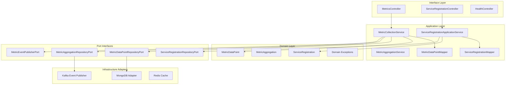
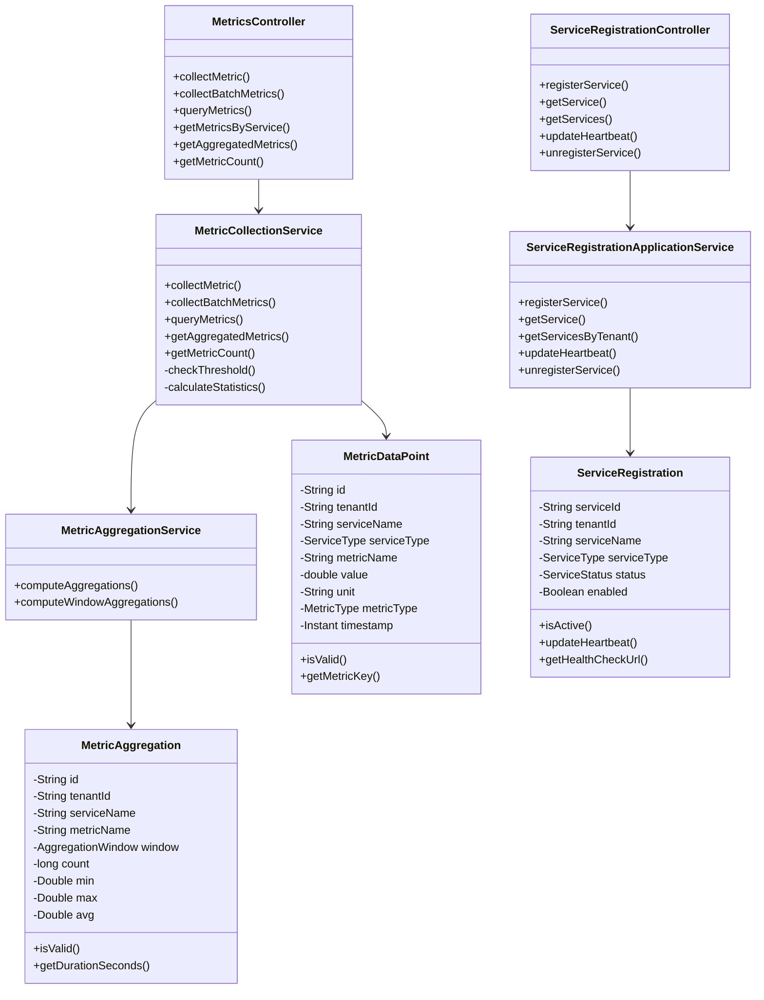
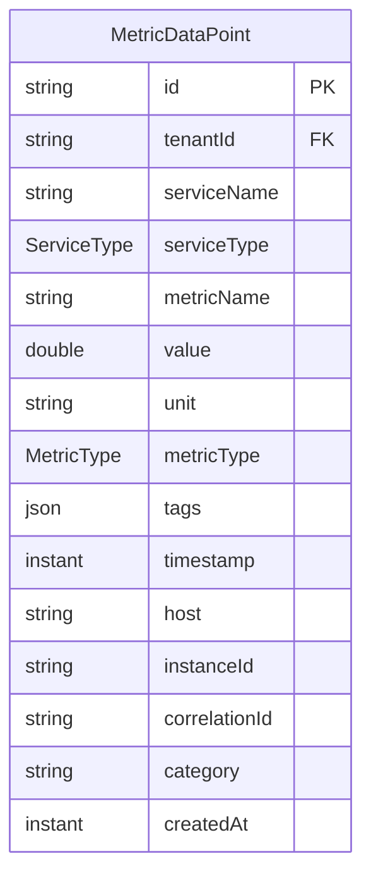
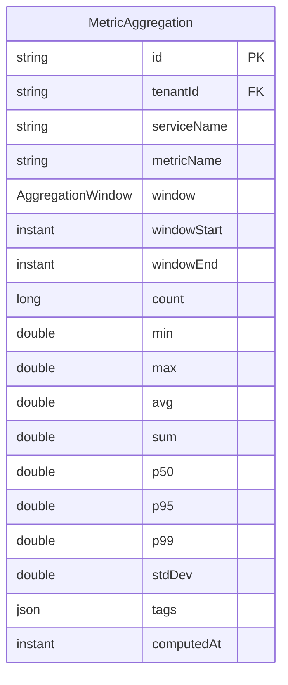
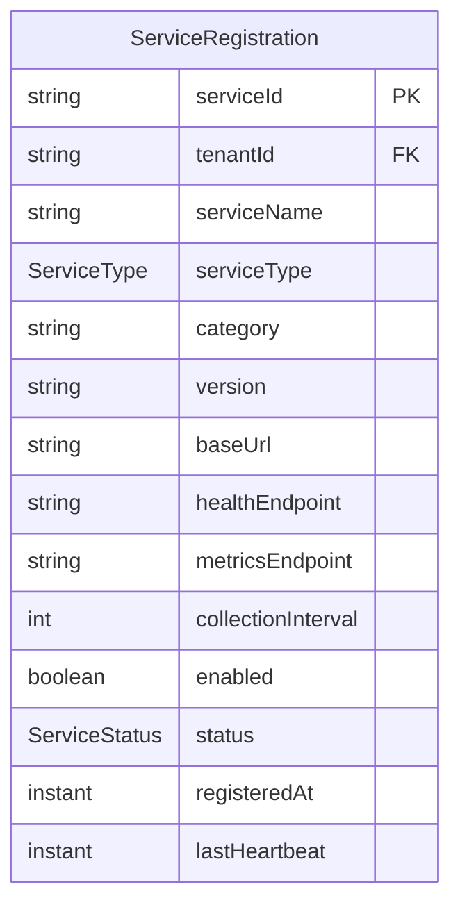
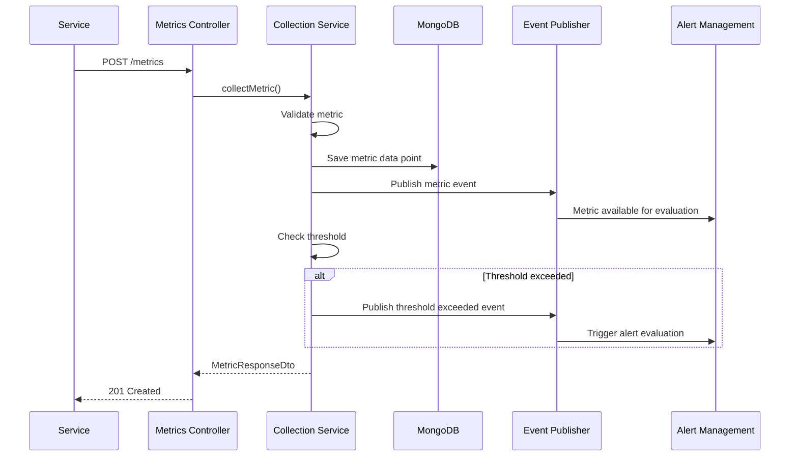
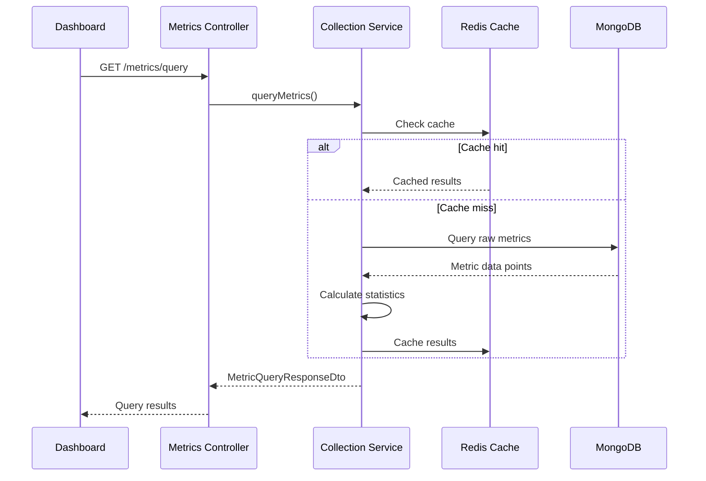
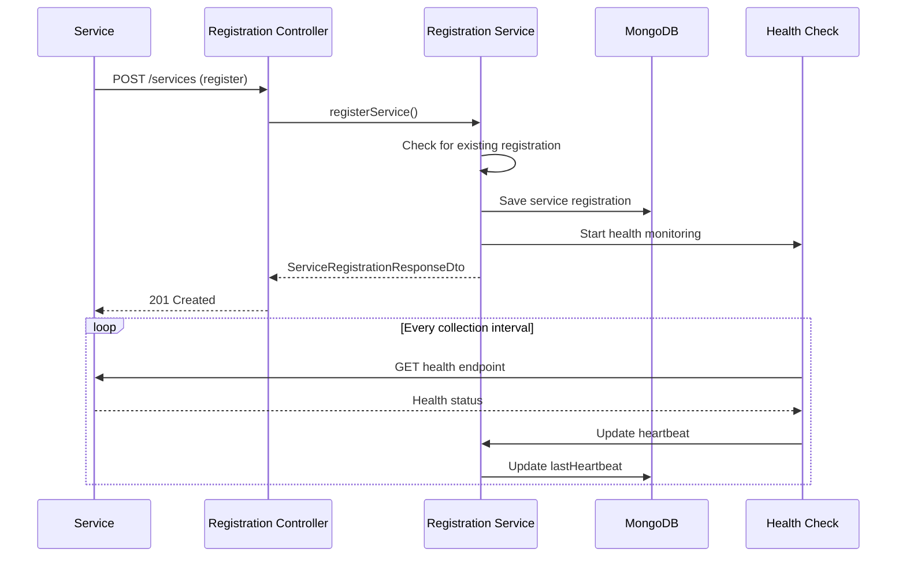
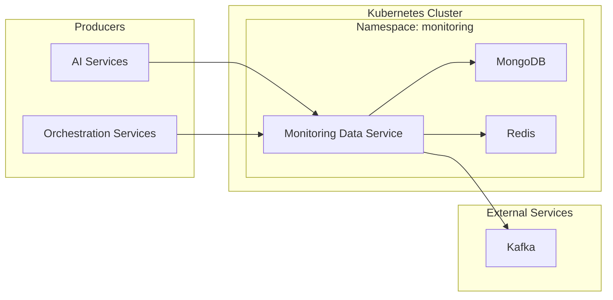

# Monitoring Data Service - Architecture Documentation

## Overview

The Monitoring Data Service is a core component of the Foundation-Services-Monitoring domain. It provides comprehensive metrics collection, storage, aggregation, and querying capabilities for the Gogidix Ecosystem.

## Table of Contents

1. [System Architecture](#system-architecture)
2. [Component Diagram](#component-diagram)
3. [Domain Model](#domain-model)
4. [Data Flow](#data-flow)
5. [Technology Stack](#technology-stack)
6. [Design Patterns](#design-patterns)

## System Architecture

The Monitoring Data Service follows a hexagonal (ports and adapters) architecture pattern:

## Component Diagram

### Core Components

## Domain Model

### MetricDataPoint

The `MetricDataPoint` entity represents a single metric data point:

### MetricAggregation

The `MetricAggregation` entity stores pre-aggregated metrics:

### ServiceRegistration

The `ServiceRegistration` entity tracks services registered for monitoring:

## Data Flow

### Metric Collection Flow

### Metric Query Flow

### Service Registration Flow

## Technology Stack

| Component | Technology | Version |
|-----------|-----------|---------|
| Language | Java | 17 |
| Framework | Spring Boot | 3.1.5 |
| Build Tool | Maven | - |
| Database | MongoDB | - |
| Cache | Redis | - |
| Messaging | Kafka | - |
| API Documentation | SpringDoc OpenAPI | 2.3.0 |
| Testing | JUnit 5, Mockito | - |
| Testcontainers | MongoDB Testcontainers | 1.19.3 |
| Metrics | Micrometer | - |

## Design Patterns

### 1. Hexagonal Architecture (Ports and Adapters)

- Domain layer with no external dependencies
- Port interfaces for repository and event publishing
- Adapter implementations for MongoDB, Kafka, Redis

### 2. Domain-Driven Design (DDD)

- Bounded context for metrics collection
- Aggregates for MetricDataPoint and MetricAggregation
- Value objects for DTOs

### 3. CQRS (Command Query Responsibility Segregation)

- Separate DTOs for commands and queries
- Optimized read models via aggregation
- Separate write and read operations

### 4. Cache-Aside Pattern

- Redis caching for query results
- Cache invalidation on new metrics
- TTL-based cache expiration

### 5. Event-Driven Architecture

- Metric events published to Kafka
- Threshold exceeded events
- Async event processing

## Enumerations

### ServiceType
- `AI_SERVICE`: AI/ML services
- `ORCHESTRATION_SERVICE`: Workflow orchestration services

### MetricType
- `GAUGE`: Current value (can go up or down)
- `COUNTER`: Cumulative value (only increases)
- `HISTOGRAM`: Distribution of values
- `SUMMARY`: Percentiles
- `RATE`: Rate per time interval

### AggregationWindow
- `MINUTE`: 60 seconds
- `FIVE_MINUTES`: 300 seconds
- `FIFTEEN_MINUTES`: 900 seconds
- `HOUR`: 3600 seconds
- `SIX_HOURS`: 21600 seconds
- `DAY`: 86400 seconds
- `WEEK`: 604800 seconds

### ServiceStatus
- `REGISTERED`: Service registered but not active
- `ACTIVE`: Service is active and reporting
- `INACTIVE`: Service is not responding
- `DEGRADED`: Service is degraded
- `UNREGISTERED`: Service has been unregistered

## REST API Endpoints

| Method | Endpoint | Description |
|--------|----------|-------------|
| POST | `/metrics` | Collect single metric |
| POST | `/metrics/batch` | Collect batch metrics |
| POST | `/metrics/query` | Query metrics |
| GET | `/metrics/services/{serviceName}` | Get metrics for service |
| GET | `/metrics/services/{serviceName}/aggregated` | Get aggregated metrics |
| GET | `/metrics/count` | Get metric count |
| POST | `/services` | Register service |
| GET | `/services/{serviceId}` | Get service registration |
| GET | `/services` | List services |
| PUT | `/services/{serviceId}/heartbeat` | Update heartbeat |
| DELETE | `/services/{serviceId}` | Unregister service |
| GET | `/health` | Health check |

## Deployment Architecture

## Performance Considerations

1. **Batch Collection**: Collect multiple metrics in a single request
2. **Caching**: Redis cache for frequently queried metrics
3. **Aggregation**: Pre-computed aggregations for faster queries
4. **Time-series Optimization**: MongoDB time-series collections
5. **Async Processing**: Event publishing is asynchronous

## Scaling Strategy

1. **Horizontal Scaling**: Stateless service instances
2. **Database Sharding**: MongoDB sharding by tenant
3. **Cache Distribution**: Redis Cluster
4. **Message Partitioning**: Kafka partitioning by service

## Security Considerations

1. **Multi-tenancy**: All operations scoped to tenant ID
2. **Authentication**: JWT-based authentication
3. **Authorization**: Role-based access control
4. **Rate Limiting**: API rate limiting per tenant
5. **Data Isolation**: Tenant data isolation at database level

## Monitoring and Observability

1. **Health Checks**: `/health`, `/health/liveness`, `/health/readiness`
2. **Metrics**: Prometheus metrics via Micrometer
3. **Logging**: Structured logging with correlation IDs
4. **Tracing**: Distributed tracing support
5. **Alerts**: Integration with Alert Management Service
