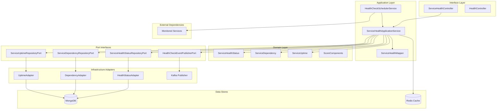
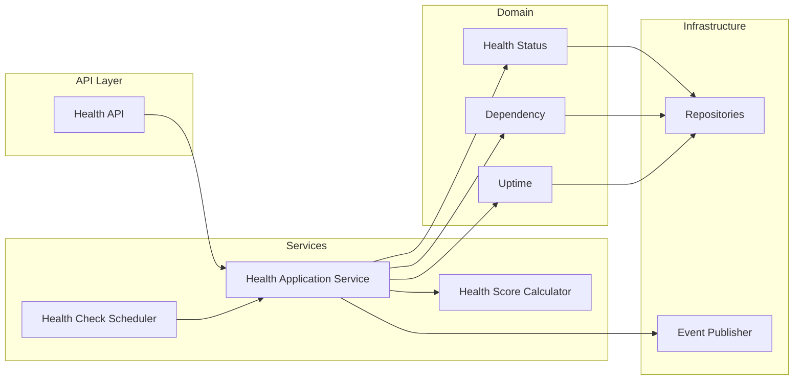
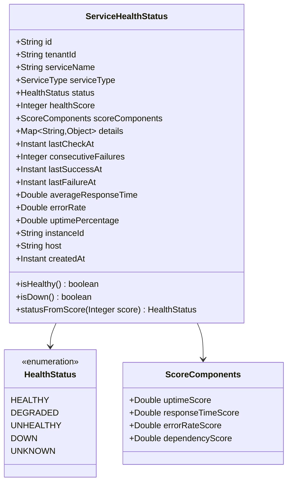
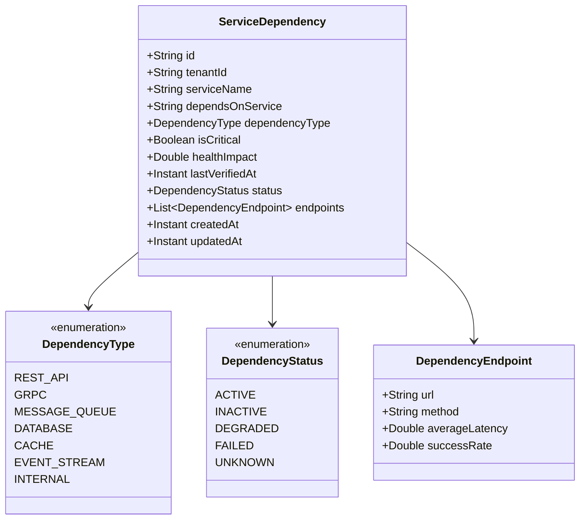
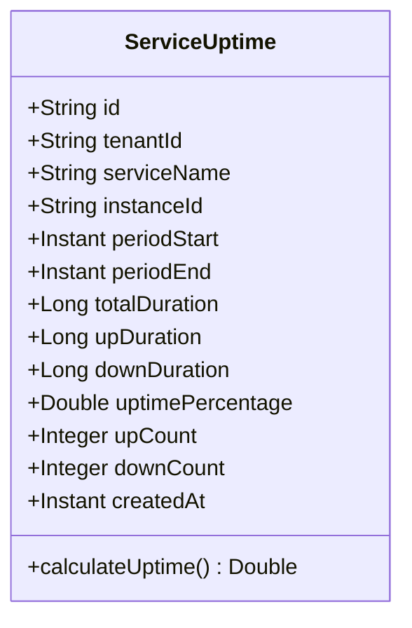
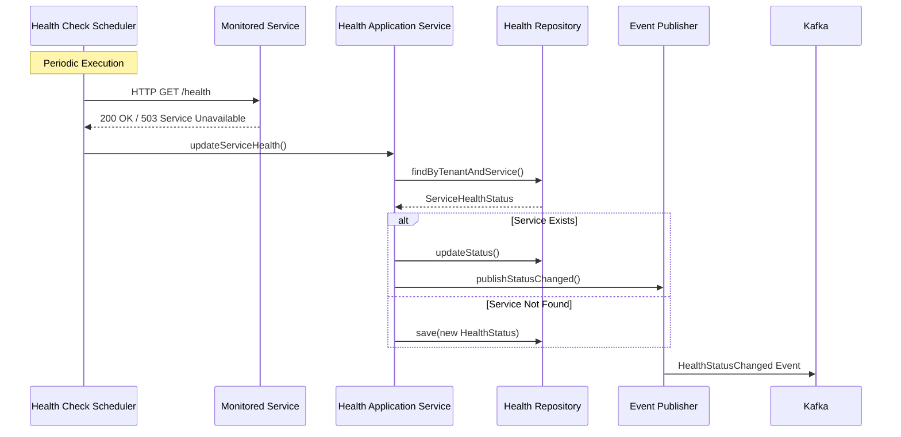
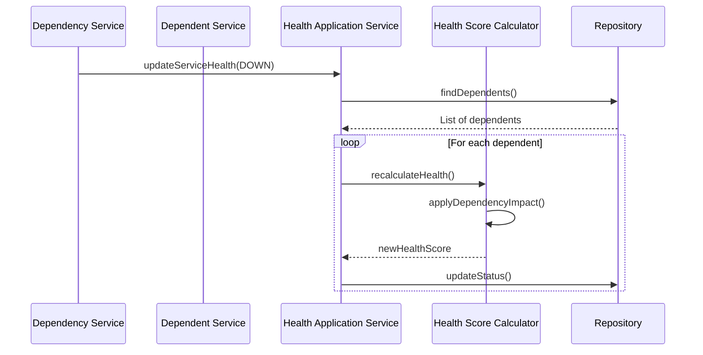
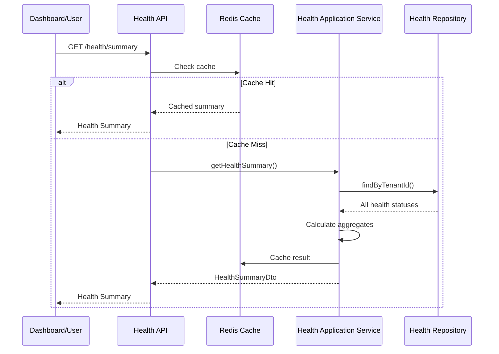

# Service Health Service - Architecture Documentation

## Overview

The Service Health Service is a core component of the Foundation-Services-Monitoring domain within the Gogidix Ecosystem. It provides comprehensive health status tracking, uptime monitoring, dependency mapping, and health score calculation for all 53 services.

## Table of Contents

1. [System Architecture](#system-architecture)
2. [Component Diagram](#component-diagram)
3. [Domain Model](#domain-model)
4. [Data Flow](#data-flow)
5. [Technology Stack](#technology-stack)
6. [Design Patterns](#design-patterns)

## System Architecture

The Service Health Service follows a hexagonal (ports and adapters) architecture pattern with scheduled health checks and event-driven updates.

## Component Diagram

## Domain Model

### Service Health Status

### Service Dependency

### Service Uptime

## Data Flow

### Health Check Flow

### Dependency Health Impact Flow

### Health Summary Flow

## Technology Stack

| Component | Technology | Version |
|-----------|-----------|---------|
| Framework | Spring Boot | 3.1.5 |
| Language | Java | 17 |
| Database | MongoDB | Latest |
| Cache | Redis | Latest |
| Messaging | Apache Kafka | Latest |
| Scheduler | Quartz Scheduler | Latest |
| API Documentation | SpringDoc OpenAPI | 2.3.0 |
| Metrics | Micrometer | Latest |
| Build Tool | Maven | 3.11.0 |
| Testing | JUnit 5, Mockito, Testcontainers | Latest |

## Design Patterns

### Hexagonal Architecture (Ports and Adapters)

- **Ports**: Domain-defined interfaces (Repository ports, Event publisher ports)
- **Adapters**: Infrastructure implementations (MongoDB adapters, Kafka publishers)

### Scheduled Task Pattern

- Quartz scheduler for periodic health checks
- Configurable check intervals per service
- Automatic retry logic

### Observer Pattern

- Health status changes trigger dependency recalculation
- Event-driven updates to dependents

### Caching Pattern

- Redis caching for frequently accessed health summaries
- TTL-based cache invalidation

### Repository Pattern

- Abstraction over data persistence
- Domain-specific query methods

## Health Score Calculation

The health score (0-100) is calculated using multiple components:

1. **Uptime Score (40%)**: Based on uptime percentage
2. **Response Time Score (25%)**: Based on average response time
3. **Error Rate Score (20%)**: Based on request error rate
4. **Dependency Score (15%)**: Based on dependency health

**Health Status Mapping:**
- 90-100: HEALTHY
- 70-89: DEGRADED
- 50-69: UNHEALTHY
- 0-49: DOWN
- Null: UNKNOWN

## Key Features

1. **Real-Time Health Tracking**: Continuous health monitoring of all services
2. **Dependency Mapping**: Tracks service dependencies and their health impact
3. **Health Scoring**: Calculates composite health scores
4. **Uptime Tracking**: Monitors and records service uptime
5. **Multi-Tenancy**: Full tenant isolation
6. **Event-Driven**: Publishes health status change events
7. **Caching**: Redis caching for improved query performance
