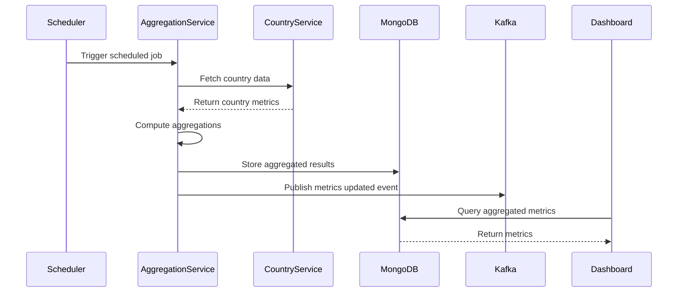

# Batch Aggregation Service - Architecture Documentation

## Overview

The Batch Aggregation Service is responsible for aggregating business data from multiple sources across regions and countries. It processes large volumes of data in scheduled batches to generate summary metrics used by global and regional dashboards.

## Architecture

```mermaid
graph TB
    subgraph "Batch Aggregation Service"
        subgraph "Application Layer"
            APP[BatchAggregationApplication]
            SCHED[BatchScheduler]
            AGG[AggregationService]
        end

        subgraph "Domain Layer"
            MODEL[Domain Models]
            REPO[Repositories]
            EVENTS[Domain Events]
        end

        subgraph "Infrastructure Layer"
            MONGO[MongoDB Config]
            KAFKA[Kafka Producer]
            CACHE[Redis Cache]
        end

        subgraph "External Interfaces"
            REST[REST API]
            JOBS[Scheduled Jobs]
        end
    end

    KAFKA_K[(Kafka)] <-- SCHED
    MONGO_DB[(MongoDB)] <-- MONGO
    REDIS_DB[(Redis)] <-- CACHE
    COUNTRY_SVC[Country Ingestion Service] --> AGG
    REGIONAL_SVC[Regional Aggregation Service] --> AGG
```

## Component Description

### Application Layer

#### BatchAggregationApplication
- **Purpose**: Main Spring Boot application entry point
- **Responsibilities**:
  - Initialize Spring context
  - Configure MongoDB auditing
  - Enable scheduled task processing

#### BatchScheduler
- **Purpose**: Manages scheduled batch jobs
- **Responsibilities**:
  - Trigger hourly/daily aggregation jobs
  - Manage job dependencies
  - Handle retry logic

#### AggregationService
- **Purpose**: Core aggregation logic
- **Responsibilities**:
  - Aggregate country-level data
  - Compute regional summaries
  - Calculate global metrics
  - Generate trend analysis

### Domain Layer

#### Domain Models
- `BatchAggregationJob`: Represents an aggregation job execution
- `AggregatedMetrics`: Stores aggregated business metrics
- `RegionalSummary`: Regional-level aggregated data
- `GlobalSummary`: Global-level aggregated data

#### Repositories
- `BatchAggregationJobRepository`: Manages job execution records
- `AggregatedMetricsRepository`: Stores aggregated metrics
- `RegionalSummaryRepository`: Regional data access
- `GlobalSummaryRepository`: Global data access

### Infrastructure Layer

#### MongoDB Configuration
- Database: `batch-aggregation-service_db`
- Collections:
  - `aggregation_jobs`
  - `aggregated_metrics`
  - `regional_summaries`
  - `global_summaries`

#### Kafka Integration
- **Topics**:
  - `batch.aggregation.events`: Job status events
  - `metrics.updated`: New aggregated metrics
  - `aggregation.completed`: Job completion notifications

#### Caching Strategy
- Cache regional summaries (TTL: 1 hour)
- Cache global summaries (TTL: 30 minutes)
- Cache recent aggregation jobs (TTL: 15 minutes)

## Data Flow



## Aggregation Logic

### Regional Aggregation
1. Group country data by region
2. Sum key metrics (revenue, users, orders)
3. Calculate averages (conversion rate, satisfaction)
4. Compute growth percentages vs previous period
5. Store results with timestamp

### Global Aggregation
1. Aggregate all regional summaries
2. Compute global totals
3. Calculate global averages
4. Identify top/bottom performing regions
5. Generate trend indicators

## Scheduled Jobs

| Job | Schedule | Description |
|-----|----------|-------------|
| HourlyAggregationJob | Every hour | Aggregates last hour's data |
| DailySummaryJob | Daily at 1 AM | Computes daily summaries |
| WeeklyTrendJob | Sunday at 2 AM | Generates weekly trends |
| MonthlyReportJob | 1st of month | Creates monthly reports |

## Error Handling

### Retry Strategy
- Maximum retries: 3
- Backoff: Exponential (1s, 2s, 4s)
- Dead letter queue for failed jobs

### Failure Scenarios
1. **Service Unavailable**: Queue job, retry later
2. **Data Quality Issues**: Log error, continue with valid data
3. **Timeout**: Abort and mark job as failed
4. **Database Error**: Rollback transaction, notify ops

## Performance Considerations

### Optimization Strategies
- Batch processing with chunk size of 100
- Parallel processing for independent regions
- Database query optimization with proper indexing
- Caching frequently accessed data

### Scalability
- Horizontal scaling via partitioning by region
- Job queue for load distribution
- Async processing for long-running jobs

## Monitoring

### Key Metrics
- Job execution time
- Records processed per job
- Failure rate
- Cache hit ratio
- Database query performance

### Health Checks
- Database connectivity
- Kafka connectivity
- Redis connectivity
- Disk space (for logs)

## Security

### Access Control
- Service-to-service authentication via JWT
- Role-based access for administrative operations
- Audit logging for all data modifications

### Data Protection
- Encryption at rest (MongoDB)
- Encryption in transit (TLS)
- PII data handling per GDPR requirements

## Deployment

### Container Configuration
```dockerfile
Base: eclipse-temurin-17-jre-alpine
Build: Maven multi-stage
Port: 8080
Health Check: /actuator/health
```

### Environment Variables
- `SPRING_PROFILES_ACTIVE`: Environment profile
- `MONGODB_URI`: MongoDB connection string
- `KAFKA_BOOTSTRAP_SERVERS`: Kafka brokers
- `REDIS_HOST`: Redis server address
