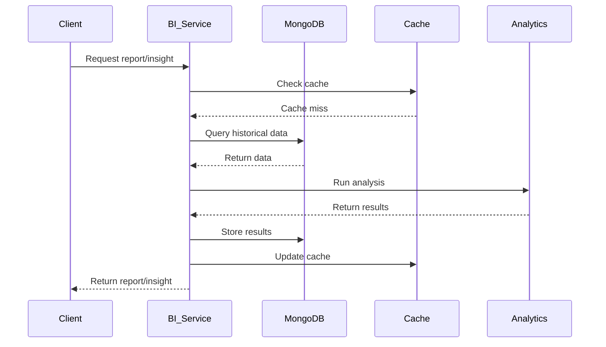

# Business Intelligence Service - Architecture Documentation

## Overview

The Business Intelligence Service provides analytics, insights, forecasting, and reporting capabilities for the Global Business Management domain. It processes business data to generate actionable insights and support strategic decision-making.

## Architecture

```mermaid
graph TB
    subgraph "Business Intelligence Service"
        subgraph "Application Layer"
            APP[BusinessIntelligenceApplication]
            REPORT_SVC[ReportGenerationService]
            INSIGHT_SVC[InsightGenerationService]
            FORECAST_SVC[ForecastingService]
            TREND_SVC[TrendAnalysisService]
        end

        subgraph "Domain Layer"
            REPORT[BIReport Model]
            INSIGHT[Insight Model]
            FORECAST[Forecast Model]
            TREND[TrendAnalysis Model]
        end

        subgraph "Infrastructure Layer"
            MONGO[MongoDB Config]
            CACHE[Cache Configuration]
        end
    end

    DASHBOARD[Global Business Dashboard] --> REPORT_SVC
    EXEC[Executive Domain] --> INSIGHT_SVC
    MONGO_DB[(MongoDB)] <-- MONGO
    REDIS[(Redis Cache)] <-- CACHE
```

## Domain Models

### BIReport
Comprehensive business intelligence reports with sections, metrics, charts, and executive summaries.

**Key Components:**
- ReportSection: Individual report sections with content
- MetricData: Business metrics with trends
- ChartData: Visual chart definitions
- TableData: Tabular data presentations
- ReportSummary: Executive summaries and key findings

### Insight
AI-generated or manual business insights with actionable recommendations.

**Key Components:**
- MetricReference: Linked business metrics
- ActionableRecommendation: Specific actions to take
- InsightContext: Business and market context
- InsightEvidence: Supporting evidence and sources

### Forecast
Business forecasts with confidence intervals and scenario analysis.

**Key Components:**
- ForecastValue: Time-series forecast values
- ForecastMetadata: Data quality and methodology
- ForecastAccuracy: Accuracy metrics (MAE, RMSE, MAPE)
- ForecastScenarios: Best/worst/expected case scenarios
- Assumption: Underlying forecast assumptions

### TrendAnalysis
Statistical analysis of business trends with pattern detection.

**Key Components:**
- DataPoint: Historical and projected values
- TrendStatistics: Mean, median, standard deviation
- SeasonalityInfo: Seasonal patterns and components
- Forecast: Future trend projections
- Anomalies: Detected anomalies and outliers
- TrendDrivers: Factors influencing trends

## Data Flow



## Caching Strategy

| Data Type | TTL | Eviction Policy |
|-----------|-----|-----------------|
| Reports | 1 hour | LRU |
| Insights | 30 min | LRU |
| Forecasts | 2 hours | Time-based |
| Trend Analysis | 1 hour | LRU |

## Report Generation Process

1. **Request Validation**: Validate report parameters and access rights
2. **Data Collection**: Gather data from multiple sources
3. **Analysis**: Run analytics and compute metrics
4. **Content Generation**: Create sections, charts, and tables
5. **Insight Integration**: Add relevant insights
6. **Summary Generation**: Create executive summary
7. **Storage**: Persist report with metadata
8. **Notification**: Alert subscribers

## Forecasting Methods

| Method | Use Case | Accuracy | Horizon |
|--------|----------|----------|---------|
| ARIMA | Linear trends | High | Short-term |
| Exponential Smoothing | Stable patterns | Medium | Medium-term |
| Prophet | Seasonal data | High | Medium-term |
| LSTM | Complex patterns | Medium | Long-term |
| Linear Regression | Simple trends | Medium | Short-term |

## Trend Detection

### Analysis Types
- Linear: Straight-line trends
- Exponential: Accelerating/declining trends
- Logarithmic: Diminishing returns
- Moving Average: Smoothed trends
- ARIMA: Time-series patterns
- Prophet: Seasonality-aware trends

### Trend Directions
- UPWARD: Increasing values
- DOWNWARD: Decreasing values
- STABLE: Little change
- VOLATILE: High fluctuation
- CYCLICAL: Periodic patterns

### Trend Patterns
- LINEAR_GROWTH: Consistent linear increase
- EXPONENTIAL_GROWTH: Accelerating growth
- SEASONAL: Regular seasonal patterns
- CYCLICAL: Long-term cycles
- MULTI_PHASE: Multiple trend phases

## Insight Generation

### Insight Types
1. **REVENUE_GROWTH**: Revenue increase opportunities
2. **PROFITABILITY**: Margin optimization
3. **COST_OPTIMIZATION**: Cost reduction opportunities
4. **MARKET_EXPANSION**: Expansion opportunities
5. **CUSTOMER_RETENTION**: Retention improvements
6. **OPERATIONAL_EFFICIENCY**: Process optimization
7. **RISK_DETECTION**: Risk identification
8. **OPPORTUNITY**: Growth opportunities
9. **ANOMALY**: Unusual patterns
10. **FORECAST**: Future predictions

### Impact Levels
- CRITICAL: Immediate action required
- HIGH: Significant impact, action needed
- MEDIUM: Moderate impact, monitor
- LOW: Minor impact, informational
- INFORMATIONAL: Reference only

### Confidence Scoring
- 0.9-1.0: Very High Confidence
- 0.7-0.9: High Confidence
- 0.5-0.7: Medium Confidence
- 0.3-0.5: Low Confidence
- 0.0-0.3: Very Low Confidence

## Performance Considerations

### Optimization Strategies
- Result caching for frequently accessed data
- Lazy loading of large report sections
- Parallel processing for independent analyses
- Batch processing for multiple reports
- Database query optimization with indexes

### Scalability
- Horizontal scaling via report partitioning
- Async processing for long-running analyses
- Queue-based report generation
- Distributed forecasting for multiple entities

## Security

### Access Control
- Role-based access for report viewing
- Owner-based edit permissions
- Audit logging for all report modifications
- PII handling per GDPR requirements

### Data Protection
- Encryption at rest (MongoDB)
- Encryption in transit (TLS)
- Sensitive data redaction in reports
- Secure credential management
