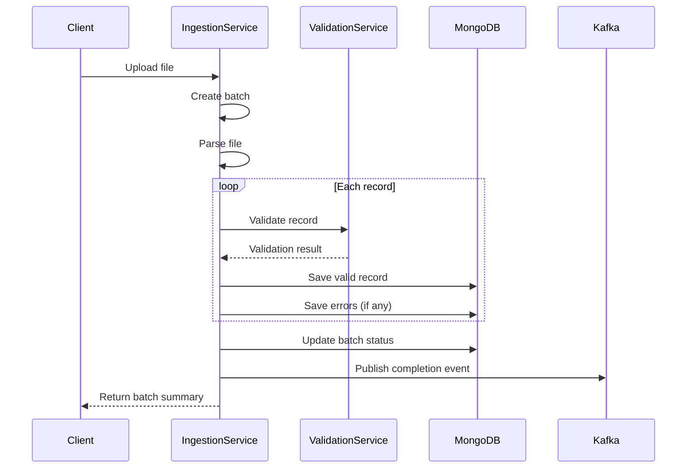

# Country Ingestion Service - Architecture Documentation

## Overview

The Country Ingestion Service is responsible for ingesting country data from various sources into the Global Business Management system. It supports multiple file formats (CSV, JSON, XML, Excel) and provides comprehensive validation and error tracking.

## Architecture

```mermaid
graph TB
    subgraph "Country Ingestion Service"
        subgraph "Application Layer"
            APP[CountryIngestionApplication]
            INGEST_SVC[CountryIngestionService]
            DATA_VAL_SVC[DataValidationService]
            BATCH_PROC[BatchProcessingService]
        end

        subgraph "Domain Layer"
            COUNTRY_DATA[CountryData]
            INGESTION_BATCH[IngestionBatch]
            VALIDATION_ERROR[ValidationError]
            DATA_SCHEMA[DataSchema]
        end

        subgraph "Infrastructure Layer"
            MONGO[MongoDB Config]
            KAFKA[Kafka Template]
            MAPPER[CountryIngestionMapper]
        end
    end

    EXT_SRC[External Sources] --> INGEST_SVC
    MONGO_DB[(MongoDB)] <-- MONGO
    KAFKA_BROKER[(Kafka)] <-- KAFKA
    VALIDATION_SVC[Data Validation Service] --> DATA_VAL_SVC
```

## Domain Models

### CountryData
Comprehensive country information including geographic, economic, and business data.

**Key Features:**
- ISO 3166-1 compliant country codes
- Geographic data (coordinates, area, borders)
- Population and demographic data
- Economic indicators (GDP, inflation, unemployment)
- Business environment data
- Data quality scoring

### IngestionBatch
Tracks the progress and status of data ingestion operations.

**Key Features:**
- Batch type classification (FULL_IMPORT, INCREMENTAL_UPDATE, etc.)
- Progress tracking with percentage
- Success/failure record counts
- Processing time metrics
- Retry support with configurable limits

### ValidationError
Records validation errors found during data ingestion.

**Key Features:**
- Error level classification (CRITICAL, HIGH, MEDIUM, LOW)
- Error type categorization
- Resolution tracking
- Auto-correction support
- Occurrence counting

## Data Flow



## Supported File Formats

| Format | Extension | Parser | Max Size |
|--------|-----------|--------|----------|
| CSV | .csv | Apache Commons CSV | 100MB |
| JSON | .json | Jackson | 50MB |
| XML | .xml | JAXB | 50MB |
| Excel | .xlsx, .xls | Apache POI | 50MB |

## Validation Rules

### Required Fields
- countryCode (ISO 3166-1 alpha-2)
- countryName
- region
- population

### Format Validation
- ISO codes must match patterns
- Numeric fields must be valid numbers
- Dates must be in ISO format

### Range Validation
- Population > 0
- GDP values > 0
- Coordinates within valid ranges

### Business Rules
- Unique country code
- Valid currency codes
- Consistent regional data

## Processing Modes

1. **Validate Only**: Validates data without storing
2. **Store Valid Records**: Stores valid records, logs errors
3. **Stop on Error**: Aborts batch on critical errors
4. **Continue on Error**: Processes all records, logs errors

## Error Handling

### Retry Strategy
- Max retries: 3 (configurable)
- Exponential backoff: 1s, 2s, 4s
- Retry on: Transient errors only

### Error Recovery
- Failed records logged with details
- Partial batch completion support
- Reprocess failed records feature

## Kafka Events

**Topics:**
- `country.ingestion.events`: Batch lifecycle events
- `country.data.updated`: New/updated country data
- `validation.errors.detected`: Validation error notifications

**Event Types:**
- CREATED: New batch created
- IN_PROGRESS: Batch processing started
- COMPLETED: Batch completed successfully
- FAILED: Batch failed
- VALIDATION_FAILED: Validation errors detected

## Performance Considerations

### Optimization Strategies
- Chunk-based processing (100 records per chunk)
- Parallel record validation
- Bulk database inserts
- Async event publishing

### Scalability
- Horizontal scaling via file partitioning
- Queue-based batch processing
- Distributed validation support

## Security

### Access Control
- File upload size limits
- File type validation
- Schema-based validation
- Audit logging for all operations

### Data Protection
- PII data handling per GDPR
- Secure file storage
- Encrypted data transmission
