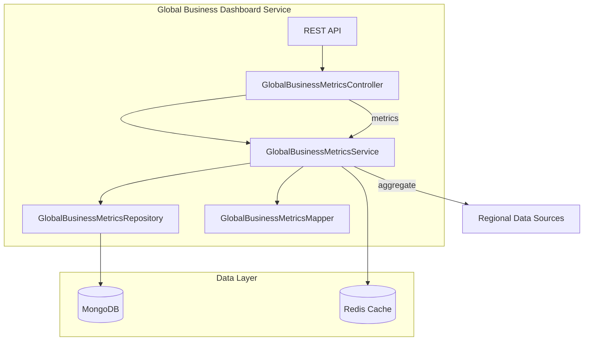

# Global Business Dashboard Service - Architecture

## Overview

The Global Business Dashboard Service is a core component of the Global Business Management domain that aggregates and presents global business metrics across all regions and countries. It provides a comprehensive view of business performance for strategic decision-making.

## Architecture Diagram



## Components

### API Layer
- **GlobalBusinessMetricsController**: REST endpoints for managing global business metrics
- **RegionalSummaryController**: REST endpoints for regional summaries

### Service Layer
- **GlobalBusinessMetricsService**: Business logic for global metrics operations
- **RegionalSummaryService**: Business logic for regional summaries

### Domain Layer
- **GlobalBusinessMetrics**: Domain model for global metrics
- **RegionalSummary**: Domain model for regional summaries
- **CountryMetrics**: Domain model for country-level metrics
- **KPIBoard**: Domain model for KPI boards

### Infrastructure Layer
- **CacheConfig**: Redis cache configuration
- **MongoConfig**: MongoDB configuration
- **WebConfig**: Web MVC configuration
- **OpenApiConfig**: OpenAPI/Swagger documentation

## Data Flow

1. **Metrics Collection**: Regional data is aggregated from multiple sources
2. **Processing**: Metrics are processed and calculated
3. **Storage**: Results are stored in MongoDB
4. **Caching**: Frequently accessed data is cached in Redis
5. **Presentation**: Data is served via REST APIs

## Caching Strategy

- **Cache Name**: `globalMetrics` and `regionalSummary`
- **Key Patterns**:
  - Entity by ID: `{entityId}`
  - Entity by period: `period:{periodId}`
  - Latest published: `latest`
  - Top regions: `topRegions:{periodId}:{limit}`
  - Financial summary: `financialSummary:{periodId}`

## Database Schema

### GlobalBusinessMetrics Collection
```json
{
  "_id": "string",
  "periodId": "string",
  "startDate": "datetime",
  "endDate": "datetime",
  "totalRevenue": "decimal",
  "totalExpenses": "decimal",
  "grossProfit": "decimal",
  "netProfit": "decimal",
  "profitMargin": "decimal",
  "totalOrders": "long",
  "activeCustomers": "long",
  "newCustomers": "long",
  "churnedCustomers": "long",
  "customerRetentionRate": "decimal",
  "averageOrderValue": "decimal",
  "baseCurrency": "string",
  "regionalBreakdown": "map",
  "status": "PUBLISHED|DRAFT|PENDING_REVIEW|ARCHIVED",
  "version": "integer",
  "createdAt": "timestamp",
  "updatedAt": "timestamp"
}
```

## Dependencies

- Spring Boot 3.2.0
- Spring Data MongoDB
- Spring Cache (Redis)
- MapStruct for DTO mapping
- Lombok for boilerplate reduction
- SpringDoc OpenAPI for API documentation

## Scaling Considerations

- **Read-Heavy**: Optimize for read operations with Redis caching
- **Batch Processing**: Support for batch aggregation of large datasets
- **Time-Series**: Organized by period for efficient time-based queries
