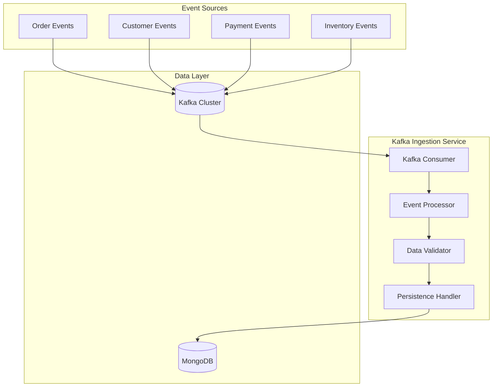

# Kafka Ingestion Service - Architecture

## Overview
The Kafka Ingestion Service handles high-throughput event ingestion from Apache Kafka, processing business events from across the global business ecosystem in real-time.

## Architecture Diagram



## Components

### Kafka Consumer
- **Event Types**: OrderCreated, OrderUpdated, CustomerRegistered, PaymentProcessed
- **Consumer Groups**: Organized by event type for parallel processing
- **Offset Management**: Automatic offset commit for at-least-once semantics

### Event Processor
- **Deserialization**: JSON to domain object conversion
- **Enrichment**: Adding metadata and timestamps
- **Batching**: Accumulating events for bulk writes

### Data Validator
- **Schema Validation**: JSON schema validation
- **Business Rules**: Domain-specific validation
- **Error Handling**: Dead letter queue for failed events

### Persistence Handler
- **Bulk Operations**: Optimized MongoDB bulk writes
- **Retry Logic**: Automatic retry with exponential backoff
- **Error Logging**: Comprehensive error tracking

## Topics

### Ingestion Topics
- **orders.v1**: Order lifecycle events
- **customers.v1**: Customer profile events
- **payments.v1**: Payment transaction events
- **inventory.v1**: Inventory level events

### DLQ Topics
- **orders.dlq**: Failed order events
- **customers.dlq**: Failed customer events
- **payments.dlq**: Failed payment events

## Configuration

### Consumer Settings
```yaml
spring:
  kafka:
    consumer:
      bootstrap-servers: localhost:9092
      group-id: global-business-ingestion
      auto-offset-reset: earliest
      enable-auto-commit: false
      max-poll-records: 500
    listener:
      ack-mode: manual_immediate
```

## Error Handling

### Retry Strategy
- Initial retry: 1 second
- Max retries: 3
- Backoff multiplier: 2
- Dead letter queue after max retries

### Monitoring
- Consumer lag monitoring
- Throughput metrics
- Error rate tracking
- DLQ size alerts

## Dependencies

- Spring Boot 3.2.0
- Spring Kafka
- Spring Data MongoDB
- Jackson for JSON processing
- Micrometer for metrics
