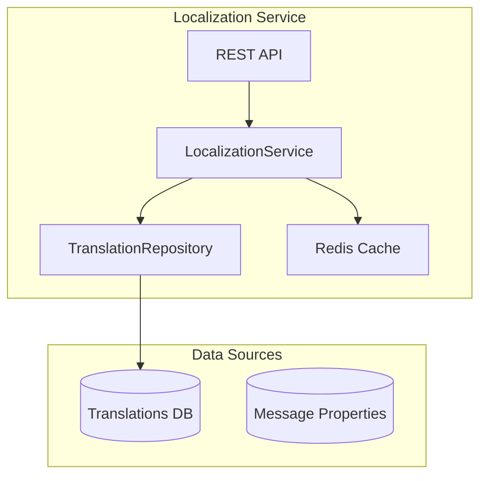

# Localization Service - Architecture

## Overview
The Localization Service provides internationalization and localization capabilities for the Global Business Management platform, enabling multi-language and multi-region support.

## Architecture Diagram

## Components

### Service Layer
- **LocalizationService**: Translation and locale management
- **LanguageDetectionService**: Automatic language detection
- **TimeZoneService**: Time zone conversion support

### Domain Models
- **Translation**: Text translation for different languages
- **Locale**: Represents supported locales
- **TranslationKey**: Keys for translatable content

## Supported Languages
- English (en) - Default
- Spanish (es)
- French (fr)
- German (de)
- Italian (it)
- Portuguese (pt)
- Chinese Simplified (zh-CN)
- Chinese Traditional (zh-TW)
- Japanese (ja)
- Korean (ko)
- Arabic (ar)
- Russian (ru)

## Supported Regions
- North America (en-US, es-MX, fr-CA)
- Europe (en-GB, de-DE, fr-FR, es-ES, it-IT)
- Asia Pacific (zh-CN, ja-JP, ko-KR)
- Middle East (ar-SA, he-IL)
- Latin America (es-MX, pt-BR)

## Caching Strategy
Translations are cached in Redis with keys: `translation:{locale}:{key}`
