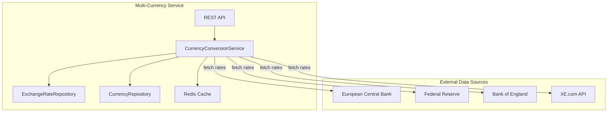

# Multi-Currency Service - Architecture

## Overview

The Multi-Currency Service provides real-time currency conversion and exchange rate management capabilities for the Global Business Management platform. It enables multi-currency transactions across all regions.

## Architecture Diagram



## Components

### Service Layer
- **CurrencyConversionService**: Core currency conversion logic
- - Direct rate conversion
- - Inverse rate calculation
- - Cross rate calculation through base currency
- - Historical rate queries
- - Batch rate retrieval

### Domain Models
- **ExchangeRate**: Stores exchange rate data between currency pairs
- **Currency**: Represents supported currencies
- **CurrencyPair**: Defines tradable currency pairs
- **MultiCurrencyAccount**: Multi-currency account balances

### Repositories
- **ExchangeRateRepository**: Exchange rate data access
- **CurrencyRepository**: Currency metadata access
- **CurrencyPairRepository**: Currency pair configuration

## Caching Strategy

- **Cache Name**: `exchangeRates`
- **Key Patterns**:
  - Conversion: `convert:{amount}:{from}:{to}`
  - Rate: `rate:{from}:{to}`
  - Entity: `entity:{from}:{to}`
  - All rates: `allRates:{base}`
  - Supported currencies: `supportedCurrencies`

## Rate Calculation Logic

### Priority Order:
1. **Direct Rate**: FROM → TO (e.g., USD → EUR)
2. **Inverse Rate**: TO → FROM (e.g., EUR → USD), then invert
3. **Cross Rate**: FROM → USD → TO (via base currency)

## Data Sources

- **ECB**: European Central Bank reference rates
- **FED**: Federal Reserve rates
- **BANK_OF_ENGLAND**: UK rates
- **BLOOMBERG**: Market rates
- **REUTERS**: Financial data
- **XE**: XE.com rates
- **OANDA**: FX rates

## Dependencies

- Spring Boot 3.2.0
- Spring Data MongoDB
- Spring Cache Abstraction
- Redis for distributed caching
- BigDecimal for precise financial calculations

## Database Schema

### ExchangeRate Collection
```json
{
  "_id": "string",
  "fromCurrency": "USD",
  "toCurrency": "EUR",
  "rate": 0.85,
  "effectiveDate": "timestamp",
  "source": "ECB",
  "status": "ACTIVE",
  "bidRate": 0.8495,
  "askRate": 0.8505,
  "midRate": 0.85,
  "spread": 0.001,
  "volatility": 0.015,
  "volume24h": 1500000000,
  "inverseRate": 1.1765
}
```

## API Features

- Real-time currency conversion
- Historical rate queries
- Batch conversion for multiple currencies
- Rate monitoring and alerts
- Support for 150+ currencies
- Decimal precision up to 6 places

## Currency Support

- **Major Currencies**: USD, EUR, GBP, JPY, CHF, CAD, AUD
- **Asian Currencies**: CNY, INR, SGD, HKD, KRW
- **Emerging Markets**: BRL, MXN, ZAR, TRY, RUB
- **Cryptocurrencies**: BTC, ETH (via CRYPTO_COMPARE)

## Error Handling

- **Rate Not Found**: Throws `IllegalArgumentException`
- **Invalid Currency**: Returns validation error
- **Stale Rate**: Automatic refresh attempted
- **Service Unavailable**: Fallback to cached rates
