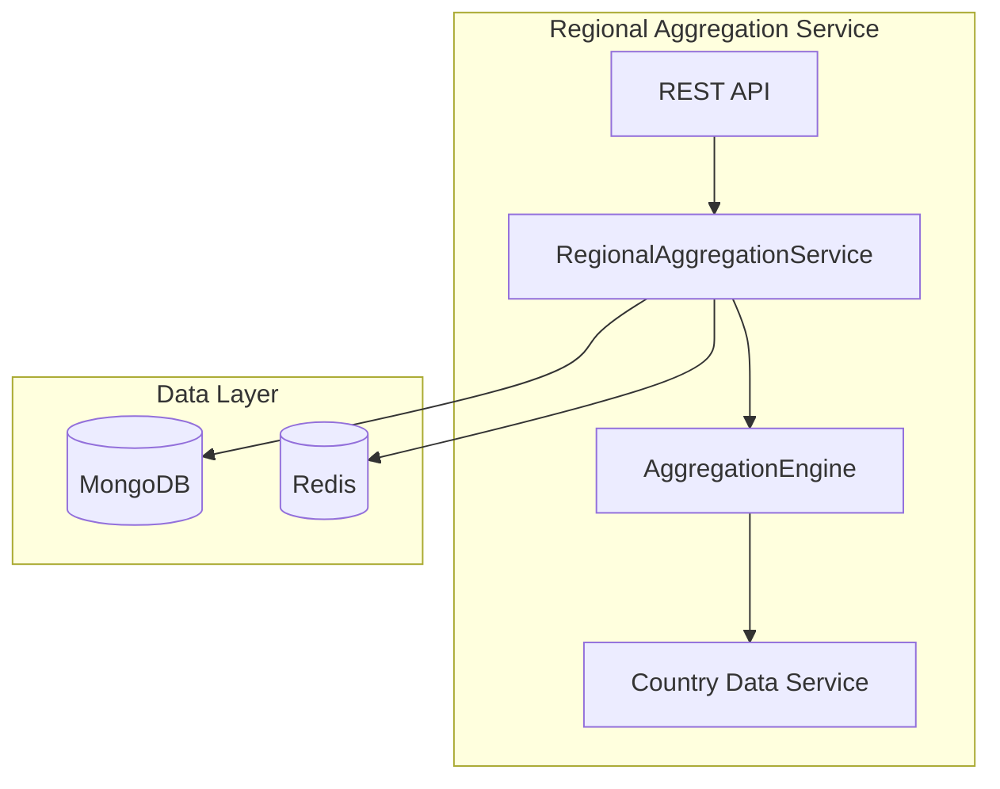

# Regional Aggregation Service - Architecture

## Overview
The Regional Aggregation Service aggregates business data from multiple countries within a region to provide regional-level insights and metrics.

## Architecture Diagram



## Components

### Service Layer
- **RegionalAggregationService**: Orchestrates regional data aggregation
- **AggregationEngine**: Performs metric aggregation logic
- **RegionalSummaryService**: Manages regional summary entities

### Aggregation Logic

### Revenue Aggregation
```
Regional Revenue = Sum(Country Revenue for all countries in region)
```

### Customer Aggregation
```
Regional Customers = Sum(Country Active Customers)
Regional New Customers = Sum(Country New Customers)
Regional Churned Customers = Sum(Country Churned Customers)
```

### Growth Rate Calculation
```
Regional Growth Rate = Weighted Average(Country Growth Rates)
Weight = Country Revenue / Total Regional Revenue
```

## Regions Supported
- North America (NA)
- Europe (EU)
- Asia Pacific (APAC)
- Latin America (LATAM)
- Middle East & Africa (MEA)

## Caching Strategy
Regional summaries are cached with TTL of 5 minutes to support real-time dashboards while allowing for periodic updates.
