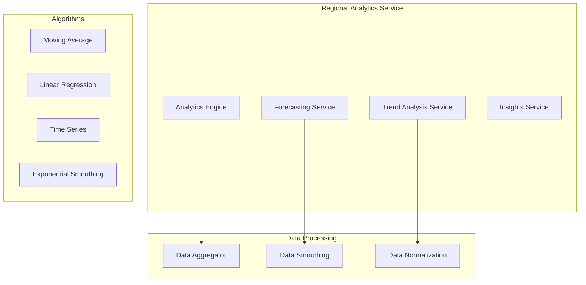

# Regional Analytics Service - Architecture

## Overview
The Regional Analytics Service provides advanced analytical capabilities for regional business data, including trend analysis, forecasting, and predictive insights.

## Architecture Diagram

## Components

### Analytics Engine
- **TrendAnalysisService**: Identifies patterns in historical data
- **ForecastingService**: Predicts future business metrics
- **InsightsService**: Generates actionable insights
- **AnomalyDetectionService**: Detects unusual patterns

### Analytics Types

### Trend Analysis
- Moving averages (7, 30, 90 day)
- Year-over-year comparisons
- Month-over-month growth
- Seasonal pattern detection

### Forecasting
- Revenue forecasting (3, 6, 12 months)
- Customer growth prediction
- Market trend projection
- Risk factor analysis

### Anomaly Detection
- Sudden spikes or drops
- Unusual customer behavior
- Data quality issues
- Potential fraud detection

## Algorithms Used

### Time Series Analysis
- Simple Moving Average (SMA)
- Exponential Moving Average (EMA)
- Linear Regression
- Seasonal Decomposition

### Forecasting Methods
- Naive forecasting
- Average forecasting
- Trend projection
- Seasonal adjustment

## Data Granularity

### Temporal
- Hourly (for real-time monitoring)
- Daily (for operational analysis)
- Weekly (for tactical decisions)
- Monthly (for strategic planning)
- Quarterly (for reporting)

### Hierarchical
- Country level
- Regional level
- Global level

## Outputs

### Dashboard Visualizations
- Line charts for trends
- Bar charts for comparisons
- Heat maps for correlations
- Scatter plots for relationships

### Export Formats
- PDF reports
- Excel spreadsheets
- CSV data files
- JSON for API consumption
