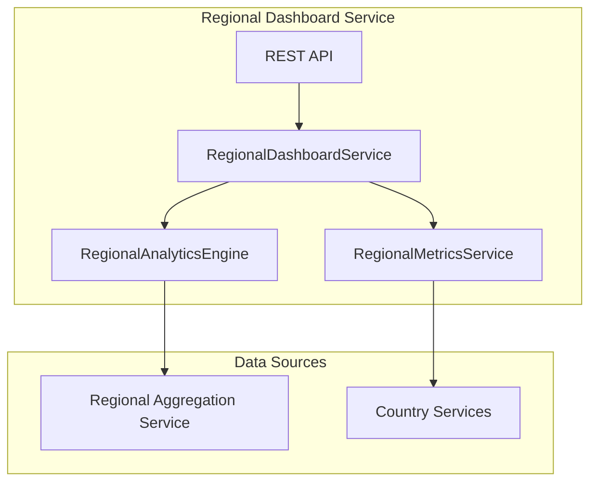

# Regional Dashboard Service - Architecture

## Overview
The Regional Dashboard Service provides region-specific business intelligence and analytics for regional managers and their teams.

## Architecture Diagram

## Components

### Service Layer
- **RegionalDashboardService**: Main service for regional dashboard operations
- **RegionalAnalyticsService**: Analytical calculations and trends
- **KPIBoardService**: KPI board management

### Key Features
- Regional revenue and profit analysis
- Country comparison within region
- Regional trend analysis
- Market penetration metrics
- Customer satisfaction tracking
- Performance benchmarking

## Dashboard Components

### Executive Summary
- Total regional revenue
- Profit margin by country
- Customer growth trends
- Top performing countries

### Country Comparison
- Country-wise revenue breakdown
- Market penetration comparison
- Growth rate rankings
- Risk assessment by country

### Analytics
- Revenue trends (monthly, quarterly)
- Customer acquisition cost
- Churn analysis
- Market share analysis

## Regions Supported
Each regional dashboard instance is configured for a specific region:
- North America Dashboard
- Europe Dashboard
- Asia Pacific Dashboard
- Latin America Dashboard
- Middle East & Africa Dashboard
