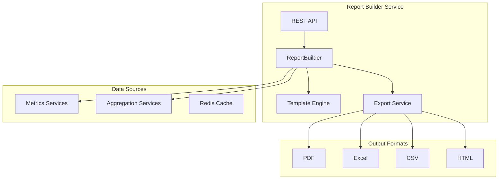

# Report Builder Service - Architecture

## Overview
The Report Builder Service provides comprehensive report generation capabilities, allowing users to create custom reports from business data across the Global Business Management platform.

## Architecture Diagram

## Components

### Service Layer
- **ReportBuilderService**: Main report building logic
- **TemplateEngine**: Processes report templates
- **ExportService**: Handles export to different formats
- **ScheduleService**: Manages report schedules

### Report Types

### Standard Reports
- Executive Summary
- Regional Performance
- Country Analysis
- Financial Statement
- Customer Analytics

### Custom Reports
- User-defined metrics
- Custom date ranges
- Selected regions/countries
- Custom layouts

## Template System

### Template Elements
- Page headers and footers
- Logo and branding
- Data tables
- Charts and graphs
- Summary statistics

### Template Variables
- {report_title}
- {date_range}
- {generated_at}
- {generated_by}
- {company_name}

## Export Formats

### PDF (Portable Document Format)
- High-quality reports for sharing
- Print-optimized
- Embedded charts
- Password protection

### Excel (XLSX)
- Spreadsheet format for analysis
- Multiple worksheets
- Formulas and calculations
- Conditional formatting

### CSV (Comma Separated Values)
- Raw data export
- Machine-readable
- Compatible with BI tools
- Large dataset support

## Scheduling

### Schedule Types
- Hourly
- Daily
- Weekly
- Monthly
- Quarterly

### Delivery Options
- Email
- FTP/SFTP
- API download
- Cloud storage
