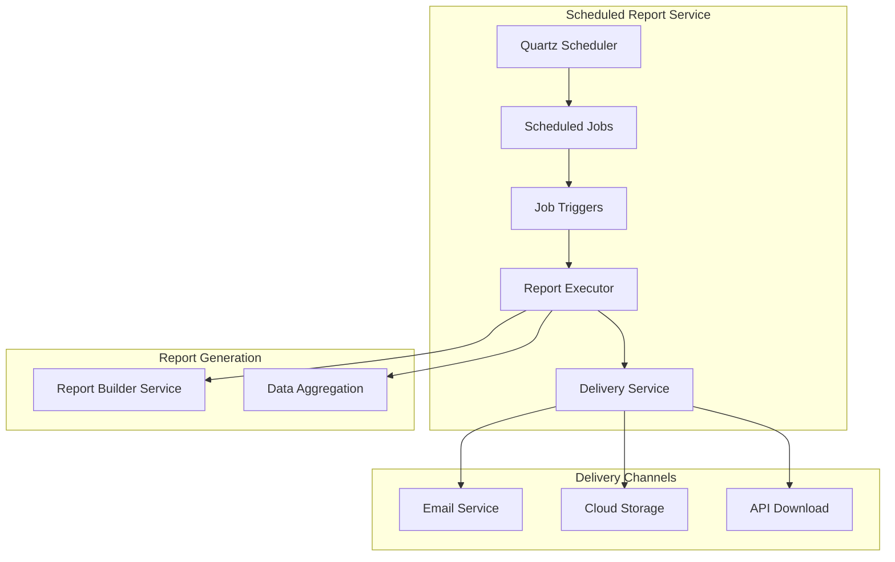

# Scheduled Report Service - Architecture

## Overview
The Scheduled Report Service automates the generation and delivery of recurring reports according to defined schedules, ensuring stakeholders receive timely business intelligence.

## Architecture Diagram



## Components

### Scheduler
- **QuartzScheduler**: Job scheduling engine
- **JobRegistry**: Maintains job definitions
- **TriggerManager**: Manages cron triggers
- **JobExecutor**: Executes scheduled jobs

### Job Management
- **ReportJob**: Represents a scheduled report job
- **JobExecution**: Tracks execution history
- **JobDependency**: Manages job dependencies
- **JobLock**: Prevents duplicate executions

## Schedule Types

### Cron Schedules
- Hourly: `0 0 * * * ?`
- Daily: `0 0 0 * * ?`
- Weekly: `0 0 0 ? * MON`
- Monthly: `0 0 0 1 * ?`
- Quarterly: `0 0 0 1 1,4,7,10 ?`

### Calendar-Based
- Business days only
- Exclude holidays
- Specific time zones
- Fiscal periods

## Job Configuration

### Job Parameters
```json
{
  "jobName": "weekly-executive-report",
  "reportType": "EXECUTIVE_SUMMARY",
  "schedule": "0 0 8 ? * MON",
  "timeZone": "America/New_York",
  "recipients": ["executive@gogidix.com"],
  "parameters": {
    "period": "last-7-days",
    "includeCharts": true,
    "format": "PDF"
  }
}
```

## Execution Flow

1. **Trigger Fires**: Schedule triggers job execution
2. **Lock Acquisition**: Distributed lock prevents duplicate runs
3. **Data Collection**: Gather data from source services
4. **Report Generation**: Build report using Report Builder
5. **Delivery**: Send report via configured channels
6. **History Logging**: Record execution details

## Delivery Channels

### Email
- SMTP configuration
- Attachments (PDF, Excel)
- HTML body
- Recipient lists

### Cloud Storage
- AWS S3
- Azure Blob Storage
- Google Cloud Storage

### API
- Webhook notifications
- Direct download links
- API access tokens

## Error Handling

### Retry Logic
- Transient errors: 3 retries with exponential backoff
- Permanent errors: Immediate notification
- Dead letter queue for failed deliveries

### Alerts
- Job failure notifications
- Timeout warnings
- Delivery confirmations
- SLA breach alerts

## Monitoring

### Metrics
- Job execution count
- Success/failure rate
- Average execution time
- Queue depth

### Health Checks
- Scheduler status
- Job registry connectivity
- Delivery service health
