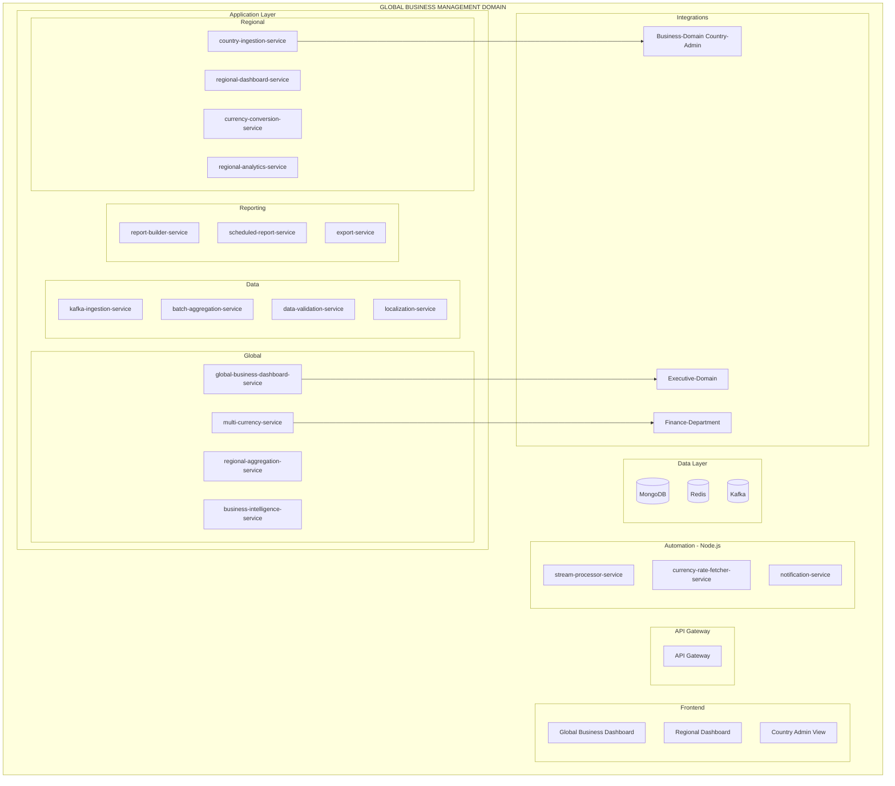

# PRD: Global-Business-Management Domain

**Version:** 1.0
**Date:** 2026-01-29
**Status:** Product Requirements Document
**Domain:** Management-Domain / Global-Business-Management

---

## Business Purpose

Aggregate, analyze, and present business operations data across all countries and regions for strategic decision-making.

## User Personas

1. **Global Operations Director** - All regions oversight
2. **Regional Manager** - Specific region (Europe, Africa, etc.)
3. **Country Admin** - Local operations
4. **Business Analyst** - Data analysis and reporting

## Domain Architecture



## Service Inventory

### Java Backend Services (15)

| Service | Priority |
|---------|----------|
| global-business-dashboard-service | P0 |
| multi-currency-service | P0 |
| regional-aggregation-service | P0 |
| business-intelligence-service | P0 |
| regional-dashboard-service | P0 |
| country-ingestion-service | P0 |
| currency-conversion-service | P0 |
| regional-analytics-service | P0 |
| kafka-ingestion-service | P0 |
| batch-aggregation-service | P0 |
| data-validation-service | P1 |
| localization-service | P1 |
| report-builder-service | P0 |
| scheduled-report-service | P0 |
| export-service | P0 |

### Node.js Services (3)

| Service | Priority |
|---------|----------|
| stream-processor-service | P0 |
| currency-rate-fetcher-service | P0 |
| notification-service | P1 |

### Frontend (3)

| Application | Priority |
|-------------|----------|
| global-business-dashboard | P0 |
| regional-dashboard | P0 |
| country-admin-view | P0 |

## Integration Points

```
Global-Business-Management → Business-Domain (Country-Admin-Dashboards)
├── Data ingestion from all countries
├── Real-time event streaming
├── Batch aggregation
└── Validation and cleansing

Global-Business-Management → Executive-Domain
├── Executive reporting
├── Strategic insights
└── Performance metrics

Global-Business-Management → Finance-Department
├── Financial data aggregation
├── Currency conversion
└── Regional financials
```

---

**End of PRD: Global-Business-Management Domain**
