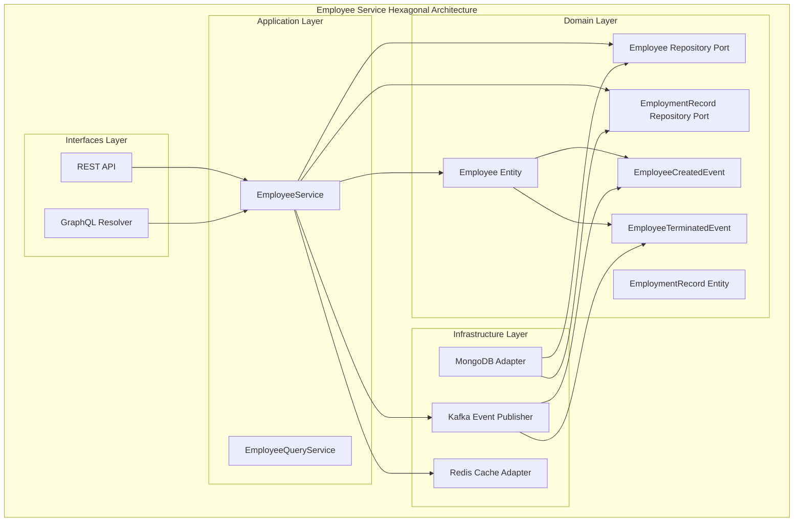
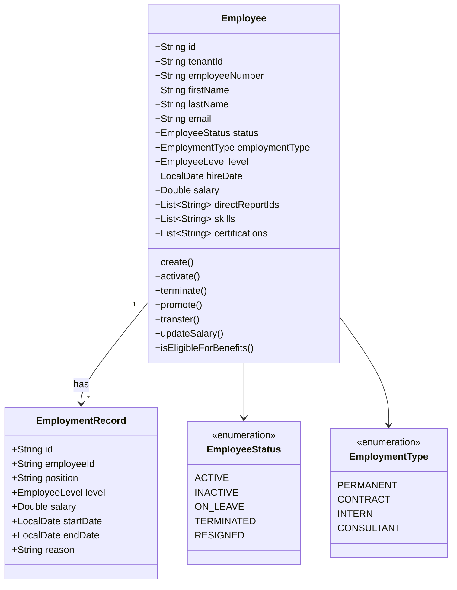
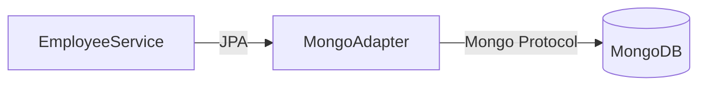
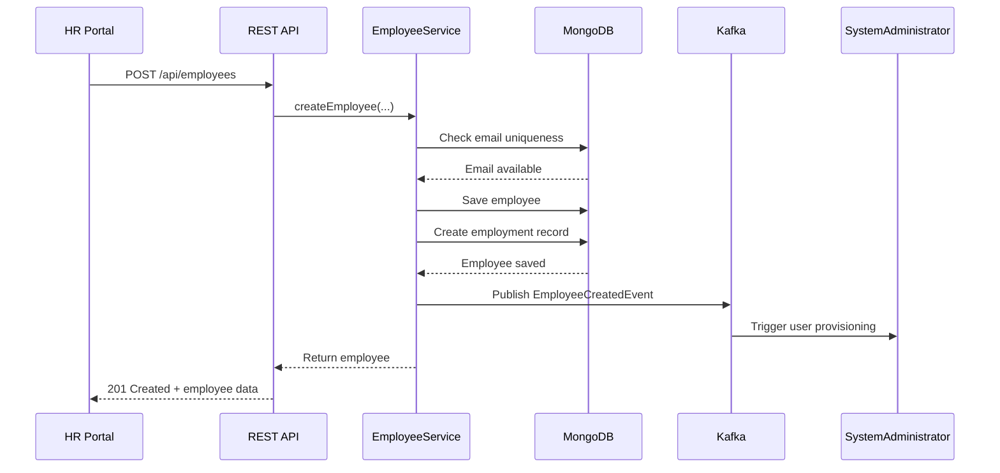
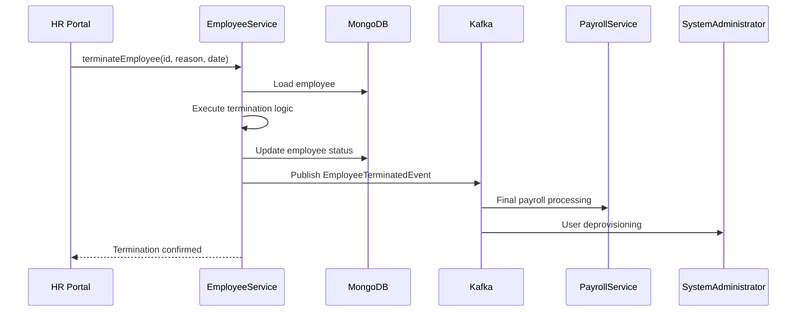

# Employee Service - Architecture Documentation

## Overview

The Employee Service is a core Human Resource domain service responsible for managing the complete employee lifecycle within the Gogidix ecosystem. It follows hexagonal architecture principles and implements domain-driven design patterns.

## Table of Contents

1. [Architecture Overview](#architecture-overview)
2. [Domain Model](#domain-model)
3. [Application Layer](#application-layer)
4. [Infrastructure Layer](#infrastructure-layer)
5. [Interfaces Layer](#interfaces-layer)
6. [Integration Points](#integration-points)
7. [Data Flow](#data-flow)
8. [Security](#security)
9. [Scalability](#scalability)

---

## Architecture Overview



### Layer Responsibilities

| Layer | Responsibility | Key Components |
|-------|---------------|----------------|
| **Domain** | Business logic, rules, and entity state | Employee, EmploymentRecord, Domain Events |
| **Application** | Use case orchestration, transaction management | EmployeeService, Query Services |
| **Infrastructure** | External concerns (DB, messaging, cache) | MongoDB, Kafka, Redis adapters |
| **Interfaces** | External communication | REST Controllers, GraphQL Resolvers |

---

## Domain Model

### Employee Aggregate Root

The Employee is the core aggregate root containing all employee-related business logic.



### Key Business Rules

1. **Employee Number Generation**
   - Format: `EMP-{UUID_FIRST_8_CHARS}`
   - Unique per tenant
   - Immutable after creation

2. **Status Transitions**
   ```
   PENDING_ONBOARDING → ACTIVE → INACTIVE
                     ↘ ON_LEAVE → ACTIVE
                     ↘ TERMINATED/RESIGNED
   ```

3. **Promotion Rules**
   - Only ACTIVE employees can be promoted
   - Level is required
   - Salary update is optional

4. **Benefits Eligibility**
   - EmploymentType must be PERMANENT
   - Status must be ACTIVE or ON_LEAVE
   - Minimum 3 months of service

---

## Application Layer

### EmployeeService

The primary application service orchestrating employee operations:

```java
@Service
@RequiredArgsConstructor
public class EmployeeService {
    private final EmployeeRepository employeeRepository;
    private final EmploymentRecordRepository employmentRecordRepository;
    private final KafkaTemplate<String, Object> kafkaTemplate;

    // Key Operations
    public Employee createEmployee(...);
    public Optional<Employee> getEmployeeById(String id);
    public Page<Employee> searchEmployees(String term, Pageable pageable);
    public Employee activateEmployee(String id);
    public Employee terminateEmployee(String id, ...);
    public Employee promoteEmployee(String id, ...);
    public Employee transferEmployee(String id, ...);
}
```

### Caching Strategy

- **Cache Name**: `employees`
- **Key**: Employee ID or Employee Number
- **TTL**: 1 hour
- **Eviction**: On update/delete operations

---

## Infrastructure Layer

### Persistence

**Database**: MongoDB



**Collections**:
- `employees` - Employee documents
- `employment_records` - Employment history documents

### Event Publishing

**Message Broker**: Apache Kafka

| Topic | Event Type | Purpose |
|-------|-----------|---------|
| `employee-created` | EmployeeCreatedEvent | New employee onboarding |
| `employee-terminated` | EmployeeTerminatedEvent | Offboarding workflow |
| `employee-updated` | UpdateEvent | Generic updates |

### Caching

**Cache Provider**: Redis

- Employee profile caching
- Search result caching
- Session management

---

## Interfaces Layer

### REST API Endpoints

```mermaid
graph TD
    Client[Client Application] -->|HTTP| API[REST API]
    API -->|POST| Create[POST /api/employees]
    API -->|GET| GetById[GET /api/employees/{id}]
    API -->|GET| Search[GET /api/employees/search]
    API -->|PUT| Update[PUT /api/employees/{id}]
    API -->|DELETE| Delete[DELETE /api/employees/{id}]
    API -->|POST| Terminate[POST /api/employees/{id}/terminate]
    API -->|POST| Promote[POST /api/employees/{id}/promote]
```

#### Endpoint Specifications

| Method | Path | Description | Auth |
|--------|------|-------------|------|
| POST | `/api/employees` | Create new employee | HR_ADMIN |
| GET | `/api/employees/{id}` | Get employee by ID | ALL_USERS |
| GET | `/api/employees/number/{number}` | Get by employee number | ALL_USERS |
| GET | `/api/employees/search` | Search employees | HR_STAFF |
| PUT | `/api/employees/{id}` | Update employee | HR_ADMIN |
| POST | `/api/employees/{id}/activate` | Activate employee | HR_ADMIN |
| POST | `/api/employees/{id}/deactivate` | Deactivate employee | HR_ADMIN |
| POST | `/api/employees/{id}/terminate` | Terminate employee | HR_ADMIN |
| POST | `/api/employees/{id}/promote` | Promote employee | HR_MANAGER |
| POST | `/api/employees/{id}/transfer` | Transfer employee | HR_MANAGER |

---

## Integration Points

### Upstream Services (Consumes From)

- **Shared-Courier-Core**: Document delivery for contracts
- **System-Administrator**: User account provisioning

### Downstream Services (Produces To)

- **Payroll-Service**: Employee salary data
- **Leave-Management-Service**: Employee leave balances
- **Benefits-Administration-Service**: Benefits enrollment
- **Performance-Review-Service**: Review assignments
- **Global-HR-Dashboard-Service**: Workforce analytics

### Event Contracts

```yaml
# EmployeeCreatedEvent
tenantId: string
employeeId: string
employeeNumber: string
employeeName: string
department: string
position: string
level: string
eventType: "EMPLOYEE_CREATED"
timestamp: datetime
```

---

## Data Flow

### Create Employee Flow



### Terminate Employee Flow



---

## Security

### Authentication & Authorization

| Role | Permissions |
|------|-------------|
| **HR_ADMIN** | Full CRUD, activate, deactivate, terminate |
| **HR_MANAGER** | Read, promote, transfer |
| **HR_STAFF** | Read, search, update basic info |
| **EMPLOYEE** | Read own record, update personal info |

### Multi-Tenancy

- Tenant ID extracted from JWT
- All queries filtered by tenantId
- Tenant isolation enforced at service layer

### Data Privacy

- PII encrypted at rest
- Audit logging for all data access
- GDPR compliance for EU employees

---

## Scalability

### Horizontal Scaling

- **Stateless Services**: Can scale horizontally
- **Session Management**: External Redis
- **Load Balancing**: Round-robin across instances

### Performance Considerations

| Concern | Strategy |
|---------|----------|
| Database | MongoDB sharding by tenantId |
| Cache | Redis Cluster |
| Messaging | Kafka partitioning by tenant |
| API | Rate limiting per tenant |

### Monitoring Metrics

- Employee creation latency
- Search query performance
- Cache hit/miss ratio
- Event publishing success rate

---

## Deployment

### Container Configuration

```dockerfile
FROM openjdk:17-slim
COPY target/employee-service.jar app.jar
ENTRYPOINT ["java", "-jar", "app.jar"]
```

### Environment Variables

| Variable | Description | Default |
|----------|-------------|---------|
| `SPRING_PROFILES_ACTIVE` | Environment profile | dev |
| `MONGODB_URI` | MongoDB connection | localhost:27017 |
| `REDIS_URI` | Redis connection | localhost:6379 |
| `KAFKA_BOOTSTRAP_SERVERS` | Kafka brokers | localhost:9092 |
| `JWT_SECRET` | JWT signing key | - |
| `TENANT_HEADER` | Tenant header name | X-Tenant-ID |

---

## Version History

| Version | Date | Changes |
|---------|------|---------|
| 1.0.0 | 2024-01-01 | Initial release |
| 1.1.0 | 2024-02-15 | Added bulk operations |
| 1.2.0 | 2024-03-01 | Enhanced search capabilities |
