# Employee Service - Business Use Cases

## Overview

This document describes the key business use cases supported by the Employee Service, including workflows, business rules, and integration points.

---

## Table of Contents

1. [Employee Lifecycle Management](#employee-lifecycle-management)
2. [Organizational Management](#organizational-management)
3. [Compensation Management](#compensation-management)
4. [Employee Development](#employee-development)
5. [Reporting and Analytics](#reporting-and-analytics)

---

## Employee Lifecycle Management

### UC-01: New Employee Onboarding

**Description**: Create a new employee record when a candidate accepts an offer.

**Actors**:
- Primary: HR Administrator
- Secondary: Hiring Manager
- Systems: System-Administrator, Benefits-Administration-Service

**Preconditions**:
- Candidate has accepted offer
- Employee basic information is available
- Department and position are defined

**Main Flow**:

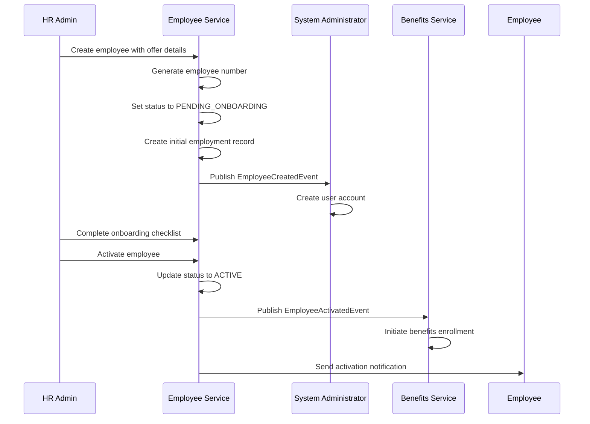

**Business Rules**:

1. Employee number format: `EMP-{8-char-unique-id}`
2. Email must be unique within tenant
3. Status cannot transition to ACTIVE until:
   - Background check completed (if required)
   - Signed employment contract received
   - Required documents uploaded
4. Benefits enrollment window opens upon activation

**Postconditions**:
- Employee record exists in ACTIVE status
- User account created
- Benefits enrollment initiated
- Manager notification sent

**Alternate Flows**:

| Condition | Action |
|-----------|--------|
| Email already exists | Return conflict error, suggest duplicate check |
| Department not found | Return validation error, require valid department |
| Background check fails | Return error, requires manual override |

---

### UC-02: Employee Termination

**Description**: Process employee termination, voluntary or involuntary.

**Actors**:
- Primary: HR Administrator
- Secondary: Payroll Administrator, IT Administrator

**Preconditions**:
- Employee exists and is not already terminated
- Termination reason documented

**Main Flow**:

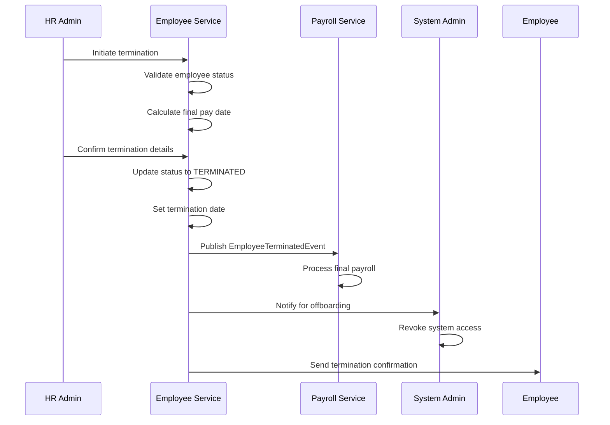

**Business Rules**:

1. Cannot terminate employee with status TERMINATED or RESIGNED
2. Final pay includes:
   - Unpaid wages through last working day
   - Accrued PTO payout (if applicable)
   - Commission/bonus proration
3. Benefits continuation:
   - COBRA notification sent
   - Coverage through month-end
4. System access revocation:
   - Effective immediately for involuntary termination
   - Effective at end of last working day for voluntary

**Postconditions**:
- Employee status = TERMINATED
- Final payroll calculated
- System access scheduled for revocation
- Benefits continuation notice sent

---

### UC-03: Employee Resignation

**Description**: Process voluntary employee resignation.

**Actors**:
- Primary: Employee (self-service), HR Administrator
- Secondary: Hiring Manager

**Preconditions**:
- Employee is ACTIVE
- Notice period per employment contract

**Main Flow**:

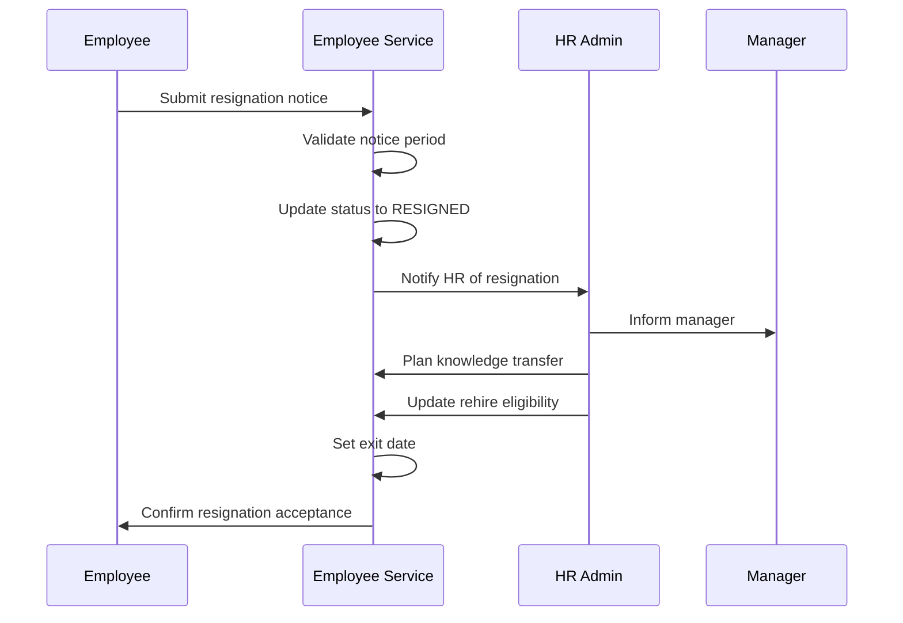

**Business Rules**:

1. Notice periods by level:
   - Entry/Mid-Level: 2 weeks
   - Senior/Lead: 4 weeks
   - Manager+: 6 weeks
2. Rehire eligibility:
   - Resigning with notice: ELIGIBLE
   - Resigning without notice: NOT_ELIGIBLE (1 year)
3. Exit interview required for:
   - Employees with 1+ years tenure
   - Voluntary resignations

---

### UC-04: Employee Transfer

**Description**: Transfer employee to new department or location.

**Actors**:
- Primary: HR Administrator
- Secondary: Current Manager, New Manager

**Preconditions**:
- Employee is ACTIVE
- Target department exists
- Budget approved for transfer

**Main Flow**:

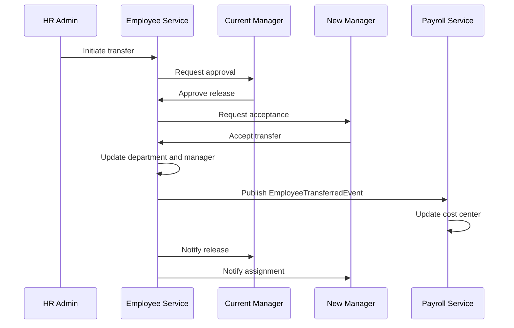

**Business Rules**:

1. Transfer effective on:
   - First of next month (cost alignment)
   - Or immediate (business need)
2. Compensation review:
   - Required if cost-of-living adjustment > 10%
   - Optional otherwise
3. Performance review timing:
   - In-progress cycle continues with current manager
   - Next cycle with new manager

---

### UC-05: Leave of Absence

**Description**: Process employee leave of absence.

**Actors**:
- Primary: HR Administrator, Employee
- Secondary: Manager, Benefits Service

**Preconditions**:
- Employee eligible for leave type
- Sufficient documentation

**Main Flow**:

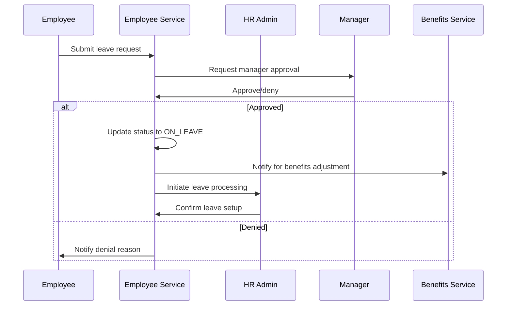

**Business Rules**:

1. Leave types requiring documentation:
   - Medical: Doctor's note
   - Military: Orders
   - Jury duty: Summons
2. Benefits during leave:
   - Medical: Continues (if < 12 weeks)
   - Personal: Continues (employee pays)
   - Military: Reinstatement rights
3. Return to work:
   - Medical: Fitness for duty required
   - Other: Notice required

---

## Organizational Management

### UC-06: Promote Employee

**Description**: Promote employee to higher level.

**Actors**:
- Primary: HR Administrator
- Secondary: Manager, Employee

**Preconditions**:
- Employee is ACTIVE
- Meets time-in-level requirement
- Performance rating meets threshold

**Main Flow**:

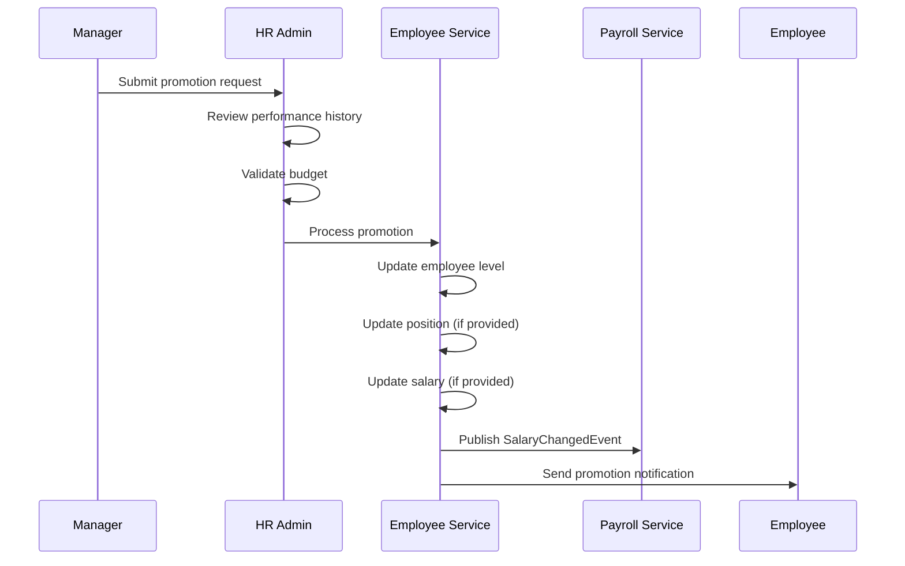

**Business Rules**:

1. Time-in-level requirements:
   - Entry → Junior: 6 months
   - Junior → Mid: 1 year
   - Mid → Senior: 2 years
   - Senior → Lead: 2 years
   - Lead → Manager: 3 years
   - Manager+: Varies by position
2. Performance requirements:
   - Last review rating: Exceeds Expectations or higher
   - No disciplinary actions in past 12 months
3. Salary increase:
   - Minimum: 3% for lateral promotion
   - Typical: 10-15% for level promotion
   - Maximum: 25% (requires VP approval)

---

### UC-07: Reorganize Department

**Description**: Bulk transfer employees during reorganization.

**Actors**:
- Primary: HR Director
- Secondary: HR Administrator, IT Support

**Preconditions**:
- Reorganization approved
- New org structure defined

**Main Flow**:

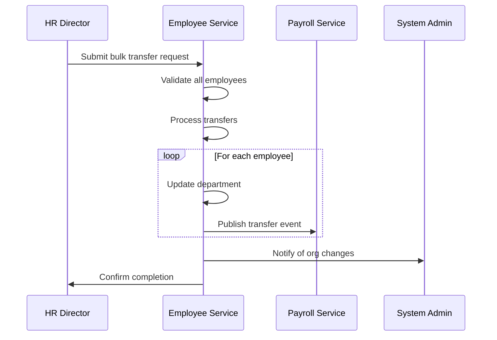

**Business Rules**:

1. All transfers effective same date
2. Reporting chain updated for all
3. Cost center transfers processed
4. Communication plan required for >10 employees

---

## Compensation Management

### UC-08: Salary Adjustment

**Description**: Process salary change for employee.

**Actors**:
- Primary: HR Administrator
- Secondary: Manager, Payroll Administrator

**Preconditions**:
- Employee is ACTIVE
- Budget approved
- Within compensation range

**Main Flow**:

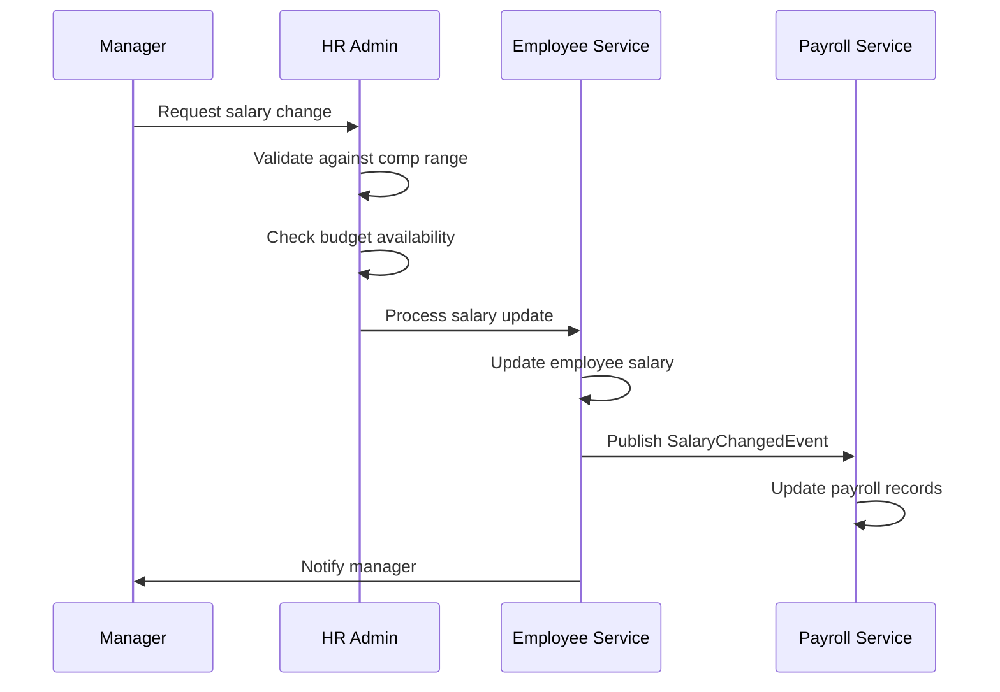

**Business Rules**:

1. Merit increase:
   - Typical: 3-5% annually
   - High performer: Up to 10%
   - Requires exception above range
2. Promotion increase:
   - See UC-06 (Promote Employee)
3. Market adjustment:
   - Based on market data
   - Requires HR Director approval
4. Equity adjustment:
   - For pay equity corrections
   - Requires VP HR approval

---

### UC-09: Compensation Review

**Description**: Annual compensation review cycle.

**Actors**:
- Primary: HR Administrator
- Secondary: All Managers, Executives

**Preconditions**:
- Review cycle configured
- Performance reviews completed
- Budget allocated

**Main Flow**:

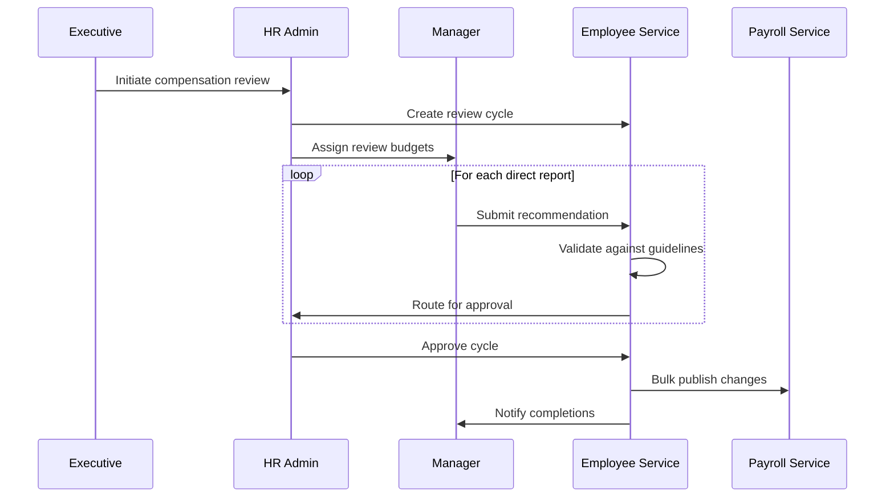

**Business Rules**:

1. Performance-based distribution:
   - Exceeds: 100-125% of budget
   - Meets: 90-100% of budget
   - Below: 0-75% of budget
2. Approval matrix:
   - < 5% increase: Manager approval
   - 5-10% increase: HR Director approval
   - > 10% increase: VP approval
3. Effective date:
   - Generally first pay period of next quarter

---

## Employee Development

### UC-10: Skill Management

**Description**: Track employee skills and competencies.

**Actors**:
- Primary: HR Administrator, Employee (self)
- Secondary: Manager

**Preconditions**:
- Skill catalog defined
- Employee record exists

**Main Flow**:

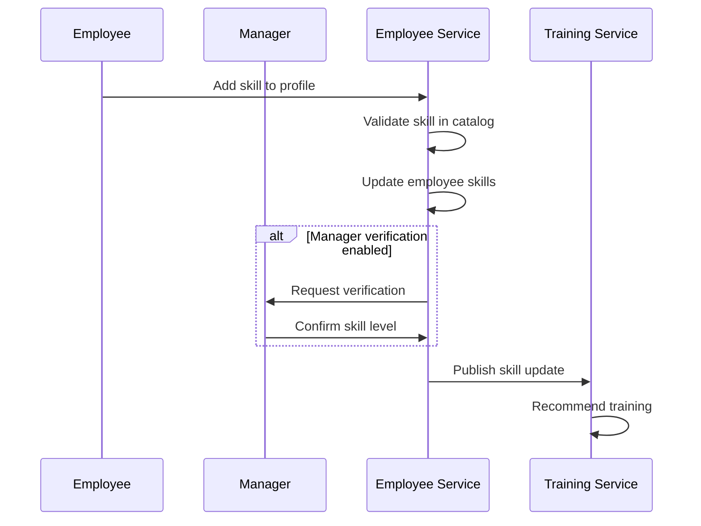

**Business Rules**:

1. Skill levels:
   - Aware: Basic knowledge
   - Skilled: Can work independently
   - Expert: Can teach others
2. Verification:
   - Manager verification for claimed skills
   - Certification required for some skills
3. Privacy:
   - Employees see own skills
   - Managers see direct reports' skills
   - HR sees all skills

---

### UC-11: Certification Tracking

**Description**: Track professional certifications and credentials.

**Actors**:
- Primary: HR Administrator, Employee
- Secondary: Manager

**Preconditions**:
- Certification type defined
- Employee record exists

**Main Flow**:

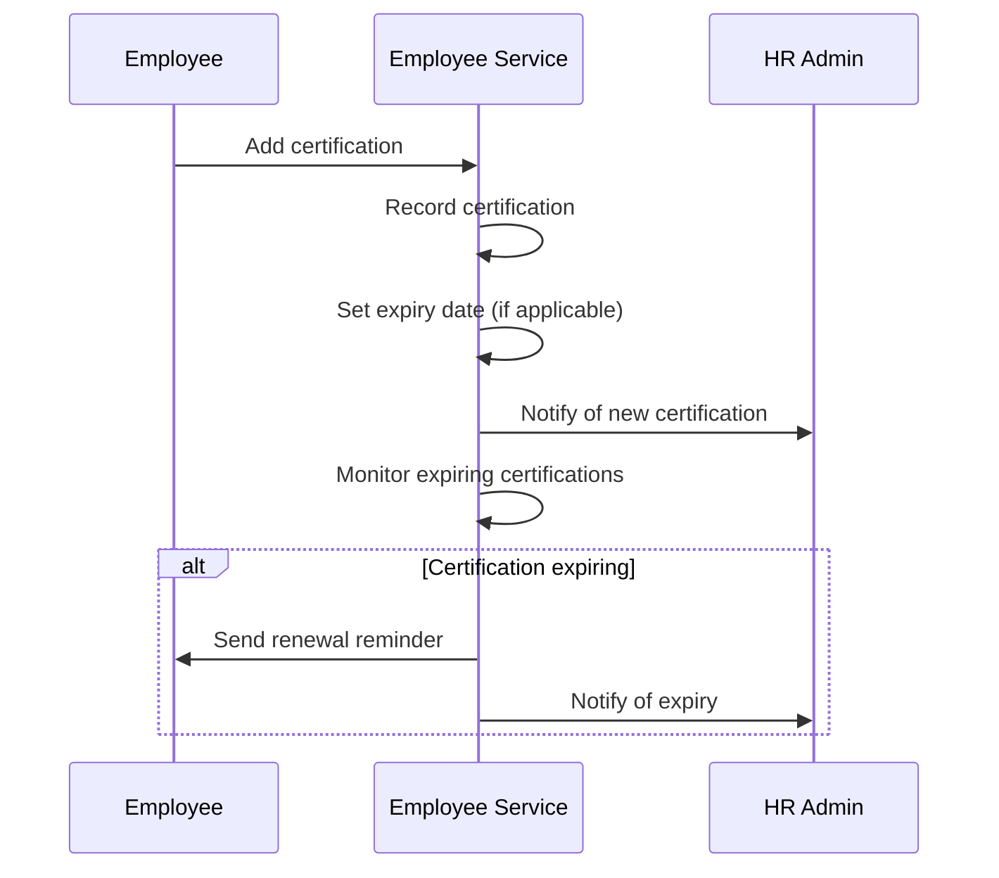

**Business Rules**:

1. Certification types:
   - Required: Must maintain for position
   - Preferred: Nice to have
2. Expiry tracking:
   - 90-day notice for renewal
   - 30-day notice for non-renewal
3. Compensation:
   - Some certifications merit pay increase
   - Company-paid renewal for required certs

---

## Reporting and Analytics

### UC-12: Employee Headcount Report

**Description**: Generate headcount by various dimensions.

**Actors**:
- Primary: HR Management, Executives

**Preconditions**:
- Employee data current

**Report Dimensions**:

| Dimension | Examples |
|-----------|----------|
| By Department | Engineering, Sales, Marketing |
| By Location | US, Ireland, India |
| By Level | Entry, Mid, Senior, Manager |
| By Status | Active, On Leave, Terminated |
| By Type | Permanent, Contract, Intern |

**Key Metrics**:

- Headcount (current, period start, change)
- Open positions
- Attrition (voluntary, involuntary)
- Growth rate

---

### UC-13: Diversity & Inclusion Report

**Description**: Track diversity metrics.

**Actors**:
- Primary: HR Management, DEI Team

**Report Categories**:

| Category | Metrics |
|----------|---------|
| Gender | Distribution by level |
| Ethnicity | Distribution by level |
| Age | Distribution by level |
| Disability | Representation |
| Veteran | Veteran status |

**Privacy**:
- Aggregate reporting only
- Individual data protected
- Consent-based where required

---

### UC-14: Tenure & Retention Report

**Description**: Track employee tenure and retention.

**Actors**:
- Primary: HR Management

**Key Metrics**:

- Average tenure (overall, by department)
- Tenure distribution
- Retention rate by tenure band
- Turnover by reason
- Risk analysis (high performers at risk)

---

## Integration Requirements

### Required Integrations

| System | Purpose | Trigger |
|--------|---------|---------|
| System-Administrator | User provisioning | Employee created |
| Payroll-Service | Salary sync | Salary change |
| Benefits-Administration-Service | Enrollment | Employee activated |
| Leave-Management-Service | Leave sync | Leave status change |
| Performance-Review-Service | Review assignment | Promotion |

### Event Contracts

**EmployeeCreatedEvent**:
```json
{
  "employeeId": "emp-001",
  "tenantId": "tenant-123",
  "employeeNumber": "EMP-A1B2C3D4",
  "employeeName": "John Doe",
  "email": "john.doe@gogidix.com",
  "department": "Engineering",
  "position": "Software Engineer",
  "level": "MID_LEVEL",
  "hireDate": "2024-03-01",
  "managerId": "mgr-001",
  "eventType": "EMPLOYEE_CREATED",
  "timestamp": "2024-02-23T10:00:00Z"
}
```

**EmployeeTerminatedEvent**:
```json
{
  "employeeId": "emp-001",
  "tenantId": "tenant-123",
  "employeeNumber": "EMP-A1B2C3D4",
  "employeeName": "John Doe",
  "terminationReason": "Resignation",
  "terminationCategory": "VOLUNTARY",
  "terminationDate": "2024-03-15",
  "lastWorkingDay": "2024-03-15",
  "rehireEligible": true,
  "eventType": "EMPLOYEE_TERMINATED",
  "timestamp": "2024-02-23T10:00:00Z"
}
```

---

## Business Rules Summary

| Rule ID | Rule | Enforcement |
|---------|------|-------------|
| BR-001 | Unique email per tenant | Database constraint |
| BR-002 | Status transition validation | Service layer |
| BR-003 | Minimum 3 months for benefits | Domain logic |
| BR-004 | Manager level required for reports | Validation |
| BR-005 | Salary positive only | Domain validation |
| BR-006 | Notice period by level | Business logic |
| BR-007 | Time-in-level for promotion | Validation |
| BR-008 | Performance threshold for promotion | Validation |
