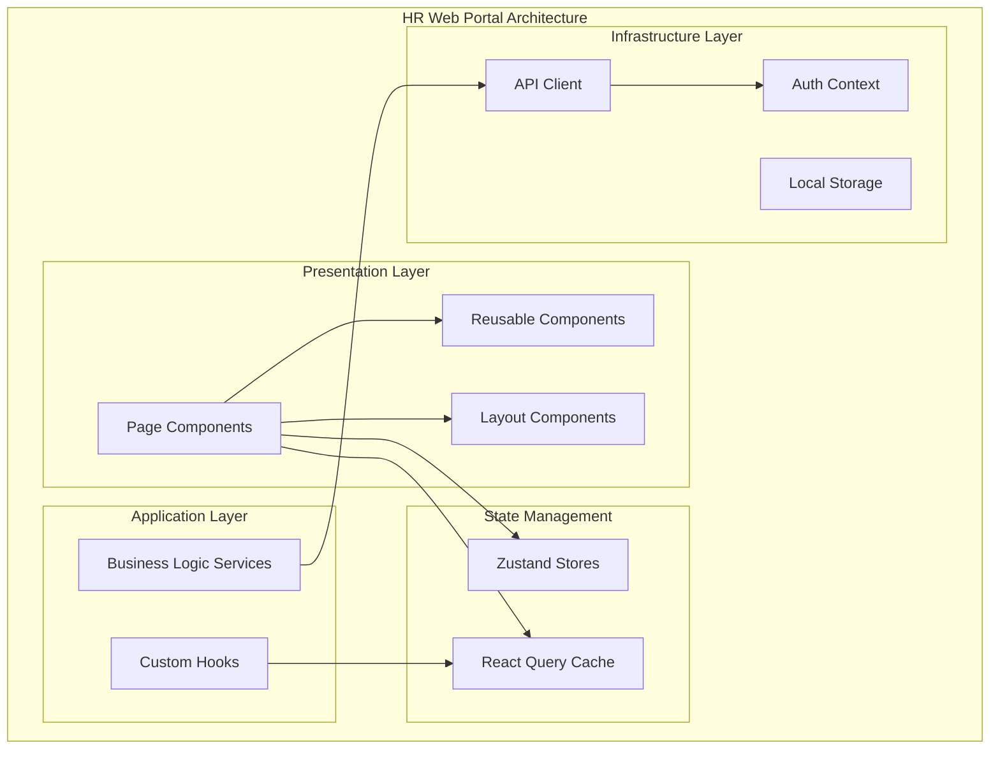
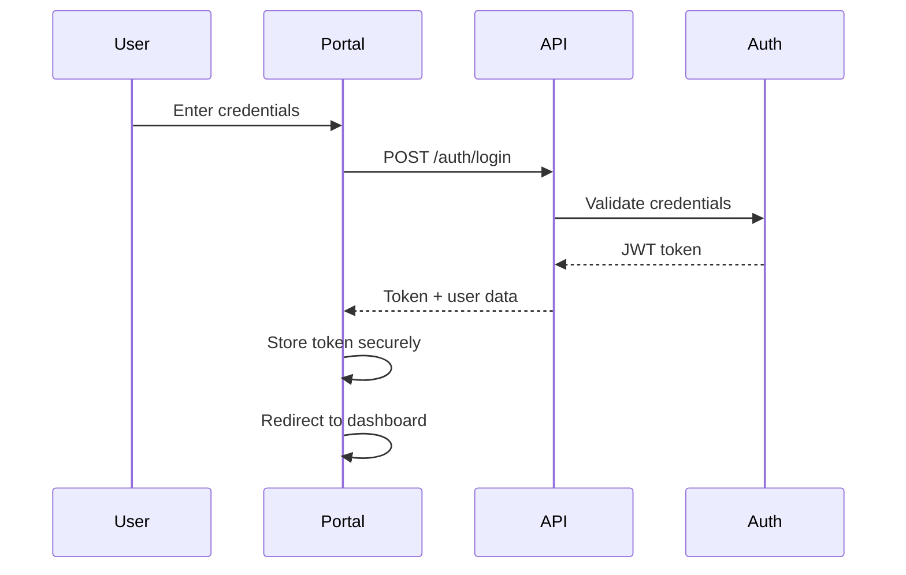

# HR Web Portal - Architecture Documentation

## Overview

The HR Web Portal is a modern React-based employee self-service portal built with Vite, TypeScript, and React Router. It follows hexagonal architecture principles with clean separation of concerns.

## Technology Stack

| Category | Technology | Version |
|----------|-----------|---------|
| **Framework** | React | 18.3.1 |
| **Build Tool** | Vite | 5.1.4 |
| **Language** | TypeScript | 5.3.3 |
| **Routing** | React Router DOM | 6.22.0 |
| **State Management** | Zustand | 4.5.0 |
| **Data Fetching** | TanStack Query | 5.28.0 |
| **HTTP Client** | Axios | 1.6.7 |
| **Validation** | Zod | 3.22.4 |
| **Date Handling** | date-fns | 3.3.1 |

---

## Architecture Overview



---

## Directory Structure

```
hr-web-portal/
├── public/                 # Static assets
├── src/
│   ├── application/        # Application services
│   │   ├── services/       # Business logic
│   │   └── hooks/          # Custom hooks
│   ├── domain/             # Domain models
│   │   ├── entities/       # Type definitions
│   │   └── validators/     # Zod schemas
│   ├── infrastructure/     # Infrastructure
│   │   ├── api/            # API client
│   │   └── storage/        # Storage adapters
│   ├── presentation/       # UI components
│   │   ├── pages/          # Page components
│   │   ├── components/     # Reusable components
│   │   └── layouts/        # Layout components
│   ├── shared/             # Shared utilities
│   │   ├── constants/      # Constants
│   │   ├── utils/          # Helper functions
│   │   └── types/          # Shared types
│   └── main.tsx            # Entry point
├── tests/                  # Test files
├── docs/                   # Documentation
├── index.html
├── package.json
├── tsconfig.json
├── vite.config.ts
└── Dockerfile
```

---

## Core Components

### 1. Authentication Context

```typescript
interface AuthContextValue {
  user: User | null;
  token: string | null;
  login: (credentials: LoginCredentials) => Promise<void>;
  logout: () => void;
  isAuthenticated: boolean;
  isLoading: boolean;
}
```

### 2. API Client

```typescript
class ApiClient {
  private baseURL: string;
  private token: string | null;

  get<T>(url: string, config?: AxiosRequestConfig): Promise<T>;
  post<T>(url: string, data?: any, config?: AxiosRequestConfig): Promise<T>;
  put<T>(url: string, data?: any, config?: AxiosRequestConfig): Promise<T>;
  delete<T>(url: string, config?: AxiosRequestConfig): Promise<T>;
}
```

### 3. State Stores (Zustand)

| Store | Purpose |
|-------|---------|
| `authStore` | Authentication state |
| `employeeStore` | Current employee profile |
| `leaveStore` | Leave balance and requests |
| `notificationStore` | User notifications |

### 4. Data Fetching (React Query)

```typescript
// Example query hook
const useEmployeeProfile = (employeeId: string) => {
  return useQuery({
    queryKey: ['employee', employeeId],
    queryFn: () => apiClient.get(`/employees/${employeeId}`),
    staleTime: 5 * 60 * 1000, // 5 minutes
  });
};
```

---

## Key Pages

### Employee Dashboard

```typescript
interface DashboardData {
  employee: Employee;
  leaveBalances: LeaveBalance[];
  upcomingLeaves: LeaveRequest[];
  pendingApprovals: ApprovalRequest[];
  notifications: Notification[];
}
```

### Leave Management

- **Leave Balance View**: Display leave balances by type
- **Leave Request Form**: Submit new leave requests
- **Leave History**: View past and upcoming leave
- **Leave Calendar**: Visual calendar representation

### Payslip Access

- **List View**: Monthly payslip list
- **Detail View**: Download/view individual payslip
- **Filter**: By year, month

### Profile Management

- **Personal Information**: Update contact details
- **Bank Details**: Manage payment information
- **Emergency Contacts**: Add/remove contacts
- **Documents**: Upload/view HR documents

---

## Routing Structure

```typescript
const routes = [
  {
    path: '/',
    element: <ProtectedRoute><DashboardLayout /></ProtectedRoute>,
    children: [
      { path: '', element: <DashboardPage /> },
      { path: 'profile', element: <ProfilePage /> },
      { path: 'leave', element: <LeavePage /> },
      { path: 'leave/request', element: <LeaveRequestPage /> },
      { path: 'payslips', element: <PayslipsPage /> },
      { path: 'payslips/:id', element: <PayslipDetailPage /> },
      { path: 'documents', element: <DocumentsPage /> },
      { path: 'notifications', element: <NotificationsPage /> }
    ]
  },
  {
    path: '/login',
    element: <LoginPage />
  },
  {
    path: '/forgot-password',
    element: <ForgotPasswordPage />
  }
];
```

---

## API Integration

### Authentication Flow



### Data Fetching Pattern

```typescript
// Service layer
export const employeeService = {
  getProfile: (id: string) =>
    apiClient.get<Employee>(`/employees/${id}`),

  updateProfile: (id: string, data: UpdateEmployeeDTO) =>
    apiClient.put<Employee>(`/employees/${id}`, data)
};

// Hook
export const useEmployeeProfile = (id: string) => {
  return useQuery({
    queryKey: ['employee', id],
    queryFn: () => employeeService.getProfile(id)
  });
};

// Component
function ProfilePage() {
  const { data, isLoading, error } = useEmployeeProfile(currentUserId);

  if (isLoading) return <LoadingSpinner />;
  if (error) return <ErrorDisplay error={error} />;

  return <ProfileDisplay employee={data} />;
}
```

---

## Security

### Token Management

- JWT stored in httpOnly cookie (fallback to sessionStorage)
- Automatic token refresh before expiry
- Token cleared on logout

### XSS Prevention

- React's built-in escaping
- Additional sanitization for user input
- Content Security Policy headers

### CSRF Protection

- CSRF tokens for state-changing operations
- SameSite cookie attribute

### Data Privacy

- PII encryption in storage
- No sensitive data in URLs
- Secure logging (no credentials)

---

## Performance Optimizations

### Code Splitting

```typescript
const LeavePage = lazy(() => import('./pages/LeavePage'));
const PayslipsPage = lazy(() => import('./pages/PayslipsPage'));
```

### Image Optimization

- WebP format with fallbacks
- Lazy loading for below-fold images
- Responsive images with srcset

### Bundle Optimization

- Tree shaking
- Minification
- Gzip compression
- Browser caching strategies

---

## Accessibility

- ARIA labels on interactive elements
- Keyboard navigation support
- Screen reader compatibility
- Focus management
- Color contrast compliance (WCAG 2.1 AA)

---

## Testing Strategy

### Unit Tests (Vitest)

```typescript
describe('EmployeeService', () => {
  it('should fetch employee profile', async () => {
    const mockData = { id: 'emp-001', name: 'John Doe' };
    mockApi.get.mockResolvedValue(mockData);

    const result = await employeeService.getProfile('emp-001');

    expect(result).toEqual(mockData);
  });
});
```

### Component Tests (React Testing Library)

```typescript
describe('LeaveRequestForm', () => {
  it('should submit leave request', async () => {
    render(<LeaveRequestForm />);

    await userEvent.selectOptions(screen.getByLabelText('Leave Type'), 'ANNUAL');
    await userEvent.type(screen.getByLabelText('Start Date'), '2024-03-01');
    await userEvent.click(screen.getByText('Submit'));

    await waitFor(() => {
      expect(screen.getByText('Request submitted')).toBeInTheDocument();
    });
  });
});
```

### E2E Tests (Playwright)

```typescript
test('employee can request leave', async ({ page }) => {
  await page.goto('/leave/request');
  await page.selectOption('select[name="leaveType"]', 'ANNUAL');
  await page.fill('input[name="startDate"]', '2024-03-01');
  await page.click('button[type="submit"]');
  await expect(page).toHaveURL('/leave');
  await expect(page.locator('.success-message')).toBeVisible();
});
```

---

## Build Configuration

### Environment Variables

```bash
# .env.production
VITE_API_BASE_URL=https://api.gogidix.com/hr
VITE_AUTH_CLIENT_ID=hr-web-portal
VITE_ENABLE_ANALYTICS=true
VITE_SENTRY_DSN=<sentry-dsn>
```

### Vite Configuration

```typescript
export default defineConfig({
  plugins: [react()],
  resolve: {
    alias: {
      '@': path.resolve(__dirname, './src')
    }
  },
  server: {
    port: 3000,
    proxy: {
      '/api': {
        target: process.env.VITE_API_BASE_URL,
        changeOrigin: true
      }
    }
  },
  build: {
    outDir: 'dist',
    sourcemap: true,
    rollupOptions: {
      output: {
        manualChunks: {
          vendor: ['react', 'react-dom', 'react-router-dom'],
          ui: ['@tanstack/react-query', 'zustand']
        }
      }
    }
  }
});
```

---

## Deployment

### Docker Build

```bash
docker build -t gogidix/hr-web-portal:latest .
```

### Environment Configuration

| Environment | URL |
|-------------|-----|
| Development | https://dev-hr-portal.gogidix.com |
| Staging | https://staging-hr-portal.gogidix.com |
| Production | https://hr-portal.gogidix.com |

### CI/CD Pipeline

1. **Lint**: ESLint + TypeScript check
2. **Test**: Unit + Component tests
3. **Build**: Production bundle
4. **Docker**: Build and push image
5. **Deploy**: Kubernetes rolling update

---

## Monitoring

### Frontend Metrics

- Page load time
- First Contentful Paint (FCP)
- Time to Interactive (TTI)
- Cumulative Layout Shift (CLS)
- First Input Delay (FID)

### Error Tracking

- Sentry integration
- Console error capture
- Unhandled promise rejection tracking
- API error tracking

---

## Browser Support

| Browser | Minimum Version |
|---------|----------------|
| Chrome | 90+ |
| Firefox | 88+ |
| Safari | 14+ |
| Edge | 90+ |

---

## Version History

| Version | Date | Changes |
|---------|------|---------|
| 1.0.0 | 2024-01-01 | Initial release |
| 1.1.0 | 2024-02-15 | Added leave calendar view |
| 1.2.0 | 2024-03-01 | Enhanced mobile experience |
