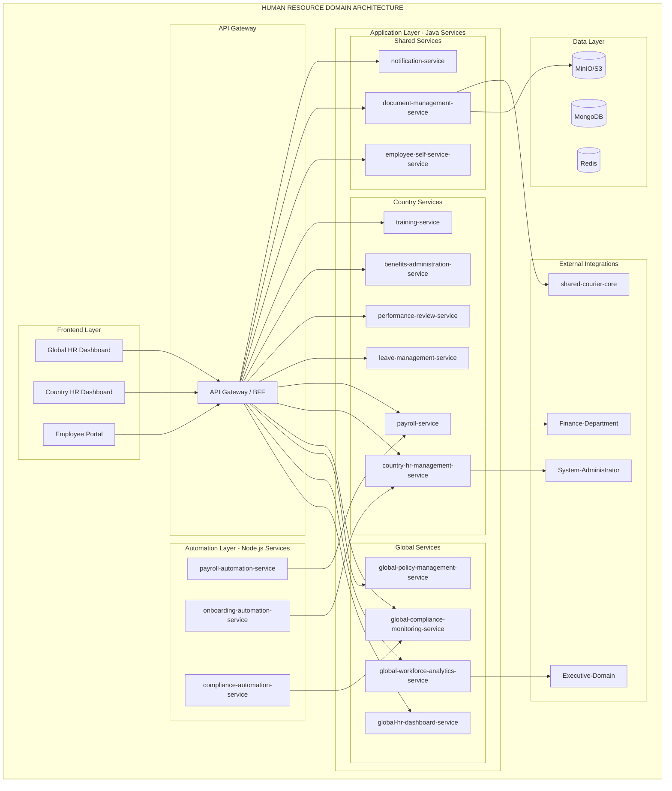
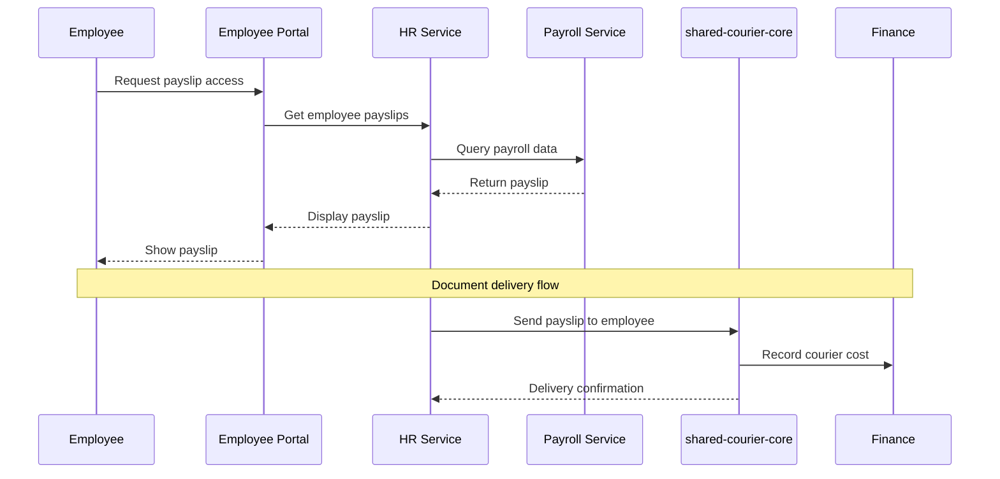

# PRD: Human-Resource Domain

**Version:** 1.0
**Date:** 2026-01-29
**Status:** Product Requirements Document
**Domain:** Management-Domain / Human-Resource

---

## Table of Contents
1. [Business Purpose](#business-purpose)
2. [User Personas](#user-personas)
3. [Domain Architecture](#domain-architecture)
4. [Core Features](#core-features)
5. [Service Inventory](#service-inventory)
6. [Integration Points](#integration-points)
7. [Technical Specifications](#technical-specifications)
8. [Implementation Roadmap](#implementation-roadmap)

---

## Business Purpose

### Vision
Manage complete employee lifecycle globally with centralized oversight and local execution across all Gogidix operations.

### Mission
Enable HR teams to attract, develop, and retain talent while ensuring compliance and operational excellence across all countries.

### Key Objectives
1. **Global Workforce Management:** Unified HR platform across all regions
2. **Local Compliance:** Country-specific HR regulations and policies
3. **Employee Self-Service:** Empower employees with self-service capabilities
4. **Data-Driven HR:** Analytics for strategic HR decisions
5. **Integration with Shared Services:** Use shared-courier-core for document delivery

---

## User Personas

### 1. Global HR Manager (HQ)
**Profile:** Strategic HR leader at Global HQ (Ireland)
**Responsibilities:**
- Global HR strategy and policy
- Workforce planning and analytics
- International assignments
- Global compliance oversight

**Key Needs:**
- Global workforce analytics
- Multi-country compliance monitoring
- International assignments tracking
- Global HR policy management

### 2. Country HR Manager
**Profile:** Local HR operations leader
**Responsibilities:**
- Local HR operations execution
- Country compliance adherence
- Payroll administration
- Employee relations

**Key Needs:**
- Local employee management
- Payroll processing
- Leave management
- Performance review administration

### 3. Employee
**Profile:** Any employee in the organization
**Responsibilities:**
- Self-service HR tasks
- Personal information management
- Leave requests
- Benefits enrollment

**Key Needs:**
- Easy access to personal information
- Quick leave request submission
- Payslip access
- Training enrollment

### 4. Line Manager
**Profile:** Team leader with direct reports
**Responsibilities:**
- Team management
- Performance reviews
- Leave approvals
- Goal setting

**Key Needs:**
- Team overview and management
- Performance review tools
- Approval workflows
- Goal tracking

---

## Domain Architecture

### High-Level Architecture Diagram



### Data Flow Diagram



---

## Core Features

### Global HR Dashboard

#### 1. Global Workforce Analytics
- Total headcount by region/country
- Demographic analysis
- Turnover metrics
- Diversity and inclusion metrics
- Organizational structure visualization

#### 2. Multi-Country Compliance Monitoring
- Local labor law compliance tracking
- Work permit and visa monitoring
- Employment contract compliance
- GDPR and data privacy compliance
- Audit trail and reporting

#### 3. Global Payroll Oversight
- Payroll cost aggregation by country
- Currency conversion and consolidation
- Salary benchmarking
- Compensation analysis
- Payroll variance tracking

#### 4. Talent Acquisition Metrics
- Time to hire by region
- Recruitment source effectiveness
- Offer acceptance rates
- Cost per hire
- Pipeline analytics

#### 5. Employee Engagement Analytics
- Engagement survey results
- eNPS tracking
- Satisfaction scores by team/region
- Trend analysis
- Action planning tools

#### 6. International Assignments
- Assignment tracking (expatriates)
- Cost allocation and tax equalization
- Visa and work permit management
- Assignment duration tracking
- Repatriation planning

#### 7. Global HR Policy Management
- Policy version control
- Policy distribution and acknowledgment
- Local policy adaptations
- Policy compliance monitoring
- Change management workflow

### Country HR Dashboard

#### 1. Local Employee Management
- Employee records (CRUD operations)
- Organizational chart management
- Position and headcount tracking
- Employee transfers and promotions
- Termination processing

#### 2. Payroll Administration
- Payroll processing and calculation
- Salary and wage management
- Tax calculations and deductions
- Benefits deductions
- Payslip generation and distribution

#### 3. Leave Management
- Leave request and approval workflow
- Leave balance tracking
- Leave types configuration
- Calendar integration
- Leave encashment processing

#### 4. Performance Reviews
- Review cycle management
- Goal setting and tracking
- 360-degree feedback
- Performance ratings
- Improvement plans

#### 5. Benefits Administration
- Benefits enrollment
- Coverage management
- Dependent tracking
- Claims processing integration
- Benefits cost analysis

#### 6. Training and Development
- Training program management
- Course enrollment
- Learning progress tracking
- Certification tracking
- Skills gap analysis

#### 7. Local Compliance Reporting
- Country-specific report generation
- Government filings
- Labor law compliance
- Data privacy compliance
- Audit preparation

### Employee Self-Service Portal

#### 1. Personal Information Management
- View and update personal details
- Contact information management
- Emergency contacts
- Bank details for payroll
- Document uploads

#### 2. Leave Requests
- Submit leave requests
- View leave balance
- Check leave history
- Cancel pending requests
- Leave calendar view

#### 3. Payslip Access
- View and download payslips
- Historical payslip access
- Tax document access
- Salary breakdown
- Year-to-date totals

#### 4. Performance Goals
- View assigned goals
- Track progress
- Update goal status
- Request feedback
- Self-assessment submission

#### 5. Training Enrollment
- Browse available courses
- Enroll in training programs
- View learning history
- Access online courses
- Track certifications

#### 6. Expense Submissions
- Submit expense reports
- Upload receipts
- Track reimbursement status
- View expense history
- Expense policy lookup

---

## Service Inventory

### Java Backend Services (12)

| Service | Type | Description | Priority |
|---------|------|-------------|----------|
| global-hr-dashboard-service | Java | Global HR analytics and oversight | P0 |
| global-workforce-analytics-service | Java | Workforce data aggregation | P0 |
| global-policy-management-service | Java | HR policy management | P1 |
| global-compliance-monitoring-service | Java | Multi-country compliance | P0 |
| country-hr-management-service | Java | Local HR operations | P0 |
| payroll-service | Java | Payroll processing | P0 |
| leave-management-service | Java | Leave workflow | P0 |
| performance-review-service | Java | Performance management | P1 |
| benefits-administration-service | Java | Benefits management | P1 |
| training-service | Java | Training and development | P1 |
| employee-self-service-service | Java | Employee portal backend | P0 |
| document-management-service | Java | HR document storage | P0 |
| notification-service | Java | HR notifications | P1 |

### Node.js Backend Services (3)

| Service | Type | Description | Priority |
|---------|------|-------------|----------|
| payroll-automation-service | Node | Automated payroll processing | P0 |
| onboarding-automation-service | Node | New hire onboarding workflows | P1 |
| compliance-automation-service | Node | Compliance checking automation | P0 |

### Frontend Applications (3)

| Application | Type | Description | Priority |
|-------------|------|-------------|----------|
| global-hr-dashboard | Web | Global HR management dashboard | P0 |
| country-hr-dashboard | Web | Local HR operations dashboard | P0 |
| employee-portal | Web | Employee self-service portal | P0 |

---

## Integration Points

### Shared-Business-Infrastructure

```
Human-Resource → shared-courier-core
├── Employee contract delivery (new hires)
├── Payslip delivery (monthly)
├── HR document delivery (policies, forms)
├── Benefits document delivery
└── Compliance document delivery
```

### Internal Management-Domain

```
Human-Resource → Finance-Department
├── Payroll data export
├── Budget tracking
├── Salary expense reporting
└── Benefits cost reporting

Human-Resource → Executive-Domain
├── Workforce analytics
├── HR metrics
├── Compliance status
└── Strategic HR data

Human-Resource → System-Administrator
├── User provisioning (new hires)
├── Access requests
├── User deprovisioning (terminations)
└── Equipment assignment
```

---

## Technical Specifications

### Technology Stack

#### Backend (Java)
- **Framework:** Spring Boot 3.1.5
- **Language:** Java 17+
- **Build:** Maven 3.9.12+
- **Database:** MongoDB (primary), Redis (cache)
- **Storage:** MinIO/S3 for documents
- **Security:** Spring Security + JWT

#### Backend (Node.js)
- **Runtime:** Node.js 18 LTS
- **Framework:** Express.js
- **Automation:** Custom workflow engine

#### Frontend (Web)
- **Framework:** React 18+ / Next.js 14
- **State:** Redux Toolkit
- **Charts:** D3.js / Recharts
- **UI:** Material-UI / Tailwind CSS
- **Document Viewer:** PDF.js

### Hexagonal Architecture Compliance

All Java services MUST follow the hexagonal architecture template (see Executive-Domain PRD for details).

### Multi-Tenancy

All services MUST implement:
1. **TenantInterceptor** - Extract tenant from JWT
2. **RequestContext** - ThreadLocal tenant context
3. **Tenant filtering** - All queries filter by tenantId
4. **Country isolation** - Data isolated by country

---

## Implementation Roadmap

### Phase 1: Foundation (Weeks 1-2)
- [ ] Set up Human-resource folder structure
- [ ] Configure shared-courier-core integration
- [ ] Implement multi-tenancy framework
- [ ] Set up document storage (MinIO/S3)
- [ ] Create base domain models

### Phase 2: Core Services (Weeks 3-4)
- [ ] Implement country-hr-management-service
- [ ] Implement employee-self-service-service
- [ ] Implement document-management-service
- [ ] Implement notification-service
- [ ] Build employee portal (Web)

### Phase 3: Payroll & Automation (Weeks 5-6)
- [ ] Implement payroll-service
- [ ] Implement payroll-automation-service
- [ ] Implement leave-management-service
- [ ] Build country HR dashboard
- [ ] Integration with Finance

### Phase 4: Performance & Training (Weeks 7-8)
- [ ] Implement performance-review-service
- [ ] Implement training-service
- [ ] Implement onboarding-automation-service
- [ ] Build performance review UI
- [ ] Build training portal

### Phase 5: Global Analytics (Weeks 9-10)
- [ ] Implement global-hr-dashboard-service
- [ ] Implement global-workforce-analytics-service
- [ ] Implement global-compliance-monitoring-service
- [ ] Build global HR dashboard
- [ ] Data pipeline setup

### Phase 6: Advanced Features (Weeks 11-12)
- [ ] Implement benefits-administration-service
- [ ] Implement global-policy-management-service
- [ ] Implement compliance-automation-service
- [ ] Advanced reporting features
- [ ] Integration testing

### Phase 7: Testing & Optimization (Weeks 13-14)
- [ ] End-to-end testing
- [ ] Performance optimization
- [ ] Security testing
- [ ] User acceptance testing
- [ ] Bug fixes and refinement

### Phase 8: Documentation & Handoff (Weeks 15-16)
- [ ] Complete API documentation
- [ ] User training materials
- [ ] Admin runbooks
- [ ] Compliance audit
- [ ] Production deployment

---

## Success Metrics

### Technical Metrics
- **API Response Time:** < 300ms (p95)
- **Portal Load Time:** < 3 seconds
- **Payroll Processing:** < 1 hour for 10,000 employees
- **Document Retrieval:** < 2 seconds
- **Uptime:** 99.9%

### Business Metrics
- **HR Adoption:** 100% of HR staff
- **Employee Portal Usage:** > 80% of employees
- **Payroll Accuracy:** 99.9%
- **Time to Hire:** Reduced by 30%
- **Compliance Incidents:** Zero critical violations

---

## Risks and Mitigations

| Risk | Impact | Probability | Mitigation |
|------|--------|-------------|------------|
| Payroll calculation errors | Critical | Low | Automated testing, approval workflows |
| Data privacy breach | Critical | Low | Encryption, access controls, audit logs |
| Country compliance gaps | High | Medium | Local legal review, automated checks |
| Poor employee adoption | Medium | Medium | UX testing, training, communication |
| Integration failures | High | Medium | Circuit breakers, retry logic, monitoring |

---

**End of PRD: Human-Resource Domain**

**Next Steps:**
1. Review and approve PRD
2. Create detailed task lists for each service
3. Begin Phase 1 implementation
